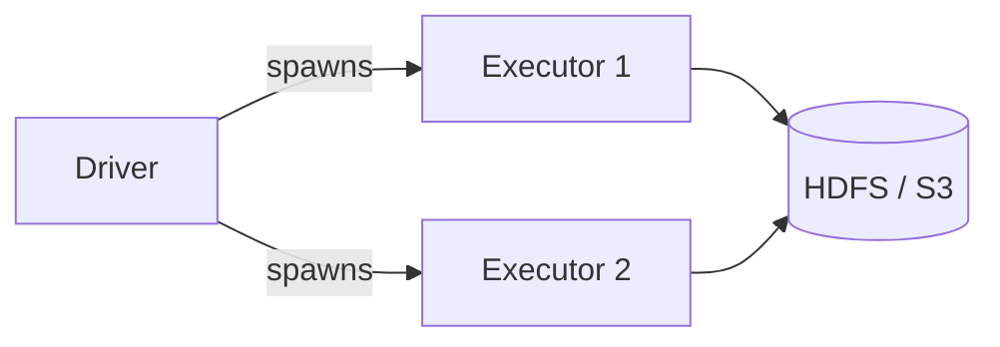

# MkDocs Documentation Instructions

## Theme & Config (mkdocs.yml)

Use **MkDocs Material** with the project's standard palette and feature set:

```yaml
theme:
  name: material
  palette:
    - scheme: default
      primary: deep orange
      accent: orange
      toggle:
        icon: material/brightness-7
        name: Switch to dark mode
    - scheme: slate
      primary: deep orange
      accent: orange
      toggle:
        icon: material/brightness-4
        name: Switch to light mode
  features:
    - navigation.tabs
    - navigation.sections
    - navigation.expand
    - navigation.top
    - navigation.indexes
    - search.highlight
    - search.suggest
    - content.code.copy
    - content.code.annotate
```

Always include these plugins:
```yaml
plugins:
  - search
  - include-markdown
```

Always include these markdown extensions:
```yaml
markdown_extensions:
  - admonition
  - attr_list
  - md_in_html
  - tables
  - pymdownx.details
  - pymdownx.inlinehilite
  - pymdownx.highlight:
      anchor_linenums: true
      line_spans: __span
      pygments_lang_class: true
  - pymdownx.superfences:
      custom_fences:
        - name: mermaid
          class: mermaid
          format: !!python/name:pymdownx.superfences.fence_code_format
  - pymdownx.tabbed:
      alternate_style: true
  - pymdownx.snippets:
      base_path: ["."]
  - toc:
      permalink: true
```

## Code Blocks

### Snippet include (preferred — keeps docs in sync with source)
```markdown
```python title="local/local_example.py"
--8<-- "local/local_example.py"
```
```

### Tabbed install options
````markdown
=== "pip"
    ```bash
    pip install pyspark==3.5.0
    ```

=== "conda"
    ```bash
    conda install -c conda-forge pyspark=3.5.0
    ```

=== "uv"
    ```bash
    uv add pyspark
    ```
````

### Code annotations
```python
spark = (SparkSession.builder
         .master("local[*]")                          # (1)!
         .config("spark.sql.shuffle.partitions", "4") # (2)!
         .getOrCreate())
```
1. Use all available CPU cores.
2. Default 200 is too high for small local datasets.

## Admonitions

```markdown
!!! tip "No cluster needed"
    Start with local mode — it runs on your laptop in seconds.

!!! warning "Java required"
    Java 8, 11, or 17 must be on your `PATH`.

!!! note
    This config is only needed for cluster deployments.

!!! success "Good fit"
    - Writing new jobs
    - Unit tests in CI

!!! failure "Not a good fit"
    - Processing data larger than available RAM
```

## Architecture Diagrams (Mermaid)

```markdown

```

## Page Structure

Every environment/topic page should follow this order:

1. **Short description** — what this environment is and when to use it.
2. **Architecture diagram** (mermaid) — for cluster environments.
3. **Prerequisites** — tabbed pip / conda / uv install blocks + Java warning.
4. **SparkSession snippet** — with code annotations.
5. **Run the example** — bash block with the exact command.
6. **Configuration reference** — table of key Spark configs.
7. **When to use / not use** — `!!! success` and `!!! failure` admonitions.
8. **Full example** — `--8<--` snippet include.
