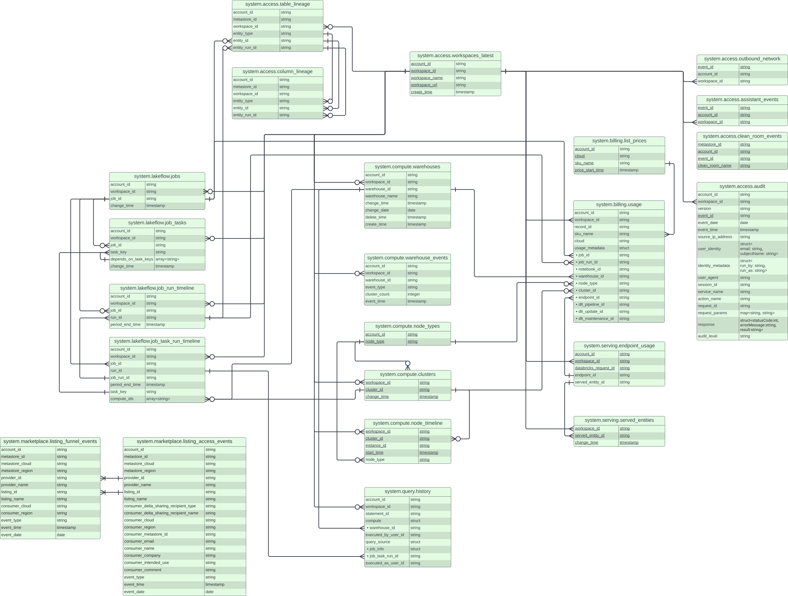

# System catalog

## What are system tables?

System tables are a Databricks-hosted analytical store of your account's operational data found in the system catalog.
System tables can be used for historical observability across your account.

## Requirements

1. To access system tables, your workspace must be enabled for Unity Catalog.
2. Only the system.billing schema and the system.access.audit table are available in Databricks on AWS GovCloud.

## Relationship

