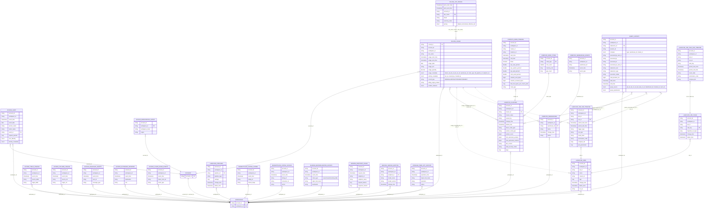

# ERD

## Diagram

```mermaid
erDiagram
    %% === Core identity anchors (repeat across schemas) ===
    ACCOUNT ||--o{ WORKSPACE : "account_id -> account_id"
    ACCOUNT {
      string account_id PK
    }
    WORKSPACE {
      string account_id FK
      string workspace_id PK
    }

    %% === Access / Audit ===
    ACCESS_AUDIT }o--|| ACCOUNT : "account_id"
    ACCESS_AUDIT }o--|| WORKSPACE : "workspace_id"
    ACCESS_AUDIT {
      string account_id
      string workspace_id
      timestamp event_time
      date event_date
      string service_name
      string action_name
      string event_id PK
      map    request_params
      struct user_identity
      struct identity_metadata
    }

    ACCESS_TABLE_LINEAGE }o--|| WORKSPACE : "workspace_id"
    ACCESS_TABLE_LINEAGE {
      string account_id
      string workspace_id
      timestamp event_time
      string source_table
      string target_table
    }

    ACCESS_COLUMN_LINEAGE }o--|| WORKSPACE : "workspace_id"
    ACCESS_COLUMN_LINEAGE {
      string account_id
      string workspace_id
      timestamp event_time
      string source_col
      string target_col
    }

    ACCESS_ASSISTANT_EVENTS }o--|| WORKSPACE : "workspace_id"
    ACCESS_ASSISTANT_EVENTS {
      string account_id
      string workspace_id
      timestamp event_time
      string user_id
      string message_type
    }

    ACCESS_OUTBOUND_NETWORK }o--|| WORKSPACE : "workspace_id"
    ACCESS_OUTBOUND_NETWORK {
      string account_id
      string workspace_id
      timestamp event_time
      string destination
      string rule
    }

    ACCESS_WORKSPACES_LATEST }o--|| ACCOUNT : "account_id"
    ACCESS_WORKSPACES_LATEST {
      string account_id
      string workspace_id PK
      string workspace_name
      string region
    }

    ACCESS_CLEAN_ROOM_EVENTS }o--|| WORKSPACE : "workspace_id"
    ACCESS_CLEAN_ROOM_EVENTS {
      string account_id
      string workspace_id
      timestamp event_time
      string clean_room_id
      string event_type
    }

    %% === Billing ===
    BILLING_USAGE }o--|| ACCOUNT : "account_id"
    BILLING_USAGE }o--o| WORKSPACE : "workspace_id"
    BILLING_USAGE {
      string  record_id PK
      string  account_id
      string  workspace_id
      string  sku_name
      timestamp usage_start_time
      timestamp usage_end_time
      date    usage_date
      string  usage_unit
      decimal usage_quantity
      struct  usage_metadata  "cluster_id, job_id, job_run_id, warehouse_id, node_type, dlt_pipeline_id, endpoint_id, ..."
      struct  identity_metadata "run_as, owned_by, created_by"
      string  record_type "ORIGINAL/RETRACTION/RESTATEMENT"
      string  billing_origin_product
      struct  product_features
    }

    BILLING_LIST_PRICES ||--o{ BILLING_USAGE : "sku_name, cloud -> sku_name, cloud"
    BILLING_LIST_PRICES {
      timestamp price_start_time
      timestamp price_end_time
      string    account_id
      string    sku_name PK
      string    cloud
      string    currency_code
      struct    pricing  "default, promotional, effective_list"
    }

    %% === Compute ===
    COMPUTE_CLUSTERS }o--|| WORKSPACE : "workspace_id"
    BILLING_USAGE }o--o{ COMPUTE_CLUSTERS : "usage_metadata.cluster_id -> cluster_id"
    COMPUTE_CLUSTERS {
      string account_id
      string workspace_id
      string cluster_id PK
      string cluster_name
      string owned_by
      timestamp change_time
      timestamp delete_time
      string driver_node_type
      string worker_node_type
      bigint worker_count
      bigint min_autoscale_workers
      bigint max_autoscale_workers
      string dbr_version
      string data_security_mode
      map    tags
    }

    COMPUTE_NODE_TIMELINE }o--|| COMPUTE_CLUSTERS : "cluster_id"
    COMPUTE_NODE_TIMELINE {
      string account_id
      string workspace_id
      string cluster_id
      string instance_id
      timestamp start_time
      timestamp end_time
      boolean driver
      double cpu_user_percent
      double cpu_system_percent
      double cpu_wait_percent
      double mem_used_percent
      bigint network_sent_bytes
      bigint network_received_bytes
      map   disk_free_bytes_per_mount_point
      string node_type
    }

    COMPUTE_NODE_TYPES ||--o{ COMPUTE_CLUSTERS : "node_type"
    COMPUTE_NODE_TYPES {
      string account_id
      string node_type PK
      double core_count
      long   memory_mb
      long   gpu_count
    }

    COMPUTE_WAREHOUSES }o--|| WORKSPACE : "workspace_id"
    COMPUTE_WAREHOUSES {
      string account_id
      string workspace_id
      string warehouse_id PK
      string name
      timestamp change_time
      string owner
    }

    COMPUTE_WAREHOUSE_EVENTS }o--|| COMPUTE_WAREHOUSES : "warehouse_id"
    COMPUTE_WAREHOUSE_EVENTS {
      string account_id
      string workspace_id
      string warehouse_id
      timestamp event_time
      string event_type
    }

    %% === Query ===
    QUERY_HISTORY }o--|| WORKSPACE : "workspace_id"
    QUERY_HISTORY }o--o{ COMPUTE_WAREHOUSES : "compute.warehouse_id -> warehouse_id"
    QUERY_HISTORY }o--o{ COMPUTE_CLUSTERS : "compute.cluster_id -> cluster_id"
    QUERY_HISTORY }o--o{ LAKEFLOW_JOB_RUN_TIMELINE : "query_source.job_run_id -> run_id"
    QUERY_HISTORY {
      string  account_id
      string  workspace_id
      string  statement_id PK
      string  session_id
      struct  compute  "type, warehouse_id, cluster_id"
      string  executed_by_user_id
      string  executed_by
      string  executed_as
      string  executed_as_user_id
      string  statement_text
      string  statement_type
      string  execution_status
      bigint  total_duration_ms
      timestamp start_time
      timestamp end_time
      struct  query_source "job_id, job_run_id, job_task_run_id, dashboard_id, notebook_id, alert_id..."
      struct  query_parameters
    }

    %% === Jobs / Lakeflow ===
    LAKEFLOW_JOBS }o--|| WORKSPACE : "workspace_id"
    LAKEFLOW_JOBS {
      string account_id
      string workspace_id
      string job_id PK
      string name
      string creator_id
      map    tags
      timestamp change_time
      timestamp delete_time
      string run_as
    }

    LAKEFLOW_JOB_TASKS }o--|| LAKEFLOW_JOBS : "job_id"
    LAKEFLOW_JOB_TASKS {
      string account_id
      string workspace_id
      string job_id
      string task_key PK
      array  depends_on_keys
      timestamp change_time
      timestamp delete_time
    }

    LAKEFLOW_JOB_RUN_TIMELINE }o--|| LAKEFLOW_JOBS : "job_id"
    LAKEFLOW_JOB_RUN_TIMELINE {
      string account_id
      string workspace_id
      string job_id
      string run_id PK
      timestamp period_start_time
      timestamp period_end_time
      string trigger_type
      string run_type
      string result_state
      string termination_code
      array  compute_ids
      map    job_parameters
    }

    LAKEFLOW_JOB_TASK_RUN_TIMELINE }o--|| LAKEFLOW_JOB_TASKS : "job_id, task_key"
    LAKEFLOW_JOB_TASK_RUN_TIMELINE {
      string account_id
      string workspace_id
      string job_id
      string run_id
      string task_key
      timestamp period_start_time
      timestamp period_end_time
      string result_state
      string termination_code
      array  compute_ids
    }

    LAKEFLOW_PIPELINES }o--|| WORKSPACE : "workspace_id"
    LAKEFLOW_PIPELINES {
      string account_id
      string workspace_id
      string pipeline_id PK
      string pipeline_type
      map    settings
      timestamp change_time
      timestamp delete_time
    }

    %% === Marketplace ===
    MARKETPLACE_LISTING_FUNNEL }o--|| WORKSPACE : "workspace_id"
    MARKETPLACE_LISTING_FUNNEL {
      string account_id
      string workspace_id
      timestamp event_time
      string listing_id
      string funnel_stage
    }

    MARKETPLACE_LISTING_ACCESS }o--|| WORKSPACE : "workspace_id"
    MARKETPLACE_LISTING_ACCESS {
      string account_id
      string workspace_id
      timestamp event_time
      string listing_id
      string consumer_id
      string action
    }

    %% === Sharing / Clean Rooms / Materialization ===
    SHARING_MATERIALIZATION_HISTORY }o--|| WORKSPACE : "workspace_id"
    SHARING_MATERIALIZATION_HISTORY {
      string account_id
      string workspace_id
      timestamp event_time
      string share_type "view/mview/streaming table"
      string object_full_name
      string destination
    }

    %% === Serving ===
    SERVING_ENDPOINT_USAGE }o--|| WORKSPACE : "workspace_id"
    SERVING_ENDPOINT_USAGE {
      string account_id
      string workspace_id
      timestamp request_time
      string endpoint_id
      string endpoint_name
      long   request_tokens
      long   response_tokens
    }

    SERVING_SERVED_ENTITIES }o--|| WORKSPACE : "workspace_id"
    SERVING_SERVED_ENTITIES {
      string account_id
      string workspace_id
      string endpoint_id PK
      string model_name
      string model_version
      timestamp change_time
    }

    %% === Storage / Predictive Optimization ===
    STORAGE_PRED_OPT_HISTORY }o--|| WORKSPACE : "workspace_id"
    STORAGE_PRED_OPT_HISTORY {
      string account_id
      string workspace_id
      timestamp operation_time
      string object_full_name
      string operation
      string status
    }

    %% === Cross-domain joins you’ll actually do ===
    BILLING_USAGE ||..o{ LAKEFLOW_JOBS : "usage_metadata.job_id -> job_id"
    BILLING_USAGE ||..o{ LAKEFLOW_JOB_RUN_TIMELINE : "usage_metadata.job_run_id -> run_id"
    BILLING_USAGE ||..o{ COMPUTE_WAREHOUSES : "usage_metadata.warehouse_id -> warehouse_id"
```
