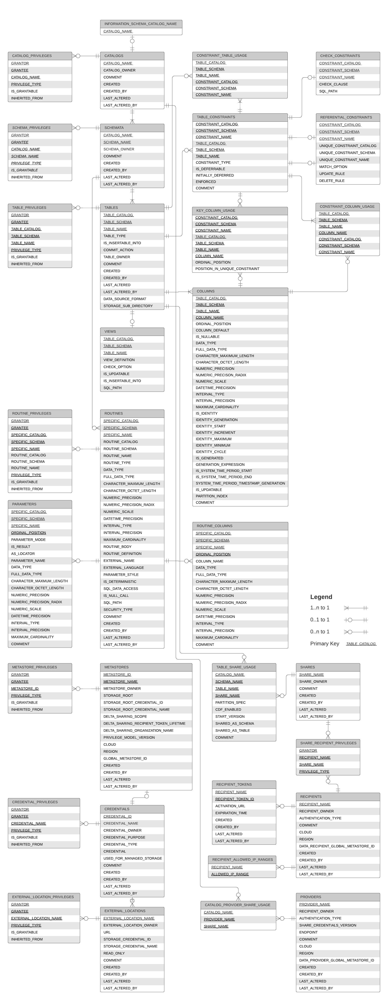

# Introduction

The `INFORMATION_SCHEMA` is a SQL standard based schema, provided in every catalog created on Unity Catalog.

Within the information schema, you can find a set of views describing the objects known to the `schema's catalog` that you are privileged to see.

The information schema of the `SYSTEM` catalog returns information about objects across `all catalogs` within the `metastore`.

**Information schema system tables do not contain metadata about hive_metastore objects.**

The purpose of the information schema is to provide a SQL based, self describing API to the metadata.

## ERD



## Access

### ✅ 1. Understand system.information_schema.tables Scope

The `system.information_schema.tables` view typically only shows tables:

1. In catalogs and schemas that you have `USE SCHEMA` or `SELECT` privileges on
2. Within the active catalog (in some systems)
3. That are not temporary views

If you're using Databricks Unity Catalog, this becomes more strict:

1. Only catalogs, schemas, and tables you have been granted access to (e.g., `USE CATALOG`, `USE SCHEMA`, `SELECT` on tables) are shown.
2. The service principal may have full data access roles, e.g., `accountadmin`, `datareader`, etc.

### What You Can Do

Ask the admin to run:

```sql
GRANT USE CATALOG ON CATALOG catalog_name TO `your_user`;
GRANT USE SCHEMA ON SCHEMA catalog_name.schema_name TO `your_user`;
GRANT SELECT ON TABLE catalog_name.schema_name.table_name TO `your_user`;
```

### Need to verify it
