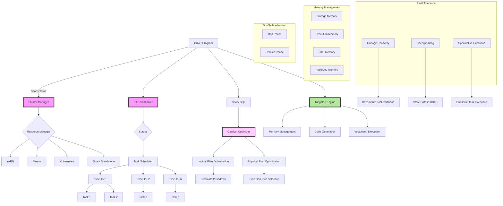
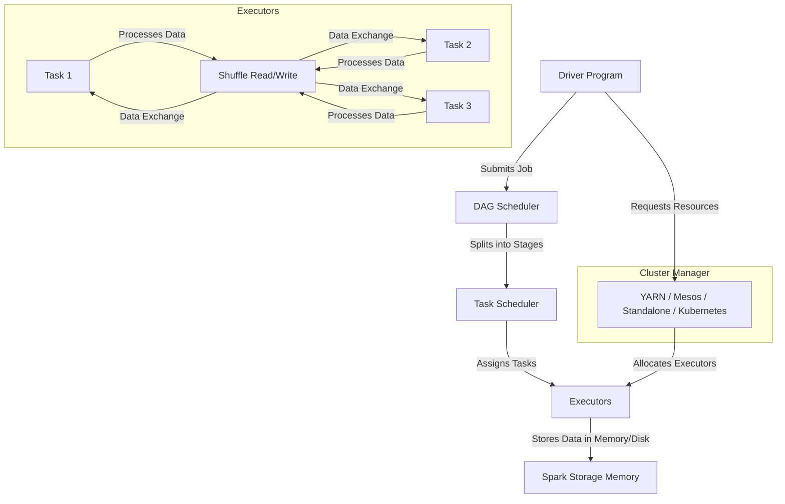

# Internal

## Diagram

1. Driver Program sends tasks to the Cluster Manager.
2. The Cluster Manager interacts with different resource managers (YARN, Mesos, Kubernetes, Spark Standalone).
3. The DAG Scheduler splits tasks into stages, and the Task Scheduler assigns tasks to Executors.
4. Executors perform tasks, interact with Memory Management, and use Shuffle Mechanism for data exchange.
5. Spark SQL uses Catalyst Optimizer for logical and physical plan optimization.
6. Fault Tolerance mechanisms like lineage recovery, checkpointing, and speculative execution ensure resilience.

Daigram 2

The driver program submitting jobs.
DAG scheduler breaking jobs into stages and passing tasks to the task scheduler.
The task scheduler assigning tasks to executors, which process data and handle shuffle operations.
The cluster manager allocating resources and launching executors.
Executors storing processed data in memory/disk.
