# Spark Ui

The Spark UI is a web application designed to help with monitoring and debugging
Spark applications.
It contains detailed runtime information and various resource
consumptions of a Spark application.
The runtime includes various metrics that are tremendously helpful in diagnosing performance issues in your Spark applications.
One thing to note is that the Spark UI is available only while a Spark application is running.
The navigation bar at the top of the Spark UI contains links to the various tabs including jobs, stages, storage, environment, executors, and SQL.

The Spark UI provides a web-based interface to monitor and debug Spark applications. It helps in understanding job execution, optimizing performance, and identifying bottlenecks.

## Key Components of Spark UI

1. Jobs: Shows all Spark jobs with details like status, duration, and DAG visualization.
2. Stages: Displays different execution stages within a job, including task execution time.
3. Tasks: Provides detailed information about individual tasks, including shuffle read/write and execution time.
4. Storage: Displays RDDs and their partitions cached in memory or disk.
5. Environment: Shows Spark configurations, JVM properties, and system environment variables.
6. Executors: Lists all executors with memory usage, task status, and logs.
7. SQL: (For Spark SQL) Displays executed queries, execution plans, and optimizations.

## Spark UI Hierarchy

```mermaid
graph TD;
    A[Apache Spark UI] -->|Shows Execution Details| B[Jobs Tab]
    A -->|Breaks Jobs into Stages| C[Stages Tab]
    A -->|Monitors Task Execution| D[Tasks Tab]
    A -->|Shows Cached Data| E[Storage Tab]
    A -->|Displays Spark Configs| F[Environment Tab]
    A -->|Monitors Executors| G[Executors Tab]
    A -->|Analyzes SQL Queries| H[SQL Tab]

    B -->|View DAG Visualization| B1[DAG Scheduler]
    B -->|Track Job Status| B2[Job Metrics]

    C -->|Breaks Down into Tasks| C1[Task Execution]
    C -->|Tracks Shuffle Read/Write| C2[Shuffle Metrics]

    D -->|Monitors Individual Tasks| D1[Task Attempts]
    D -->|Analyzes GC & CPU Usage| D2[Resource Metrics]

    E -->|Shows Cached RDDs| E1[RDD Storage]
    E -->|Tracks Partition Size| E2[Partition Details]

    F -->|Displays JVM & System Info| F1[JVM Properties]
    F -->|Lists Spark Conf Settings| F2[Spark Configs]

    G -->|Shows Executor Performance| G1[Task Execution Time]
    G -->|Displays Memory Usage| G2[Memory & Storage]
    G -->|Links to Executor Logs| G3[Executor Logs]

    H -->|Tracks Query Execution| H1[Query Plans]
    H -->|Optimizations & Execution Time| H2[Performance Insights]
```



## Spark Application UI

```text
http://localhost:4040/
```

## Resource Manager

    http://localhost:9870

## Spark JobTracker

    http://localhost:8088/

## Node Specific Info

    http://localhost:8042/

## Environment

The Environment tab contains the basic information about the environment that a
Spark application is running in.
The sections are Runtime Information, Spark Properties, System Properties, and Classpath Entries.

| Name                | Description                                                                                                                                                                                                 |
|---------------------|-------------------------------------------------------------------------------------------------------------------------------------------------------------------------------------------------------------|
| Runtime Information | This section contains the locations and versions of the various components that Spark depends on, including Java and Scala.                                                                                 |
| Spark properties    | This area contains the basic and advanced properties that are configured in a Spark application. The basic properties include the basic information about an application such as application ID, name, etc. |
| System Properties   | These properties are mainly at the OS and Java level and are not Spark specific.                                                                                                                            |
| Classpath Entries   | This area contains a list of classpath and JAR files that are used in a Spark application.                                                                                                                  |

## Executor

The Executors tab contains the summary and breakdown information for each of the executors that is supporting a Spark application.
This information includes the capacity of certain resources as well as how much is being used in each executor.
The resources include memory, disk, CPU, and so on.
The Summary section provides a bird's-eye view of the resource consumption across all the executors in a Spark application.
