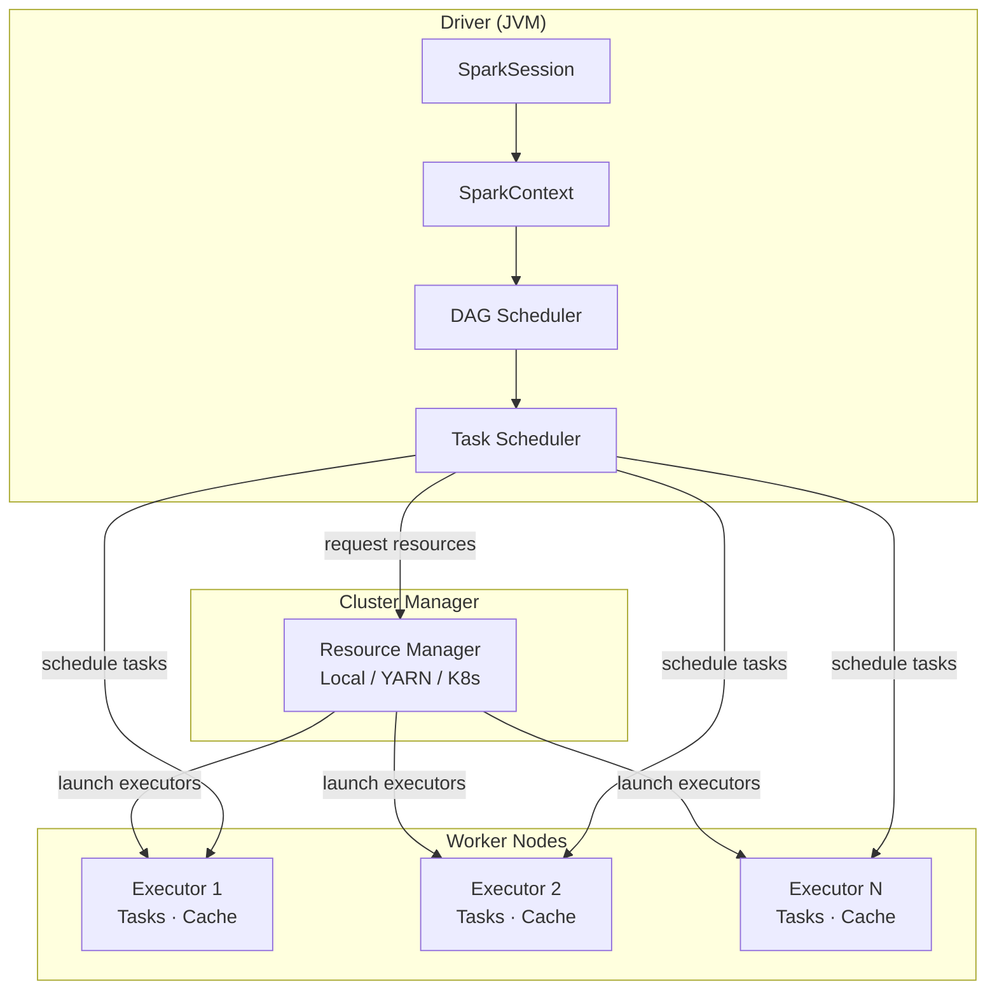
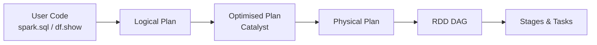
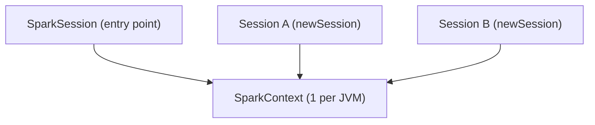
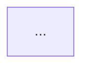

# MkDocs Documentation Instructions — PySpark Architecture

## Theme & Config (`mkdocs.yml`)

Use **MkDocs Material** with the project's standard palette and the Mermaid
superfence enabled (essential for architecture diagrams):

```yaml
site_name: PySpark Architecture
theme:
  name: material
  palette:
    - scheme: default
      primary: deep orange
      accent: orange
      toggle:
        icon: material/brightness-7
        name: Switch to dark mode
    - scheme: slate
      primary: deep orange
      accent: orange
      toggle:
        icon: material/brightness-4
        name: Switch to light mode
  features:
    - navigation.tabs
    - navigation.sections
    - navigation.expand
    - navigation.top
    - navigation.indexes
    - search.highlight
    - search.suggest
    - content.code.copy
    - content.code.annotate

plugins:
  - search
  - include-markdown

markdown_extensions:
  - admonition
  - attr_list
  - md_in_html
  - tables
  - pymdownx.details
  - pymdownx.inlinehilite
  - pymdownx.highlight:
      anchor_linenums: true
      line_spans: __span
      pygments_lang_class: true
  - pymdownx.superfences:
      custom_fences:
        - name: mermaid
          class: mermaid
          format: !!python/name:pymdownx.superfences.fence_code_format
  - pymdownx.tabbed:
      alternate_style: true
  - pymdownx.snippets:
      base_path: ["."]
  - toc:
      permalink: true
```

---

## Recommended Site Structure

```
docs/
├── index.md                    # Overview — what is Spark architecture?
├── components/
│   ├── spark-session.md        # SparkSession lifecycle & configuration
│   ├── spark-context.md        # SparkContext, RDDs, partition model
│   ├── driver.md               # Driver program — DAG, plan, scheduling
│   └── executor.md             # Executor — tasks, shuffle, caching
├── cluster-managers/
│   ├── local.md                # Local mode
│   ├── standalone.md           # Spark Standalone
│   ├── yarn.md                 # YARN
│   └── kubernetes.md           # Kubernetes
└── internals/
    ├── dag-scheduler.md        # DAG & stage creation
    ├── task-scheduler.md       # Task scheduling & locality
    └── memory-model.md         # Driver vs executor memory
```

Register every new page under `nav:` in `mkdocs.yml`.

---

## Architecture Diagrams (Mermaid)

Every component page **must** include a Mermaid architecture diagram. Use the
patterns below as starting points.

### Overall Spark Architecture



### Driver Internals



### SparkSession / SparkContext relationship



### Cluster Manager Comparison

```mermaid
graph LR
    subgraph Local
        L[local / local[N] / local[*]]
    end
    subgraph Standalone
        S[Master] --> SW1[Worker 1]
        S --> SW2[Worker 2]
    end
    subgraph YARN
        RM[Resource Manager] --> NM1[Node Manager 1]
        RM --> NM2[Node Manager 2]
    end
    subgraph Kubernetes
        AP[API Server] --> P1[Pod / Executor 1]
        AP --> P2[Pod / Executor 2]
    end
```

---

## Code Blocks

### Snippet include (preferred — keeps docs in sync with source)

````markdown
```python title="src/architecture/spark_session.py"
--8<-- "src/architecture/spark_session.py"
```
````

### Code annotations

```python
spark = (SparkSession.builder
         .appName("architecture-demo")          # (1)!
         .master(os.environ.get(
             "SPARK_MASTER", "local[*]"))        # (2)!
         .config("spark.ui.enabled", "false")   # (3)!
         .getOrCreate())
```
1. Visible in the Spark Web UI and logs.
2. Falls back to local mode when no cluster is configured.
3. Skip the web UI for lightweight local runs.

### Tabbed install options

````markdown
=== "pip"
    ```bash
    pip install pyspark==3.5.0
    ```

=== "conda"
    ```bash
    conda install -c conda-forge pyspark=3.5.0
    ```

=== "uv"
    ```bash
    uv add pyspark
    ```
````

---

## Admonitions

```markdown
!!! tip "Single JVM rule"
    Only one active `SparkContext` per JVM. Use `getOrCreate()` to avoid
    `ValueError: Cannot run multiple SparkContexts`.

!!! warning "Java required"
    Java 11 must be on your `PATH` before starting PySpark.

!!! note "Session vs Context"
    `SparkSession` is the high-level entry point; `SparkContext` is the
    low-level connection to the cluster. Access it via
    `spark.sparkContext` — never create it separately.

!!! success "Good fit — Local mode"
    - Unit tests and CI pipelines
    - Local development without a cluster
    - Exploring Spark APIs

!!! failure "Not suitable"
    - Processing datasets larger than a single machine's RAM
    - Production ETL (use YARN, Kubernetes, or EMR instead)
```

---

## Component Page Template

Use this structure for every component page under `docs/components/` and
`docs/cluster-managers/`:

```markdown
# Component Name

One-sentence definition of what this component is and what it does.

## Role in the Architecture

Short paragraph + architecture diagram (Mermaid) showing where this
component sits relative to the others.



## Key Responsibilities

- Bullet list of what this component is responsible for.

## Configuration Reference

| Config key | Default | Description |
| ---------- | ------- | ----------- |
| `spark.executor.memory` | `1g` | Heap memory per executor |

## Code Example

```python title="src/architecture/<component>.py"
--8<-- "src/architecture/<component>.py"
```

## Run

```bash
SPARK_MASTER=local[*] python src/architecture/<component>.py
```

## When to Use / Avoid

!!! success "Good fit"
    - ...

!!! failure "Not a good fit"
    - ...
```

---

## Building & Serving

```bash
mkdocs serve              # local dev server — hot-reload at http://127.0.0.1:8000
mkdocs build --strict     # production build — fails on any warning (use in CI)
```
