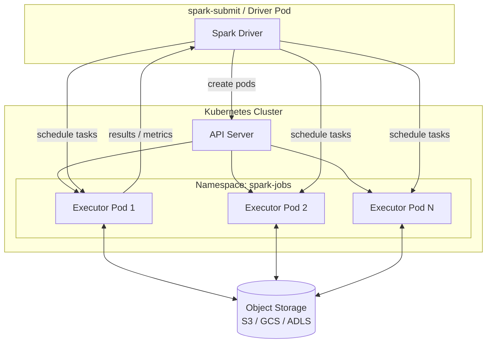

# Kubernetes

Kubernetes (K8s) is a **cloud-native** cluster manager that schedules Spark
Executors as individual **Pods**.  It is the preferred choice for containerised,
multi-cloud, and serverless-style Spark deployments.

## Architecture



Each Executor runs in its own Pod.  When the job completes, all Executor Pods
are automatically deleted by Spark.

## Deploy Modes

| Mode | Driver location | Use when |
| ---- | --------------- | -------- |
| `client` | Submitting machine | Interactive / notebook use |
| `cluster` | A Pod inside K8s | Production — Driver tolerates network interruptions |

## SparkSession

```python
import os
from pyspark.sql import SparkSession

K8S_MASTER    = os.environ.get("SPARK_MASTER",         "k8s://https://localhost:6443")
K8S_IMAGE     = os.environ.get("SPARK_K8S_IMAGE",      "apache/spark:3.5.0-python3")
K8S_NAMESPACE = os.environ.get("SPARK_K8S_NAMESPACE",  "spark-jobs")
K8S_SA        = os.environ.get("SPARK_K8S_SA",         "spark")

spark = (SparkSession.builder
         .appName("k8s-etl-job")
         .master(K8S_MASTER)                                        # (1)!
         .config("spark.kubernetes.container.image",      K8S_IMAGE)  # (2)!
         .config("spark.kubernetes.namespace",            K8S_NAMESPACE)
         .config("spark.kubernetes.authenticate.driver.serviceAccountName", K8S_SA)
         .config("spark.executor.instances",  "3")
         .config("spark.executor.memory",     "2g")
         .config("spark.executor.cores",      "2")
         .config("spark.driver.memory",       "1g")
         .config("spark.sql.adaptive.enabled",                    "true")
         .config("spark.sql.adaptive.coalescePartitions.enabled", "true")
         .getOrCreate())
spark.sparkContext.setLogLevel("WARN")
```

1. `k8s://https://<api-server>:<port>` — the K8s API server URL.
   Run `kubectl cluster-info` to find the URL.
2. The same Docker image is used for both the Driver and Executor Pods.

## Submit with `spark-submit`

```bash
spark-submit \
  --master k8s://https://$(kubectl config view --minify -o jsonpath='{.clusters[0].cluster.server}') \
  --deploy-mode cluster \
  --name spark-etl \
  --conf spark.kubernetes.container.image=apache/spark:3.5.0-python3 \
  --conf spark.kubernetes.namespace=spark-jobs \
  --conf spark.executor.instances=3 \
  --conf spark.executor.memory=2g \
  --conf spark.executor.cores=2 \
  local:///opt/spark/work-dir/src/spark_driver.py
```

## RBAC — Service Account

Spark needs permission to create and delete Pods:

```bash
kubectl create namespace spark-jobs

kubectl create serviceaccount spark -n spark-jobs

kubectl create clusterrolebinding spark-role \
  --clusterrole=edit \
  --serviceaccount=spark-jobs:spark \
  --namespace=spark-jobs
```

## Dockerfile

The Executor image must contain your application code and dependencies:

```dockerfile
FROM apache/spark:3.5.0-python3

USER root
RUN pip install --no-cache-dir pyspark==3.5.0
ENV PYSPARK_PYTHON=python3 \
    PYSPARK_DRIVER_PYTHON=python3 \
    SPARK_LOCAL_IP=127.0.0.1

COPY src/ /opt/spark/work-dir/src/
USER spark
```

## Configuration Reference

| Config key | Default | Description |
| ---------- | ------- | ----------- |
| `spark.kubernetes.container.image` | *(required)* | Docker image for Driver and Executor Pods |
| `spark.kubernetes.namespace` | `default` | K8s namespace for Executor Pods |
| `spark.kubernetes.authenticate.driver.serviceAccountName` | `default` | K8s service account |
| `spark.executor.instances` | `2` | Number of Executor Pods |
| `spark.executor.memory` | `1g` | Memory per Executor Pod |
| `spark.executor.cores` | `1` | CPU cores per Executor Pod |
| `spark.kubernetes.driver.pod.name` | *(auto)* | Name of the Driver Pod |
| `spark.kubernetes.executor.deleteOnTermination` | `true` | Auto-delete Executor Pods on job finish |

!!! tip "Dynamic allocation on Kubernetes"
    Enable `spark.dynamicAllocation.enabled=true` with the
    [Spark Operator](https://github.com/kubeflow/spark-operator) or the
    External Shuffle Service to scale Executors automatically.

## When to Use / Avoid

!!! success "Good fit"
    - Cloud-native and multi-cloud deployments
    - CI/CD pipelines using container images
    - Environments already running Kubernetes (EKS, GKE, AKS)
    - Reproducible, immutable job environments via Docker images

!!! failure "Not a good fit"
    - On-premise Hadoop clusters — use YARN
    - Local development — use Local mode
    - Teams unfamiliar with Kubernetes operations
