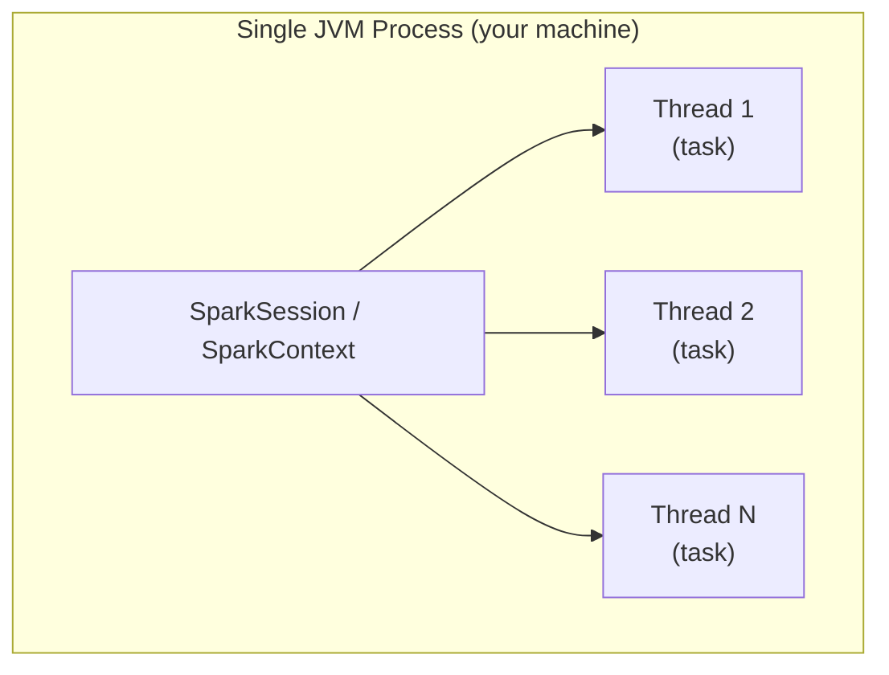

# Local Mode

Local mode runs the Driver and all "Executors" inside a **single JVM process** on
your machine — no cluster required.  It is the default for development, unit tests,
and CI pipelines.

## Architecture



There is **no Cluster Manager** in local mode.  Spark simulates parallelism using
threads within the same process.

## Master URL Options

| Master URL | Threads | When to use |
| ---------- | ------- | ----------- |
| `local` | 1 | Fully sequential — simplest debugging |
| `local[2]` | 2 | Tests — deterministic, faster than `local[*]` |
| `local[*]` | All CPU cores | Development — maximum local parallelism |
| `local[4, 3]` | 4 threads, 3 retries | Test failure recovery |

## SparkSession

```python
import os
from pyspark.sql import SparkSession

spark = (SparkSession.builder
         .appName("local-demo")
         .master(os.environ.get("SPARK_MASTER", "local[*]"))  # (1)!
         .config("spark.sql.shuffle.partitions", "4")          # (2)!
         .config("spark.ui.enabled", "false")                  # (3)!
         .getOrCreate())
spark.sparkContext.setLogLevel("WARN")
```

1. Reads `SPARK_MASTER` from the environment — defaults to `local[*]` so the
   same script runs on a cluster without code changes.
2. Default 200 is excessive for local datasets.
3. Skip the Web UI in scripts and tests.

## Run an Example

```bash
# Use all local CPU cores
SPARK_MASTER=local[*] python src/spark_session.py

# Exactly 2 threads (deterministic for tests)
SPARK_MASTER=local[2] pytest tests/ -v
```

## Configuration Reference

| Config key | Recommended (local) | Description |
| ---------- | ------------------- | ----------- |
| `spark.sql.shuffle.partitions` | `4` | Reduce from default 200 for small data |
| `spark.ui.enabled` | `false` | Skip Web UI in scripts/tests |
| `spark.driver.memory` | `2g` | Increase if processing large files locally |

!!! tip "No cluster needed"
    `local[*]` is the fastest way to start — it runs on your laptop in seconds
    with zero infrastructure setup.

!!! warning "Not for production"
    Local mode has no fault tolerance.  If the process crashes, the job is lost.
    Use YARN or Kubernetes for production workloads.

## When to Use / Avoid

!!! success "Good fit"
    - Local development and experimentation
    - Unit tests in CI (use `local[2]` for determinism)
    - Prototyping transformations before cluster deployment

!!! failure "Not a good fit"
    - Datasets larger than available RAM
    - Production ETL pipelines requiring fault tolerance
    - Multi-user shared workloads
