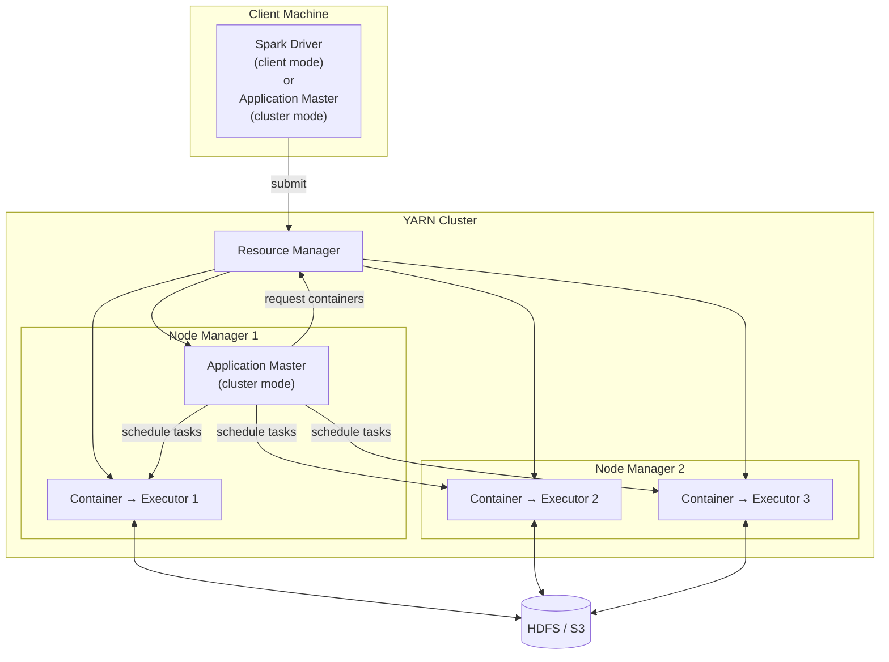

# YARN

YARN (Yet Another Resource Negotiator) is the resource manager bundled with
**Apache Hadoop**.  It is the most common cluster manager for on-premise Spark
deployments in Hadoop ecosystems (CDH, HDP, EMR).

## Architecture



## Deploy Modes

| Mode | Driver runs on | Use when |
| ---- | -------------- | -------- |
| `client` | Submitting machine | Interactive development, `spark-shell`, notebooks |
| `cluster` | YARN Application Master | Production — Driver survives client disconnection |

## SparkSession

```python
import os
from pyspark.sql import SparkSession

spark = (SparkSession.builder
         .appName("yarn-etl-job")
         .master("yarn")                                         # (1)!
         .config("spark.yarn.queue",
                 os.environ.get("YARN_QUEUE", "default"))        # (2)!
         .config("spark.executor.instances", "4")
         .config("spark.executor.memory",    "4g")
         .config("spark.executor.cores",     "4")
         .config("spark.driver.memory",      "2g")
         .config("spark.dynamicAllocation.enabled",    "true")   # (3)!
         .config("spark.dynamicAllocation.minExecutors", "1")
         .config("spark.dynamicAllocation.maxExecutors", "10")
         .config("spark.sql.adaptive.enabled",                   "true")
         .config("spark.sql.adaptive.coalescePartitions.enabled","true")
         .getOrCreate())
spark.sparkContext.setLogLevel("WARN")
```

1. `"yarn"` tells Spark to use YARN as the Cluster Manager.
   `HADOOP_CONF_DIR` or `YARN_CONF_DIR` must be set so Spark can locate the
   YARN Resource Manager.
2. Route the job to a specific YARN queue for resource governance.
3. Dynamic Allocation automatically scales Executors up and down based on load.

## Submit with `spark-submit`

```bash
spark-submit \
  --master yarn \
  --deploy-mode cluster \
  --queue "${YARN_QUEUE:-default}" \
  --num-executors 4 \
  --executor-memory 4g \
  --executor-cores 4 \
  --driver-memory 2g \
  src/spark_driver.py
```

## Prerequisites

```bash
# YARN configuration directory must be on the PATH
export HADOOP_CONF_DIR=/etc/hadoop/conf
# or
export YARN_CONF_DIR=/etc/hadoop/conf
```

!!! warning "Java required on all nodes"
    Every YARN Node Manager must have Java 11 installed and `JAVA_HOME` set.

## Configuration Reference

| Config key | Default | Description |
| ---------- | ------- | ----------- |
| `spark.yarn.queue` | `default` | YARN queue name |
| `spark.executor.instances` | `2` | Fixed Executor count (static allocation) |
| `spark.executor.memory` | `1g` | JVM heap per Executor |
| `spark.executor.memoryOverhead` | `executorMemory × 0.1` | Off-heap per Executor |
| `spark.executor.cores` | `1` | vCores per Executor |
| `spark.driver.memory` | `1g` | Driver JVM heap |
| `spark.dynamicAllocation.enabled` | `false` | Scale Executors automatically |
| `spark.dynamicAllocation.maxExecutors` | `∞` | Upper bound for dynamic allocation |
| `spark.yarn.maxAppAttempts` | `2` | YARN-level application retries |

## When to Use / Avoid

!!! success "Good fit"
    - Existing Hadoop / HDFS infrastructure
    - Multi-tenant clusters with queue-based resource governance
    - On-premise data centres

!!! failure "Not a good fit"
    - Cloud-native environments — prefer Kubernetes or managed services (EMR, Dataproc)
    - Single-machine development — use Local mode
