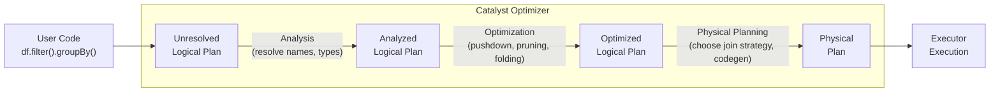
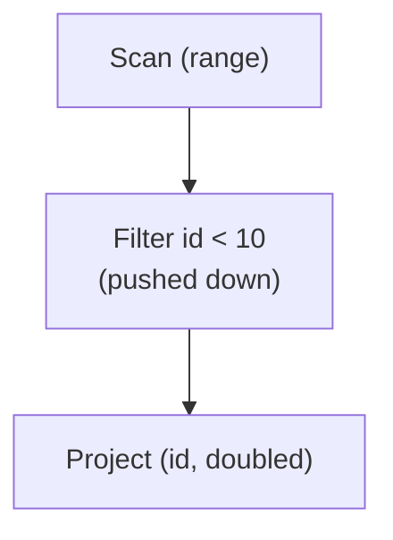

# Catalyst Optimizer

The **Catalyst Optimizer** is Spark's extensible query planning engine.  It transforms
your high-level DataFrame / SQL code through a series of plan phases — parsing,
analysis, optimization, and physical planning — before a single byte of data moves.

## Role in the Architecture



## Key Responsibilities

- **Parse** user code into an unresolved logical plan.
- **Analyze** — resolve column names, table references, and data types.
- **Optimize** — apply rule-based and cost-based optimizations.
- **Plan** — select physical operators (join strategy, scan type, codegen).

## Viewing Query Plans

Use `explain()` to inspect what Catalyst does with your query:

```python
from pyspark.sql import functions as F

df = spark.range(1000).filter(F.col("id") > 500).groupBy((F.col("id") % 10).alias("bucket")).count()

df.explain(mode="simple")     # (1)!
df.explain(mode="extended")   # (2)!
df.explain(mode="formatted")  # (3)!
```

1. Physical plan only — what actually runs.
2. All four phases: parsed → analysed → optimised → physical.
3. Human-readable formatted output with section headers.

## Optimization Rules

### Predicate Pushdown

Catalyst pushes filter predicates as close to the data source as possible,
reducing the amount of data read and shuffled:

```python
result = (spark.range(1000)
          .withColumn("doubled", F.col("id") * 2)
          .filter(F.col("id") < 10))     # (1)!

result.explain(mode="extended")
result.show()
```

1. Even though the filter is written after `withColumn`, Catalyst pushes it
   below the projection so fewer rows are processed.



### Column Pruning

Columns not referenced in the final output are eliminated early:

```python
df = spark.createDataFrame(
    [(1, "Alice", "NYC", 100.0)],
    ["id", "name", "city", "salary"],
)
result = df.select("name", "salary")   # (1)!
result.explain(mode="extended")
```

1. Catalyst prunes `id` and `city` from the scan — they are never materialised.

### Constant Folding

Compile-time constant expressions are evaluated during planning:

```python
df = spark.range(5).withColumn("secs_per_day", F.lit(60 * 60 * 24))
# Catalyst folds the expression into the literal 86400
```

## Adaptive Query Execution (AQE)

Since Spark 3.0, AQE re-optimises the plan **at runtime** using actual shuffle
statistics.  Key features:

| Feature | What it does |
| ------- | ------------ |
| Coalesce post-shuffle partitions | Merges small partitions to reduce task count |
| Convert sort-merge join → broadcast | Switches strategy when one side is small enough |
| Optimise skew joins | Splits skewed partitions for balanced execution |

```python
spark = (SparkSession.builder
         .config("spark.sql.adaptive.enabled", "true")                      # (1)!
         .config("spark.sql.adaptive.coalescePartitions.enabled", "true")   # (2)!
         .getOrCreate())
```

1. Master switch for AQE.
2. Automatically reduces partition count after shuffles.

!!! tip "AQE is enabled by default since Spark 3.2"
    You only need to set these explicitly on older versions or when overriding
    defaults in test environments.

## Configuration Reference

| Config key | Default | Description |
| ---------- | ------- | ----------- |
| `spark.sql.adaptive.enabled` | `true` (3.2+) | Enable Adaptive Query Execution |
| `spark.sql.adaptive.coalescePartitions.enabled` | `true` | Merge small post-shuffle partitions |
| `spark.sql.adaptive.localShuffleReader.enabled` | `true` | Avoid extra shuffle for co-partitioned data |
| `spark.sql.adaptive.skewJoin.enabled` | `true` | Split skewed partitions during joins |
| `spark.sql.autoBroadcastJoinThreshold` | `10MB` | Table size below which broadcast join is used |
| `spark.sql.cbo.enabled` | `false` | Enable Cost-Based Optimizer (needs table stats) |

## When to Use / Avoid

!!! success "Catalyst works automatically"
    - You don't need to call it explicitly — every DataFrame and SQL query goes through it
    - Use `explain()` to verify the optimizer is making sensible choices
    - Collect table statistics (`ANALYZE TABLE`) to unlock cost-based optimizations

!!! failure "When Catalyst can't help"
    - RDD API bypasses Catalyst entirely — prefer DataFrame/SQL for optimized plans
    - UDFs are opaque to the optimizer — use built-in `functions as F` where possible
    - Complex nested expressions may not be fully optimized

## Full Example

```python title="src/architecture/spark_catalyst.py"
--8<-- "src/architecture/spark_catalyst.py"
```

## Run

```bash
SPARK_MASTER=local[*] python src/architecture/spark_catalyst.py
```
