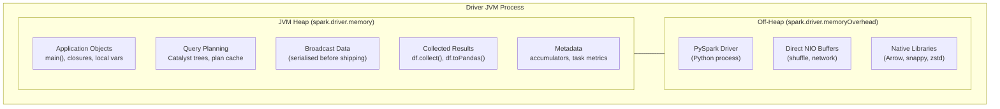
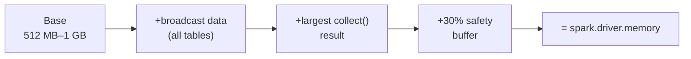
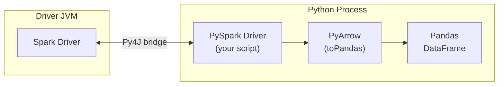

# Driver Memory

The Driver is a **single JVM process** that orchestrates the entire Spark application.
Its memory budget must cover the application logic, query planning, broadcast
variables, and any data collected back from Executors.  Because the Driver is a
single point of failure, running out of memory here kills the entire job.

## Memory Layout



## Memory Regions Explained

### JVM Heap (`spark.driver.memory`)

The main memory pool for the Driver process.  Default is **1 GB** — often too
small for production workloads.

| What lives here | Typical size | Risk when too small |
| --------------- | ------------ | ------------------- |
| Catalyst plan trees | Small (KB–MB) | Plans with 100+ joins can grow large |
| Broadcast variables | Size of broadcast data | `OutOfMemoryError` during broadcast |
| Collected results | Size of `collect()` output | OOM on large `collect()` / `toPandas()` |
| Accumulator values | Small (KB) | Rarely a problem |
| Application objects | Varies | OOM in user code |

### Off-Heap (`spark.driver.memoryOverhead`)

Additional memory **outside** the JVM heap.  Defaults to `max(384 MB, 0.1 × driverMemory)`.

!!! warning "PySpark doubles the overhead"
    In PySpark, the Driver runs a Python process alongside the JVM.  This Python
    process (and libraries like Pandas, NumPy, Arrow) consumes off-heap memory.
    Set `spark.driver.memoryOverhead` higher than the default for PySpark jobs.

### Max Result Size (`spark.driver.maxResultSize`)

Caps the total size of serialised results collected from all partitions in a
single action.  Default is **1 GB**.

```python
# If the result exceeds maxResultSize, Spark aborts the job
spark.conf.set("spark.driver.maxResultSize", "2g")
```

When this limit is hit you'll see:

```
org.apache.spark.SparkException: Job aborted: Total size of serialized results
of N tasks is bigger than spark.driver.maxResultSize (1024.0 MiB)
```

!!! tip "Set to `0` for unlimited (development only)"
    ```python
    spark.conf.set("spark.driver.maxResultSize", "0")  # no limit — risky in production
    ```

## Sizing Guide



**Rule of thumb:**

```
driver.memory ≥ base (1 GB)
               + sum of all broadcast table sizes
               + largest expected collect() result
               + 30% safety margin
```

| Workload | Recommended `driver.memory` | Notes |
| -------- | :-------------------------: | ----- |
| Simple ETL (no collect) | `1g`–`2g` | Default is fine |
| Broadcast joins (< 1 GB tables) | `2g`–`4g` | Account for serialised broadcast data |
| `df.toPandas()` on medium data | `4g`–`8g` | Entire DataFrame pulled to Driver |
| Complex plans (100+ joins) | `4g`+ | Catalyst tree consumes heap |
| ML pipelines with `collect()` | `8g`+ | Model params + result collection |

## Common OOM Patterns

### 1. Large `collect()` or `toPandas()`

```python
# BAD — pulls all 10M rows into Driver memory
df = spark.read.parquet("s3://bucket/huge-table/")
pdf = df.toPandas()  # OutOfMemoryError

# GOOD — filter or limit first
pdf = df.filter(F.col("date") == "2024-01-01").limit(10_000).toPandas()

# GOOD — write to storage instead
df.write.mode("overwrite").parquet("/tmp/output")
```

### 2. Broadcast too large

```python
# BAD — 5 GB table broadcast to every executor AND held in Driver memory
big_lookup = spark.read.parquet("s3://bucket/big-lookup/")
joined = events.join(F.broadcast(big_lookup), on="key")

# GOOD — let Spark choose the join strategy (sort-merge for large tables)
joined = events.join(big_lookup, on="key")
```

### 3. Too many accumulators or metrics

Each accumulator value is sent back to the Driver.  Thousands of custom
accumulators can consume noticeable memory.

## PySpark-Specific Considerations



When using `toPandas()` or `createDataFrame()` with Arrow:

- The data is serialised in the JVM → transferred via Py4J → deserialised in Python.
- **Both** the JVM and Python process hold copies temporarily.
- Set `spark.sql.execution.arrow.pyspark.enabled=true` for efficient Arrow transfer.

```python
spark.conf.set("spark.sql.execution.arrow.pyspark.enabled", "true")
pdf = df.limit(10_000).toPandas()  # uses Arrow — faster, but still consumes Driver memory
```

## Configuration Reference

| Config key | Default | Description |
| ---------- | ------- | ----------- |
| `spark.driver.memory` | `1g` | JVM heap for the Driver process |
| `spark.driver.memoryOverhead` | `max(384m, 0.1 × driverMemory)` | Off-heap memory (Python, native libs, NIO) |
| `spark.driver.maxResultSize` | `1g` | Max serialised result size per action |
| `spark.broadcast.blockSize` | `4m` | Chunk size for broadcast transfers |
| `spark.sql.autoBroadcastJoinThreshold` | `10485760` (10 MB) | Auto-broadcast threshold |
| `spark.sql.execution.arrow.pyspark.enabled` | `false` | Use Arrow for `toPandas()` / `createDataFrame()` |
| `spark.task.maxFailures` | `4` | Task retries before aborting the job |
| `spark.rpc.message.maxSize` | `128` (MB) | Max size of an RPC message (task results) |

## Troubleshooting

| Symptom | Likely cause | Fix |
| ------- | ------------ | --- |
| `java.lang.OutOfMemoryError: Java heap space` | Driver heap exhausted | Increase `spark.driver.memory` |
| `Total size of serialized results … is bigger than maxResultSize` | `collect()` result too large | Increase `maxResultSize` or reduce collected data |
| Python process killed (OOM Killer) | PySpark overhead too low | Increase `spark.driver.memoryOverhead` |
| Slow broadcast joins | Broadcast data near heap limit | Reduce broadcast table size or switch to sort-merge join |
| `GC overhead limit exceeded` | Too many objects on heap | Increase heap or reduce object creation |

## When to Tune Driver Memory

!!! success "Increase driver memory when"
    - Using `df.collect()`, `df.toPandas()`, or `df.take(n)` on large results
    - Broadcasting dimension tables larger than a few hundred MB
    - Running complex queries with many joins or subqueries
    - Using PySpark with Pandas/Arrow integration

!!! failure "Don't increase blindly"
    - More Driver memory ≠ faster Spark jobs (computation runs on Executors)
    - YARN/K8s may reject containers exceeding the node's available memory
    - On shared clusters, excessive Driver memory starves other applications

## Full Example

```python title="src/architecture/spark_driver_memory.py"
--8<-- "src/architecture/spark_driver_memory.py"
```

## Run

```bash
SPARK_MASTER=local[*] python src/architecture/spark_driver_memory.py
```
