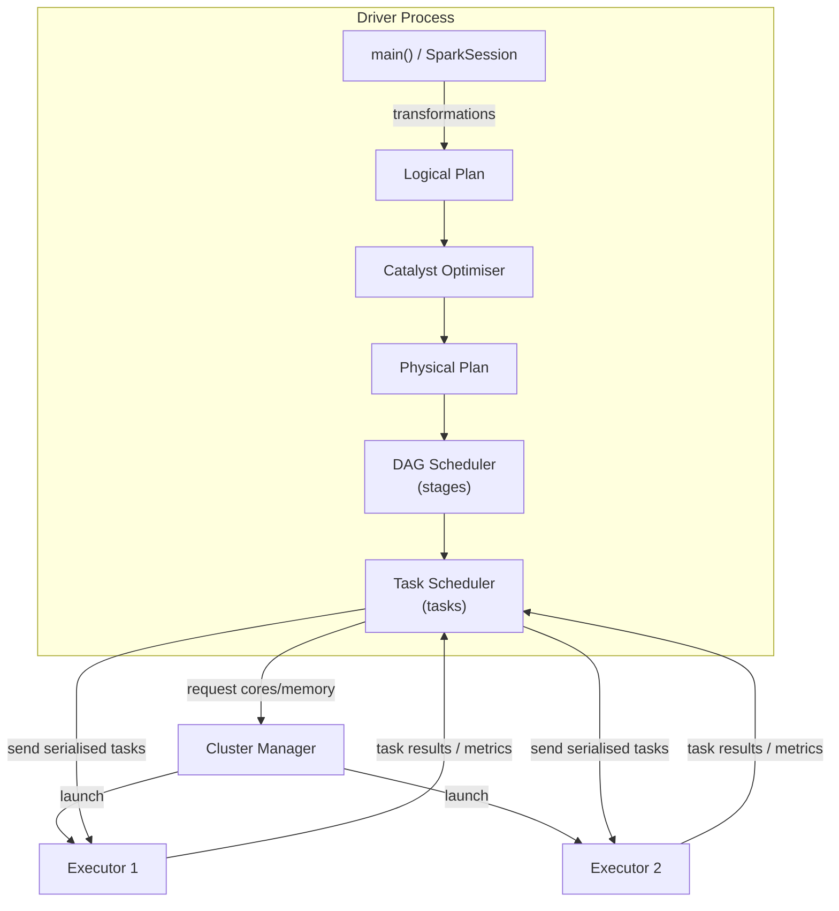
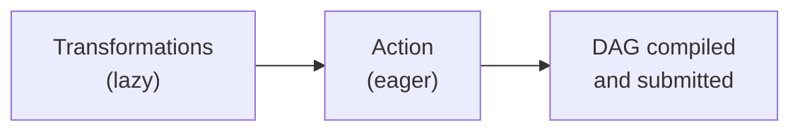
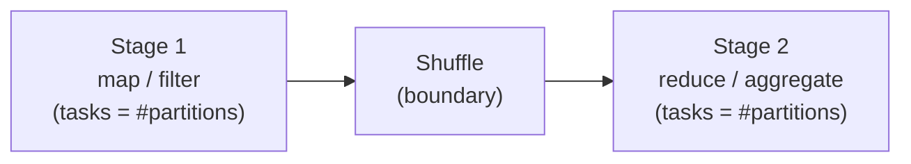

# Driver

The **Driver** is the JVM process that runs the `main()` function of your Spark
application.  It translates your high-level code into a physical execution plan
and coordinates work across Executors — but never touches the actual data itself.

## Role in the Architecture



## Key Responsibilities

- Host the `SparkSession` and `SparkContext`.
- Build the **logical plan** from transformation chains.
- Hand the plan to the **Catalyst Optimiser** for rewriting.
- Convert the optimised plan into a **physical plan** (stages and tasks).
- Negotiate resources with the **Cluster Manager**.
- Dispatch tasks to Executors and collect results.
- Manage **broadcast variables** and **accumulators**.

## Lazy Evaluation & the DAG

Transformations are **lazy** — calling `.filter()`, `.groupBy()`, or `.join()` only
appends a node to the logical plan; no data moves.  The DAG is compiled and
executed only when an **action** (`.show()`, `.count()`, `.write`) is called.



```python
from pyspark.sql import functions as F

df = spark.range(0, 1_000_000, numPartitions=4)    # lazy

# Each call below adds a node to the plan — still lazy
transformed = (df
               .withColumn("squared", F.col("id") * F.col("id"))
               .filter(F.col("squared") % 3 == 0)
               .withColumn("label",
                           F.when(F.col("id") % 2 == 0, "even").otherwise("odd")))

# .show() is the action — triggers DAG compilation + execution
transformed.agg(
    F.count("id").alias("count"),
    F.sum("squared").alias("total_squared"),
).show()
```

## Stages and Tasks

The DAG Scheduler breaks the plan into **stages** at shuffle boundaries.
Each stage contains a set of **tasks**, one per partition:



## Broadcast Variables

The Driver serialises the value once and ships it to every Executor.  Use for
**read-only** lookup tables that would otherwise be re-sent with every task:

```python
lookup = {1: "Alice", 2: "Bob", 3: "Charlie"}
bc = spark.sparkContext.broadcast(lookup)   # (1)!

df = spark.createDataFrame([(1,), (2,), (3,)], ["id"])
result = df.rdd.map(lambda row: (row["id"], bc.value.get(row["id"], "Unknown")))
print(result.collect())

bc.destroy()   # (2)!
```

1. Driver serialises `lookup` and sends it to each Executor's block manager.
2. Free the memory on all Executors when the broadcast is no longer needed.

## Accumulators

Executors increment an accumulator; the Driver reads the final tally.
Useful for counting records, errors, or custom metrics without a full collect:

```python
counter = spark.sparkContext.accumulator(0)

rdd = spark.sparkContext.parallelize(range(1, 101))
rdd.foreach(lambda x: counter.add(1))   # runs on Executors

print(f"Processed {counter.value} records")  # read on Driver → 100
```

## Driver Memory Configuration

| Config key | Default | Description |
| ---------- | ------- | ----------- |
| `spark.driver.memory` | `1g` | JVM heap for the Driver process |
| `spark.driver.memoryOverhead` | `driverMemory * 0.1` | Off-heap memory (native, PySpark) |
| `spark.driver.maxResultSize` | `1g` | Max size of data collected back to the Driver |
| `spark.broadcast.blockSize` | `4m` | Chunk size for broadcasting data |
| `spark.task.maxFailures` | `4` | Retries before failing the whole job |

!!! warning "Driver is a single point of failure"
    If the Driver process crashes, the entire application fails.  Avoid
    `df.collect()` on large datasets — it pulls all data into Driver memory.

## When to Use / Avoid

!!! success "Driver-side operations"
    - Assembling the transformation pipeline
    - Broadcasting small lookup tables (< a few GB)
    - Collecting small result sets for logging or assertions

!!! failure "Keep off the Driver"
    - Large `collect()` calls — use `write` to persist results instead
    - Heavy computation in `map` lambdas that could run on Executors
    - Opening JDBC connections per-partition from the Driver

## Full Example

```python title="src/spark_driver.py"
--8<-- "src/spark_driver.py"
```

## Run

```bash
SPARK_MASTER=local[*] python src/spark_driver.py
```
