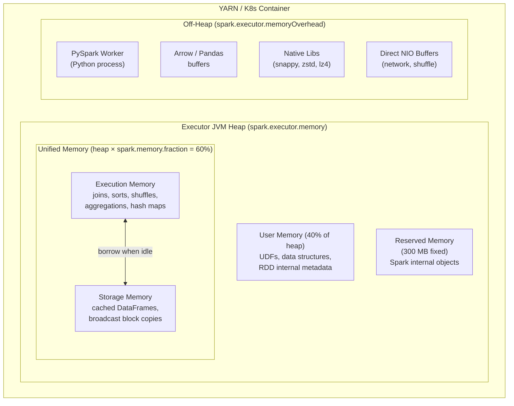
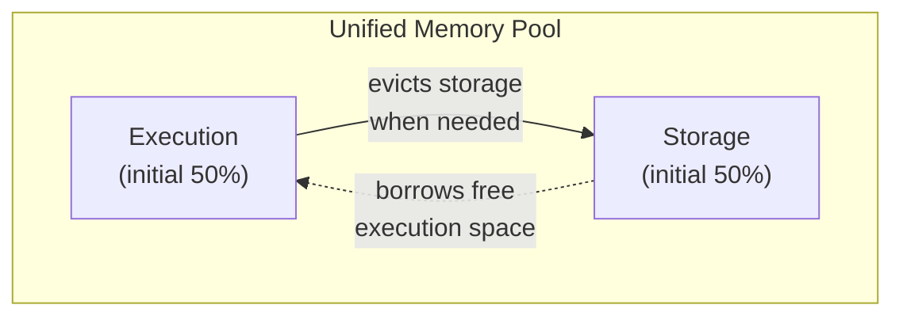
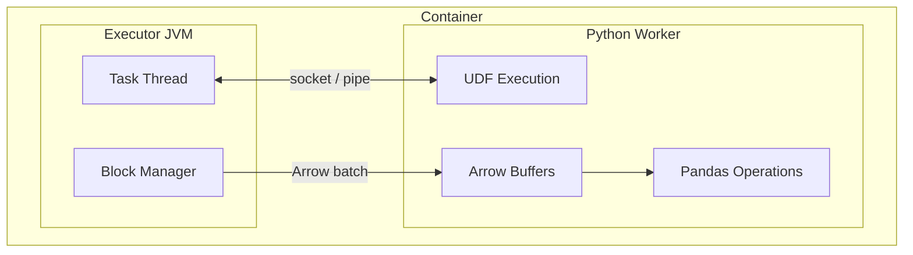
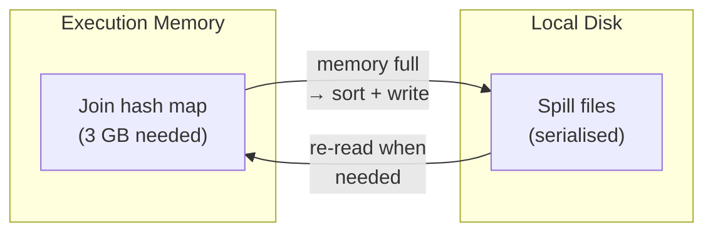

# Executor Memory

Each **Executor** is a JVM process on a Worker node.  Its memory is split between
**execution** (shuffles, joins, sorts), **storage** (cached data), **user code**
(UDFs, closures), and **off-heap** space (PySpark workers, native libraries).
Correct sizing is critical — too little causes spills and OOM errors; too much
wastes cluster resources.

## Memory Layout



## Memory Regions in Detail

### Unified Memory (`heap × spark.memory.fraction`)

The **unified memory pool** is dynamically shared between execution and storage.
Default: **60%** of heap (`spark.memory.fraction = 0.6`).

#### Execution Memory

Used for intermediate data during shuffles, joins, sorts, and aggregations.

- Hash maps for `groupBy` and `join` operations.
- Sort buffers for `orderBy`.
- Shuffle write/read buffers.
- **Can evict** cached storage blocks when under pressure.

#### Storage Memory

Used for cached DataFrames/RDDs and broadcast variable copies on the Executor.

- Starts with `spark.memory.storageFraction` (default **50%**) of unified memory.
- **Cannot evict** execution data — execution always wins when both pools compete.
- Expands into free execution space when execution is idle.



!!! note "Execution always wins"
    When execution needs more memory, it can evict cached blocks from storage.
    But storage can never evict execution data.  This means aggressive caching
    under heavy computation can lead to cache thrashing.

### User Memory

Everything **outside** the unified pool and reserved area: `heap × (1 - spark.memory.fraction) - 300 MB`.

- UDF closures and their local variables.
- RDD internal metadata (`Partition`, `Dependency` objects).
- Custom data structures in `mapPartitions` lambdas.

### Reserved Memory (300 MB)

Fixed overhead for Spark's internal objects.  Cannot be configured.  This is why
`spark.executor.memory` should **never** be set below 450 MB.

### Off-Heap (`spark.executor.memoryOverhead`)

Memory outside the JVM heap.  Default: `max(384 MB, 0.1 × executorMemory)`.

!!! warning "PySpark requires more overhead"
    Each Executor spawns a **Python worker process** per task slot.  These
    workers hold Python objects, Pandas DataFrames, and Arrow buffers in off-heap
    memory.  For PySpark jobs, set overhead to at least **0.2 × executorMemory**
    or higher.

    ```python
    .config("spark.executor.memoryOverhead", "2g")  # for heavy PySpark/Pandas usage
    ```

## Sizing Formula

For a node with **N GB** total memory, calculate:

```
Container memory  = spark.executor.memory + spark.executor.memoryOverhead
                  = heap + max(384 MB, 0.1 × heap)

Within the heap:
  Unified memory  = heap × 0.6
    Execution     = unified × 0.5  (initial)
    Storage       = unified × 0.5  (initial)
  User memory     = heap × 0.4 - 300 MB
  Reserved        = 300 MB
```

**Worked example — 8 GB container:**

| Region | Formula | Size |
| ------ | ------- | ---- |
| `spark.executor.memory` (heap) | | 6 GB |
| `spark.executor.memoryOverhead` | max(384 MB, 0.1 × 6 GB) | 2 GB |
| Unified memory | 6 GB × 0.6 | 3.6 GB |
| → Execution (initial) | 3.6 GB × 0.5 | 1.8 GB |
| → Storage (initial) | 3.6 GB × 0.5 | 1.8 GB |
| User memory | 6 GB × 0.4 − 300 MB | 2.1 GB |
| Reserved | fixed | 300 MB |
| **Total container** | heap + overhead | **8 GB** |

## Dynamic Allocation

Dynamic allocation adjusts the number of Executors based on workload.  This
affects total cluster memory usage without changing per-Executor sizing:

```python
spark = (SparkSession.builder
         .config("spark.dynamicAllocation.enabled", "true")
         .config("spark.dynamicAllocation.minExecutors", "2")
         .config("spark.dynamicAllocation.maxExecutors", "20")
         .config("spark.dynamicAllocation.executorIdleTimeout", "60s")
         .getOrCreate())
```

| Config | Default | Description |
| ------ | ------- | ----------- |
| `spark.dynamicAllocation.enabled` | `false` | Enable/disable dynamic allocation |
| `spark.dynamicAllocation.minExecutors` | `0` | Minimum executor count |
| `spark.dynamicAllocation.maxExecutors` | `∞` | Maximum executor count |
| `spark.dynamicAllocation.executorIdleTimeout` | `60s` | Remove idle executors after this duration |
| `spark.dynamicAllocation.schedulerBacklogTimeout` | `1s` | Add executors when tasks are pending |

!!! tip "Dynamic allocation + caching"
    Idle Executors may be removed even if they hold cached data.  Use
    `spark.dynamicAllocation.cachedExecutorIdleTimeout` (default `∞`) to keep
    Executors alive while they hold cached blocks.

## Garbage Collection Tuning

Frequent GC pauses on Executors cause task stalls and slow shuffles:

```python
# Use G1GC for large heaps (recommended for heap > 4 GB)
spark = (SparkSession.builder
         .config("spark.executor.extraJavaOptions",
                 "-XX:+UseG1GC -XX:InitiatingHeapOccupancyPercent=35 "
                 "-XX:G1HeapRegionSize=16m")
         .getOrCreate())
```

| Symptom | Likely cause | Fix |
| ------- | ------------ | --- |
| Long GC pauses (> 1s) | Large heap with many objects | Switch to G1GC, increase region size |
| Frequent minor GCs | High allocation rate | Increase young generation size |
| Full GC events | Heap too small for workload | Increase `spark.executor.memory` |

!!! note "Monitor GC in the Spark UI"
    The **Executors** tab shows GC time per Executor.  If GC time exceeds
    10% of total task time, tuning is needed.

## PySpark Memory Architecture



In PySpark, each task slot spawns a **separate Python worker process**:

- Python workers live in **off-heap** memory (`memoryOverhead`).
- Data flows JVM → Python via sockets (or Arrow for `pandas_udf`).
- Both JVM and Python hold copies of the data temporarily during transfer.
- `pandas_udf` operations materialise entire partitions as Pandas DataFrames.

**Sizing for PySpark:**

```python
# Typical PySpark config for heavy Pandas UDF usage
spark = (SparkSession.builder
         .config("spark.executor.memory", "4g")
         .config("spark.executor.memoryOverhead", "2g")     # (1)!
         .config("spark.executor.cores", "4")                # (2)!
         .config("spark.sql.execution.arrow.pyspark.enabled", "true")
         .getOrCreate())
```

1. 50% of heap as overhead — accounts for 4 concurrent Python workers.
2. Each core spawns a Python worker; more cores = more Python memory.

## Spill Behaviour

When execution memory is exhausted, data spills to the Executor's local disk:



Spills are visible in the Spark UI under **Shuffle Spill (Memory)** and
**Shuffle Spill (Disk)** columns.

**How to reduce spills:**

| Strategy | How |
| -------- | --- |
| Increase executor memory | `spark.executor.memory` = larger heap |
| Increase partitions | More partitions = less data per task |
| Use broadcast joins | Avoids shuffle entirely for small tables |
| Increase `memory.fraction` | More heap for execution (less user memory) |

## Configuration Reference

| Config key | Default | Description |
| ---------- | ------- | ----------- |
| `spark.executor.memory` | `1g` | JVM heap per Executor |
| `spark.executor.memoryOverhead` | `max(384m, 0.1 × executorMemory)` | Off-heap (PySpark, native libs, NIO) |
| `spark.executor.cores` | `1` (YARN/K8s) | CPU cores (task slots) per Executor |
| `spark.executor.instances` | *(varies)* | Fixed Executor count (static allocation) |
| `spark.memory.fraction` | `0.6` | Unified memory as fraction of heap |
| `spark.memory.storageFraction` | `0.5` | Storage share within unified memory |
| `spark.memory.offHeap.enabled` | `false` | Enable off-heap memory pool |
| `spark.memory.offHeap.size` | `0` | Off-heap pool size |
| `spark.executor.extraJavaOptions` | *(none)* | JVM flags (GC tuning, logging) |
| `spark.python.worker.memory` | `512m` | Memory limit per Python worker |
| `spark.sql.execution.arrow.pyspark.enabled` | `false` | Arrow-based data transfer |

## Troubleshooting

| Symptom | Likely cause | Fix |
| ------- | ------------ | --- |
| `java.lang.OutOfMemoryError: Java heap space` | Executor heap too small | Increase `spark.executor.memory` |
| `Container killed by YARN for exceeding memory limits` | Off-heap usage exceeded overhead | Increase `spark.executor.memoryOverhead` |
| Large shuffle spill (Disk) | Execution memory insufficient | Increase heap, partitions, or use broadcast joins |
| Slow tasks with high GC time | Heap fragmentation / too many objects | Tune GC (`G1GC`), increase heap |
| Python worker OOM (PySpark) | Python memory > overhead | Increase `memoryOverhead`, reduce `executor.cores` |
| `FetchFailedException` during shuffle | Executor lost (OOM killed) | Increase memory, reduce data per partition |

## Sizing Recommendations by Workload

| Workload | `executor.memory` | `executor.cores` | `memoryOverhead` | Notes |
| -------- | :----------------: | :---------------: | :---------------: | ----- |
| Simple ETL | 2–4 GB | 2–4 | Default (10%) | Low memory pressure |
| Heavy joins/aggregations | 4–8 GB | 4–5 | 1–2 GB | Sort buffers need execution memory |
| PySpark + Pandas UDFs | 4–8 GB | 2–4 | 2–4 GB | Python workers are memory-hungry |
| ML training (`MLlib`) | 8–16 GB | 4–5 | 2–4 GB | Large models + broadcast |
| Streaming (micro-batch) | 2–4 GB | 2–4 | 1 GB | Keep overhead low for fast scheduling |

!!! success "General guidelines"
    - **4–5 cores** per Executor balances parallelism and HDFS throughput
    - **Overhead ≥ 20%** of heap for PySpark jobs
    - Leave **1 core + 1 GB** per node for the OS and YARN NodeManager
    - Prefer **fewer large Executors** over many small ones (reduces shuffle connections)

!!! failure "Common mistakes"
    - Setting `executor.memory` to the full node memory (leaves nothing for overhead/OS)
    - Using too many cores per Executor (> 5 degrades HDFS throughput)
    - Ignoring `memoryOverhead` for PySpark (Python workers are not counted in heap)
    - Same config for all jobs — ETL and ML workloads need different tuning
