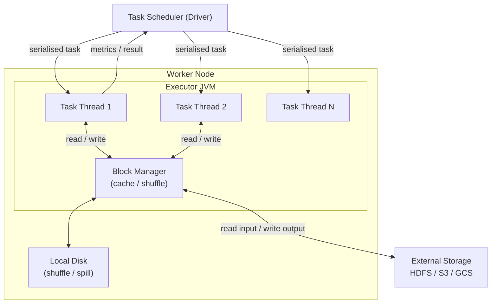
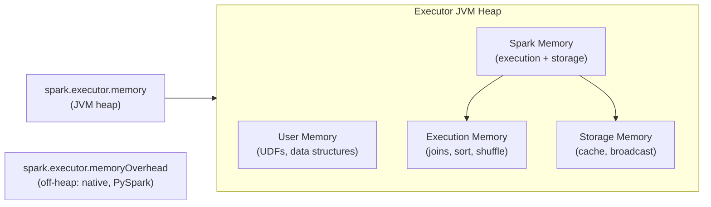

# Executor

An **Executor** is a JVM process launched on a Worker node by the Cluster Manager.
Each Executor hosts a pool of **task threads** and a **block manager** for caching.
Executors are the only processes that touch actual data.

## Role in the Architecture



## Key Responsibilities

- Execute individual **tasks** assigned by the Driver's Task Scheduler.
- Store **cached RDD/DataFrame partitions** in memory or on disk (Block Manager).
- Participate in **shuffle** — write shuffle files for downstream stages.
- Return **task results** and metrics back to the Driver.

## Partitions — Unit of Parallelism

Each partition maps to exactly **one task** on one Executor core.
The number of partitions directly controls the degree of parallelism:

```python
df = spark.range(0, 20, numPartitions=4)   # 4 partitions → 4 parallel tasks

def tag_partition(idx: int, rows):
    for row in rows:
        yield (idx, int(row["id"]))

tagged = df.rdd.mapPartitionsWithIndex(tag_partition)
for partition_id, value in tagged.collect():
    print(f"  Partition {partition_id}: id={value}")
```

!!! tip "Choosing the right partition count"
    A good rule of thumb: **2–4× the number of total Executor cores**.
    Too few → underutilised cores.  Too many → scheduling overhead.

## Repartition vs Coalesce

```python
df = spark.range(0, 100, numPartitions=2)
print(f"Original:          {df.rdd.getNumPartitions()} partitions")

# repartition — full shuffle, can increase or decrease
repartitioned = df.repartition(8)
print(f"After repartition: {repartitioned.rdd.getNumPartitions()} partitions")

# coalesce — no shuffle when reducing; merges existing partitions
coalesced = repartitioned.coalesce(2)
print(f"After coalesce:    {coalesced.rdd.getNumPartitions()} partitions")
```

| Method | Shuffle? | Use when |
| ------ | -------- | -------- |
| `repartition(n)` | Yes | Increasing partitions, or distributing data evenly |
| `coalesce(n)` | No (when reducing) | Reducing partitions cheaply before a `write` |

## Caching & Persistence

Executors store cached partitions in their Block Manager.  Choose a storage
level based on available memory and read frequency:

```python
from pyspark.storagelevel import StorageLevel

df = spark.range(0, 10_000)

df.persist(StorageLevel.MEMORY_AND_DISK)   # (1)!
df.count()     # materialises the cache on Executors

df.count()     # served from Executor memory — no re-computation
df.unpersist() # (2)!
```

1. Spills to local Executor disk when memory is insufficient.
2. Always unpersist when the cached DataFrame is no longer needed.

### Storage Levels

| Level | Memory | Disk | Serialised | Replicated |
| ----- | :----: | :--: | :--------: | :--------: |
| `MEMORY_ONLY` | ✅ | ❌ | ❌ | ❌ |
| `MEMORY_AND_DISK` | ✅ | ✅ | ❌ | ❌ |
| `MEMORY_ONLY_SER` | ✅ | ❌ | ✅ | ❌ |
| `DISK_ONLY` | ❌ | ✅ | ✅ | ❌ |
| `MEMORY_AND_DISK_2` | ✅ | ✅ | ❌ | ✅ |

!!! tip "Use `df.cache()` as a shortcut"
    `df.cache()` is equivalent to `df.persist(StorageLevel.MEMORY_AND_DISK)` and is
    the most common choice.

## Executor Memory Configuration

For a detailed deep-dive into Executor memory layout, sizing formulas, dynamic
allocation, GC tuning, and PySpark overhead, see **[Executor Memory](executor-memory.md)**.



| Config key | Default | Description |
| ---------- | ------- | ----------- |
| `spark.executor.memory` | `1g` | JVM heap per Executor |
| `spark.executor.memoryOverhead` | `executorMemory × 0.1` | Off-heap (PySpark, native libs) |
| `spark.executor.cores` | `1` (YARN/K8s) | Task threads per Executor |
| `spark.executor.instances` | *(varies)* | Fixed number of Executors (static allocation) |
| `spark.memory.fraction` | `0.6` | Fraction of heap for Spark memory pool |
| `spark.memory.storageFraction` | `0.5` | Fraction of Spark memory reserved for cache |

## When to Use / Avoid

!!! success "Executor best practices"
    - Cache DataFrames reused in multiple actions with `.cache()`
    - Use `coalesce()` before writing to reduce small output files
    - Tune `spark.executor.cores` to 4–5 for balanced parallelism

!!! failure "Common pitfalls"
    - Caching DataFrames that are used only once — wastes Executor memory
    - Too many small partitions — scheduler overhead dominates
    - Forgetting `unpersist()` — evicts other useful cached data

## Full Example

```python title="src/spark_executor.py"
--8<-- "src/architecture/spark_executor.py"
```

## Run

```bash
SPARK_MASTER=local[*] python src/architecture/spark_executor.py
```
