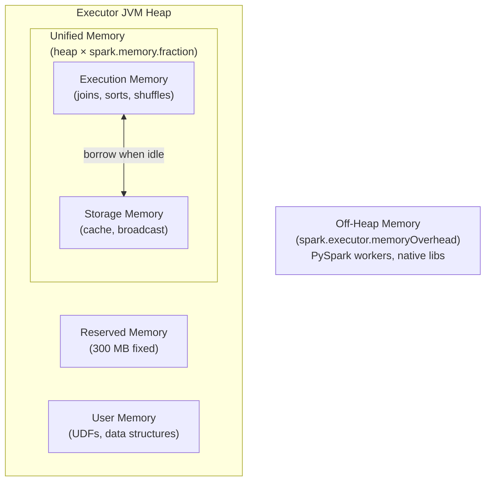
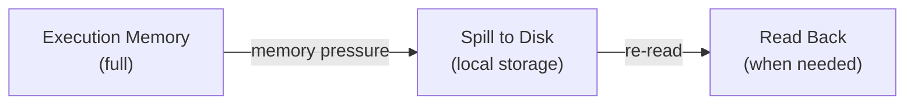

# Memory Management

Spark's **unified memory manager** dynamically shares JVM heap space between
**execution** (joins, sorts, shuffles) and **storage** (cached DataFrames,
broadcast variables).  Understanding this model is key to avoiding OOM errors
and maximising throughput.

## Role in the Architecture



## Memory Pools

| Pool | Config | Default | Purpose |
| ---- | ------ | ------- | ------- |
| **Unified Memory** | `spark.memory.fraction` | `0.6` | Execution + storage combined |
| **Storage** | `spark.memory.storageFraction` | `0.5` | Initial fraction of unified memory reserved for cache |
| **User Memory** | *(remainder)* | `0.4 × heap` | UDFs, internal data structures |
| **Reserved** | *(fixed)* | `300 MB` | Internal Spark overhead |
| **Off-Heap** | `spark.executor.memoryOverhead` | `max(384 MB, 0.1 × executor memory)` | PySpark, native libs |

!!! note "Dynamic borrowing"
    Execution can evict cached blocks when it needs more memory. Storage can
    expand into free execution space. This makes the boundary **soft** rather
    than hard-partitioned.

## Storage Levels

When you call `.cache()` or `.persist()`, the Block Manager stores partitions
according to the chosen storage level:

```python
from pyspark.storagelevel import StorageLevel

df = spark.range(100_000)

df.persist(StorageLevel.MEMORY_ONLY)       # (1)!
df.persist(StorageLevel.MEMORY_AND_DISK)   # (2)!
df.persist(StorageLevel.MEMORY_ONLY_SER)   # (3)!
df.persist(StorageLevel.DISK_ONLY)         # (4)!
```

1. Keep deserialized Java objects in memory; drop partition if it doesn't fit.
2. Spill to local disk when memory is insufficient — **most common choice**.
3. Serialize before storing — smaller footprint, higher CPU cost on read.
4. Write all partitions to disk — slowest reads, but never evicted from memory.

| Level | Memory | Disk | Serialised | Replicated |
| ----- | :----: | :--: | :--------: | :--------: |
| `MEMORY_ONLY` | ✅ | ❌ | ❌ | ❌ |
| `MEMORY_AND_DISK` | ✅ | ✅ | ❌ | ❌ |
| `MEMORY_ONLY_SER` | ✅ | ❌ | ✅ | ❌ |
| `DISK_ONLY` | ❌ | ✅ | ✅ | ❌ |
| `MEMORY_AND_DISK_2` | ✅ | ✅ | ❌ | ✅ (2×) |

!!! tip "Use `df.cache()` as a shortcut"
    `df.cache()` is equivalent to `df.persist(StorageLevel.MEMORY_AND_DISK)`.

## Cache vs Checkpoint

| Feature | `cache()` / `persist()` | `checkpoint()` |
| ------- | :---------------------: | :------------: |
| Storage | Executor memory / disk | Reliable storage (HDFS / S3) |
| Lineage | Preserved (can recompute) | **Truncated** |
| Speed | Fast (in-process) | Slower (write to external FS) |
| Use case | Reuse within a job | Break long lineages to avoid stack overflows |

```python
# Cache — keeps lineage for recomputation
df.cache()
df.count()

# Checkpoint — saves to reliable storage and truncates lineage
spark.sparkContext.setCheckpointDir("/tmp/spark-checkpoint")
df.rdd.checkpoint()
df.count()   # triggers checkpoint write
```

!!! warning "Always set a checkpoint directory before calling `checkpoint()`"
    Without `setCheckpointDir()`, Spark raises an error.

## Serialization

Serialisation affects both **shuffle size** and **cache footprint**:

| Serializer | Config value | Pros | Cons |
| ---------- | ------------ | ---- | ---- |
| Java (default) | `org.apache.spark.serializer.JavaSerializer` | Simple, debuggable | Slow, large |
| Kryo | `org.apache.spark.serializer.KryoSerializer` | Fast, compact | Needs class registration |

```python
spark = (SparkSession.builder
         .config("spark.serializer", "org.apache.spark.serializer.KryoSerializer")
         .config("spark.kryo.registrationRequired", "false")
         .getOrCreate())
```

## Spill to Disk

When execution memory is exhausted during a sort, join, or aggregation, Spark
**spills** data to the Executor's local disk.  Spills are expensive (disk I/O +
re-serialisation) and visible in the Spark UI under the **Spill** columns.



To reduce spills:

- Increase `spark.executor.memory` or `spark.memory.fraction`.
- Increase partition count so each partition holds less data.
- Use `MEMORY_AND_DISK` persistence to avoid recomputation.

## Configuration Reference

| Config key | Default | Description |
| ---------- | ------- | ----------- |
| `spark.executor.memory` | `1g` | JVM heap per Executor |
| `spark.executor.memoryOverhead` | `max(384m, 0.1 × executor memory)` | Off-heap (PySpark, native libs) |
| `spark.memory.fraction` | `0.6` | Fraction of heap for unified memory pool |
| `spark.memory.storageFraction` | `0.5` | Initial storage share of unified memory |
| `spark.memory.offHeap.enabled` | `false` | Enable off-heap memory for execution/storage |
| `spark.memory.offHeap.size` | `0` | Off-heap memory size (requires `offHeap.enabled`) |
| `spark.serializer` | `JavaSerializer` | Serialization library |
| `spark.kryo.registrationRequired` | `false` | Require Kryo class registration |

## When to Use / Avoid

!!! success "Memory best practices"
    - Cache DataFrames used in multiple actions with `.cache()`
    - Always `unpersist()` when a cached DataFrame is no longer needed
    - Use `checkpoint()` to break very long lineage chains (> 100 transformations)
    - Monitor the Spark UI **Storage** tab for cache hit rates

!!! failure "Common memory pitfalls"
    - Caching DataFrames used only once — wastes executor memory
    - Forgetting `unpersist()` — evicts other useful cached data via LRU
    - Large `collect()` calls — pulls all data into Driver memory
    - Ignoring `memoryOverhead` for PySpark — Python workers need off-heap space

## Full Example

```python title="src/architecture/spark_memory.py"
--8<-- "src/architecture/spark_memory.py"
```

## Run

```bash
SPARK_MASTER=local[*] python src/architecture/spark_memory.py
```
