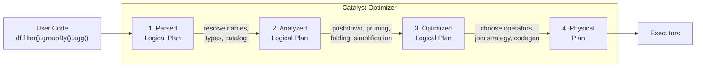
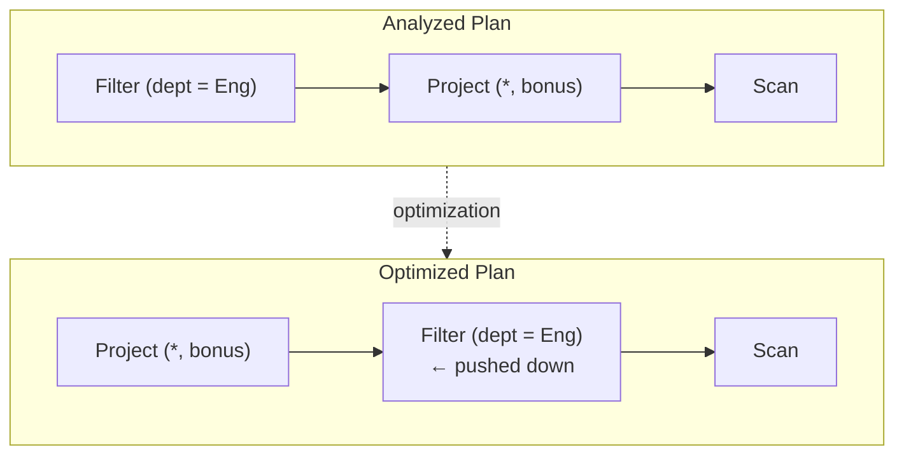
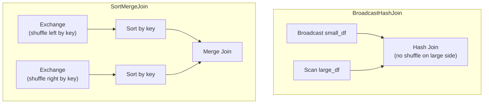

# Query Plans

Every DataFrame operation and SQL query passes through **four plan phases**
before any data moves.  Understanding these phases is key to reading `explain()`
output, diagnosing performance issues, and knowing *why* Spark executes your
query the way it does.

## The Four Phases



| Phase | Input | Output | Key operations |
| ----- | ----- | ------ | -------------- |
| **Parsed** | User code (DataFrame API or SQL) | Unresolved logical tree | Build AST; column names may be unresolved |
| **Analyzed** | Unresolved logical tree | Resolved logical tree | Resolve names, types, catalog; expand `*`; validate |
| **Optimized** | Resolved logical tree | Optimized logical tree | Predicate pushdown, column pruning, constant folding, boolean simplification |
| **Physical** | Optimized logical tree | Executable plan | Choose join strategy, scan type, exchange placement, codegen |

---

## 1. Parsed Logical Plan

The **parser** converts your DataFrame operations (or SQL text) into a tree of
logical operators.  At this stage, column and table references may be
**unresolved** — the parser doesn't check whether `salary` actually exists.

```python
df = employees.select("name", "salary").filter(F.col("salary") > 80000)

parsed = df._jdf.queryExecution().logical().toString()
print(parsed)
```

```
'Filter (salary#4 > 80000.0)
+- Project [name#1, salary#3]
   +- LogicalRDD [id#0, name#1, dept#2, salary#3]
```

!!! note "Parser preserves user intent"
    The parsed plan mirrors the order of operations you wrote.  If you write
    `withColumn` then `filter`, that's the exact order in the parsed tree.
    Reordering happens in the **optimization** phase.

### What to look for

- **`Filter`**, **`Project`**, **`Aggregate`** — the logical operators
- Column references like `salary#4` — the `#4` is an internal expression ID
- Unresolved references (more common in SQL-parsed plans)

---

## 2. Analyzed Logical Plan

The **analyzer** resolves every reference against the catalog and schema:

- Column names → resolved to their source DataFrame with data types
- `*` → expanded to the full column list
- Cast operations → inserted explicitly
- Aliases → resolved and propagated

```python
analyzed = df._jdf.queryExecution().analyzed().toString()
```

```
'Filter (salary#3: double > 80000.0)
+- Project [name#1: string, salary#3: double]
   +- LogicalRDD [id#0: int, name#1: string, dept#2: string, salary#3: double]
```

!!! tip "Analyzed plan catches errors early"
    If you reference a column that doesn't exist, the analyzer raises an
    `AnalysisException` — before any data processing begins:
    ```python
    df.select("nonexistent_column")
    # AnalysisException: cannot resolve 'nonexistent_column'
    ```

### Star expansion

```python
result = employees.select("*")
# Analyzed plan expands to: Project [id#0, name#1, dept#2, salary#3]
```

### Type resolution

```python
result = employees.withColumn("sal_int", F.col("salary").cast("int"))
# Analyzed plan shows: cast(salary#3 as int) AS sal_int#8
```

---

## 3. Optimized Logical Plan

The **optimizer** applies dozens of rules to rewrite the analyzed plan into a
more efficient form.  The key rules:

### Predicate Pushdown

Moves filters closer to the data source, reducing rows processed by downstream
operators:

```python
# User writes: withColumn → filter
result = df.withColumn("bonus", F.col("salary") * 0.1).filter(F.col("dept") == "Eng")
```



### Column Pruning

Drops columns that are never used in the final output:

```python
result = employees.select("name")
# Optimized plan scans only the 'name' column — id, dept, salary are pruned
```

### Constant Folding

Evaluates constant expressions at plan time:

```python
df.withColumn("minutes_per_year", F.lit(365 * 24 * 60))
# Optimized plan contains the literal 525600 — not the multiplication
```

### Boolean Simplification

Simplifies always-true or redundant boolean expressions:

```python
df.filter(F.lit(True) & (F.col("salary") > 0))
# Optimized: true AND (salary > 0) → salary > 0
```

### Combine Filters

Merges consecutive filter nodes into a single predicate:

```python
df.filter(F.col("dept") == "Eng").filter(F.col("salary") > 90000)
# Optimized: Filter ((dept = 'Eng') AND (salary > 90000))
```

### Impossible Predicate Elimination

If a filter can never be true, Catalyst replaces the subtree with an empty
`LocalRelation`:

```python
df.filter(F.lit(False))
# Optimized: LocalRelation <empty> — no scan at all
```

---

## 4. Physical Plan

The **planner** converts the optimized logical plan into a tree of **physical
operators** — the actual code that runs on Executors:

| Logical concept | Physical operator(s) |
| --------------- | -------------------- |
| Filter | `Filter` (with codegen) |
| Project | `Project` (with codegen) |
| Aggregate | `HashAggregate` (partial + final) |
| Join | `BroadcastHashJoin`, `SortMergeJoin`, `ShuffleHashJoin` |
| Sort | `Sort` |
| Shuffle | `Exchange` (hashpartitioning / rangepartitioning) |
| Scan | `InMemoryTableScan`, `FileScan`, `ExternalRDDScan` |

### Join Strategy Selection

```python
# Broadcast Hash Join — small table broadcast to all executors
joined = large_df.join(F.broadcast(small_df), on="key")

# Sort-Merge Join — both sides shuffled and sorted
joined = left.hint("merge").join(right, on="key")
```



### Whole-Stage Code Generation

Spark fuses multiple physical operators into a single Java method using
**whole-stage codegen** for maximum performance.  In the plan output, codegen
boundaries appear as `WholeStageCodegen` wrappers, and operators inside them
are prefixed with `*`:

```
*(1) HashAggregate(keys=[dept#2], functions=[sum(salary#3)])
+- Exchange hashpartitioning(dept#2, 200)
   +- *(2) HashAggregate(keys=[dept#2], functions=[partial_sum(salary#3)])
      +- *(2) Filter (salary#3 > 70000.0)
         +- *(2) Scan ExternalRDDScan [id#0, name#1, dept#2, salary#3]
```

### AdaptiveSparkPlan

When AQE is enabled, the physical plan is wrapped in `AdaptiveSparkPlan`.
The plan may be **re-optimized at runtime** based on actual shuffle statistics:

```
AdaptiveSparkPlan isFinalPlan=false
+- HashAggregate(...)
   +- Exchange hashpartitioning(...)
      +- HashAggregate(...)
```

!!! note "`isFinalPlan=false`"
    This means AQE hasn't finalized the plan yet — it will adapt at runtime.
    After execution, `isFinalPlan=true` shows the final chosen plan.

---

## SQL vs DataFrame API

Both APIs go through the **exact same** Catalyst pipeline.  The optimized plans
are equivalent:

```python
# DataFrame API
df_result = employees.filter(F.col("dept") == "Eng").select("name", "salary")

# SQL API
employees.createOrReplaceTempView("emp")
sql_result = spark.sql("SELECT name, salary FROM emp WHERE dept = 'Eng'")

# Both produce the same optimized plan and identical results
```

!!! tip "Use whichever API feels natural"
    There is no performance difference between SQL and DataFrame API —
    Catalyst optimizes both identically.

---

## Accessing Plans Programmatically

```python
qe = df._jdf.queryExecution()

parsed    = qe.logical().toString()       # (1)!
analyzed  = qe.analyzed().toString()      # (2)!
optimized = qe.optimizedPlan().toString() # (3)!
physical  = qe.executedPlan().toString()  # (4)!
```

1. Raw AST — unresolved references.
2. Resolved names, types, and catalog references.
3. After all optimization rules have been applied.
4. Concrete operators with join strategies and codegen.

Or use `explain()` for a formatted view:

```python
df.explain(mode="simple")     # physical plan only
df.explain(mode="extended")   # all four phases
df.explain(mode="formatted")  # human-readable with section headers
df.explain(mode="cost")       # includes cost estimates (when CBO is enabled)
df.explain(mode="codegen")    # shows generated Java code
```

## Configuration Reference

| Config key | Default | Description |
| ---------- | ------- | ----------- |
| `spark.sql.adaptive.enabled` | `true` (3.2+) | AQE re-optimizes physical plan at runtime |
| `spark.sql.autoBroadcastJoinThreshold` | `10485760` (10 MB) | Auto-broadcast join threshold |
| `spark.sql.cbo.enabled` | `false` | Cost-Based Optimizer (needs `ANALYZE TABLE` stats) |
| `spark.sql.cbo.joinReorder.enabled` | `false` | CBO-based join reordering |
| `spark.sql.codegen.wholeStage` | `true` | Enable whole-stage code generation |
| `spark.sql.optimizer.maxIterations` | `100` | Max rule application iterations |

## Full Example

```python title="src/architecture/spark_query_plans.py"
--8<-- "src/architecture/spark_query_plans.py"
```

## Run

```bash
SPARK_MASTER=local[*] python src/architecture/spark_query_plans.py
```
