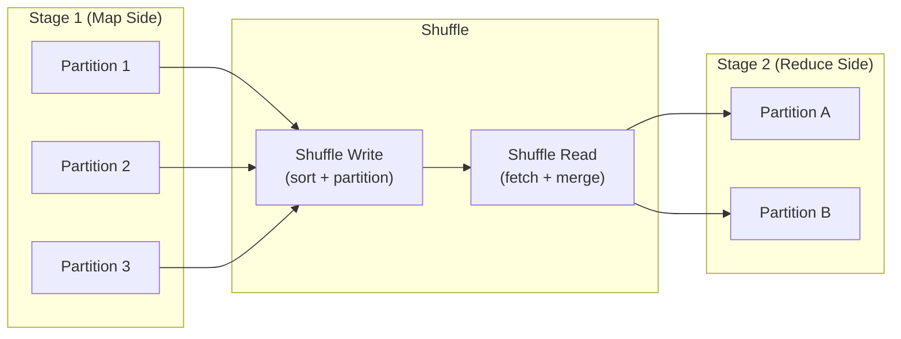
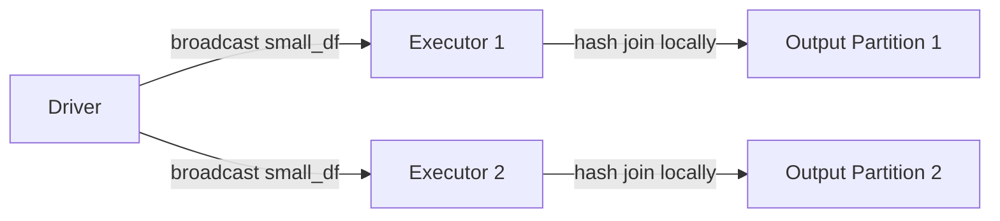
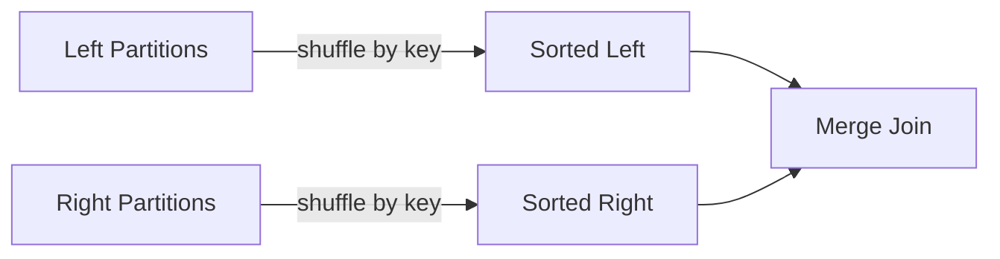
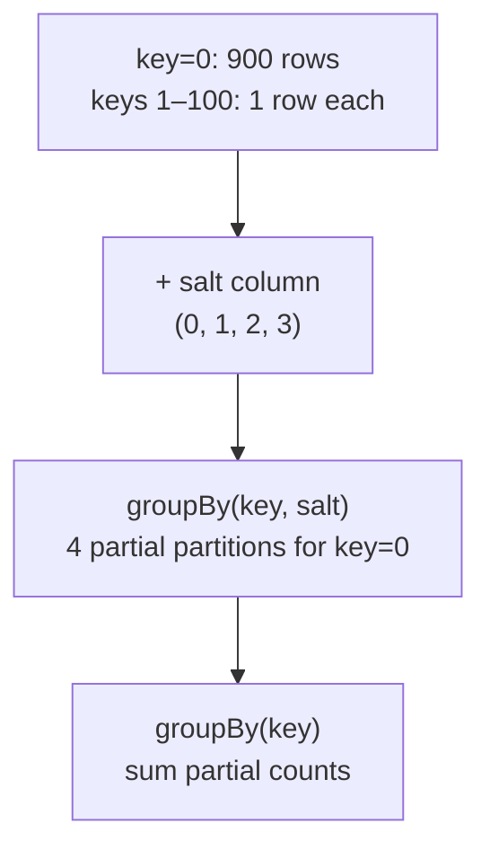

# Shuffle

A **shuffle** is the mechanism Spark uses to redistribute data across partitions
when a transformation requires co-locating rows by key — such as `groupBy`,
`join`, `repartition`, or `distinct`.  Shuffles are the most expensive operation
in a Spark job: they involve serialisation, disk I/O, and network transfer.

## Role in the Architecture



## Narrow vs Wide Transformations

| Type | Examples | Shuffle? | Partitions |
| ---- | -------- | :------: | ---------- |
| **Narrow** | `filter`, `map`, `withColumn`, `union` | ❌ | Unchanged |
| **Wide** | `groupBy`, `join`, `repartition`, `distinct` | ✅ | Determined by `shuffle.partitions` |

```python
from pyspark.sql import functions as F

df = spark.range(100, numPartitions=4)

# Narrow — each partition transforms independently
narrow = df.filter(F.col("id") % 2 == 0)
print(narrow.rdd.getNumPartitions())  # still 4

# Wide — groupBy triggers a shuffle
wide = df.withColumn("bucket", F.col("id") % 5).groupBy("bucket").count()
wide.explain()   # look for "Exchange" in the plan
```

!!! tip "How to spot a shuffle"
    Look for **Exchange** (or **ShuffleExchange**) in the physical plan output
    from `df.explain()`.

## Join Strategies

Spark supports multiple join strategies. The optimizer picks one automatically,
but you can guide it with hints:

### Broadcast Hash Join

The smaller table is broadcast to every executor — **no shuffle** on the large side:

```python
joined = large_df.join(F.broadcast(small_df), on="key")   # (1)!
```

1. Forces a broadcast even if the table exceeds `autoBroadcastJoinThreshold`.



### Sort-Merge Join

Both sides are **shuffled and sorted** by the join key, then merged:

```python
joined = left.hint("merge").join(right, on="key")
```



| Strategy | Shuffle? | Best when |
| -------- | :------: | --------- |
| Broadcast Hash | No (large side) | One side fits in memory (< 10 MB default) |
| Sort-Merge | Both sides | Both sides are large |
| Shuffle Hash | Both sides | One side is moderately smaller |

## Shuffle Partitions

`spark.sql.shuffle.partitions` controls how many output partitions a shuffle produces:

```python
spark.conf.get("spark.sql.shuffle.partitions")   # default: "200"

# Override for small local datasets
spark.conf.set("spark.sql.shuffle.partitions", "4")
```

!!! warning "Default 200 is rarely optimal"
    - **Too high** for small data → thousands of tiny tasks and scheduling overhead.
    - **Too low** for large data → each partition is too big and may spill to disk.
    - With AQE enabled, Spark can coalesce small partitions automatically.

## Handling Data Skew

When one key has far more rows than others, its partition becomes a bottleneck:

```python
# Skewed data — key 0 has 90% of rows
data = [(0, "a")] * 900 + [(i, "b") for i in range(1, 101)]
df = spark.createDataFrame(data, ["key", "value"])

# Salt the hot key to spread it across partitions
salted = df.withColumn("salt", (F.rand() * 4).cast("int"))
result = (salted
          .groupBy("key", "salt")
          .agg(F.count("value").alias("partial"))  # (1)!
          .groupBy("key")
          .agg(F.sum("partial").alias("total")))    # (2)!
```

1. First pass: partial aggregation with salted key — spreads work evenly.
2. Second pass: combine the partial counts — tiny shuffle.



!!! tip "AQE skew join optimization"
    With `spark.sql.adaptive.skewJoin.enabled=true` (default since Spark 3.0),
    AQE can automatically split skewed partitions during joins.

## Configuration Reference

| Config key | Default | Description |
| ---------- | ------- | ----------- |
| `spark.sql.shuffle.partitions` | `200` | Output partitions after a shuffle |
| `spark.sql.autoBroadcastJoinThreshold` | `10485760` (10 MB) | Max table size for auto-broadcast |
| `spark.shuffle.compress` | `true` | Compress shuffle output |
| `spark.shuffle.spill.compress` | `true` | Compress spill files |
| `spark.reducer.maxSizeInFlight` | `48m` | Buffer size for shuffle fetch |
| `spark.shuffle.file.buffer` | `32k` | Buffer size for shuffle write |
| `spark.sql.adaptive.skewJoin.enabled` | `true` | AQE automatic skew handling |

## When to Use / Avoid

!!! success "Minimise shuffles"
    - Use `F.broadcast()` for small dimension tables
    - Pre-partition data by the join key with `repartition("key")` before multiple joins
    - Use `coalesce()` instead of `repartition()` when only reducing partitions

!!! failure "Shuffle anti-patterns"
    - Calling `repartition()` before every action — shuffles are expensive
    - Setting `shuffle.partitions` too high for small datasets
    - Ignoring data skew — leads to straggler tasks

## Full Example

```python title="src/architecture/spark_shuffle.py"
--8<-- "src/architecture/spark_shuffle.py"
```

## Run

```bash
SPARK_MASTER=local[*] python src/architecture/spark_shuffle.py
```
