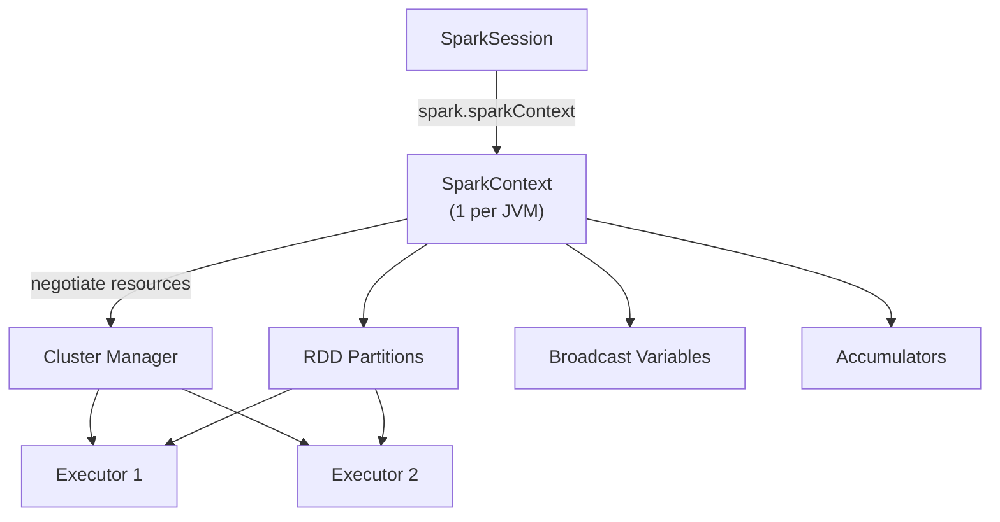

# SparkContext

`SparkContext` (`sc`) is the **low-level connection** between the Driver and the
cluster.  It creates RDDs, broadcasts variables, and schedules tasks.  Since
Spark 2.0, it is accessed through `SparkSession` rather than created directly.

## Role in the Architecture



## Key Responsibilities

- Establish and maintain the connection to the Cluster Manager.
- Create RDDs from in-memory collections, files, or other sources.
- Broadcast read-only data to all executors.
- Track shared mutable counters via accumulators.
- Cancel, retry, and monitor individual tasks.

## Accessing SparkContext

Always access `SparkContext` through the `SparkSession`:

```python
from pyspark.sql import SparkSession

spark = SparkSession.builder.appName("sc-demo").master("local[*]").getOrCreate()
sc = spark.sparkContext   # (1)!
```

1. Never call `SparkContext(conf)` directly — use `getOrCreate()` if you must
   create one without a `SparkSession`.

## Creating RDDs

```python
# From a Python list
rdd = sc.parallelize([1, 2, 3, 4, 5], numSlices=2)   # (1)!
print(rdd.getNumPartitions())  # 2
print(rdd.sum())               # 15

# From a text file (each line becomes one element)
rdd_text = sc.textFile("data/sample.txt", minPartitions=4)

# From a sequence of key-value pairs
rdd_kv = sc.parallelize([("a", 1), ("b", 2), ("a", 3)])
counts = rdd_kv.reduceByKey(lambda x, y: x + y)
print(counts.collect())  # [('b', 2), ('a', 4)]
```

1. `numSlices` controls the initial partition count.

## `getOrCreate()` — Singleton Safety

```python
from pyspark import SparkConf, SparkContext

conf = SparkConf().setAppName("demo").setMaster("local[*]")

sc1 = SparkContext.getOrCreate(conf)
sc2 = SparkContext.getOrCreate(conf)

assert sc1 == sc2   # same object — only one SparkContext per JVM
```

!!! warning "Only one SparkContext per JVM"
    Creating a second `SparkContext` with the bare constructor raises:
    ```
    ValueError: Cannot run multiple SparkContexts at once
    ```
    Always use `getOrCreate()`.

## Broadcast Variables

Broadcast a large read-only lookup table once to all executors instead of
shipping it with every task:

```python
lookup = {"NY": "New York", "CA": "California", "TX": "Texas"}
bc = sc.broadcast(lookup)

rdd = sc.parallelize(["NY", "CA", "TX", "NY"])
result = rdd.map(lambda code: bc.value.get(code, "Unknown"))
print(result.collect())  # ['New York', 'California', 'Texas', 'New York']

bc.destroy()   # free memory on all executors
```

## Accumulators

Executors increment an accumulator; the Driver reads the final value:

```python
counter = sc.accumulator(0)
error_count = sc.accumulator(0)

rdd = sc.parallelize(range(1, 101))
rdd.foreach(lambda x: counter.add(1))
print(f"Processed: {counter.value}")   # 100
```

!!! note "Accumulators are write-only on executors"
    Executor tasks can only *add* to an accumulator.  Only the Driver can *read* it.

## Configuration Reference

| Config key | Default | Description |
| ---------- | ------- | ----------- |
| `spark.default.parallelism` | `#cores * 2` | Default partition count for RDD operations |
| `spark.rdd.compress` | `false` | Compress serialised RDD partitions |
| `spark.serializer` | `JavaSerializer` | Use `KryoSerializer` for better performance |
| `spark.kryo.registrationRequired` | `false` | Enforce Kryo class registration |

## When to Use / Avoid

!!! success "Use SparkContext for"
    - RDD-level transformations (`map`, `filter`, `reduceByKey`)
    - Broadcasting large lookup tables
    - Tracking metrics with accumulators
    - Demonstrating low-level Spark internals

!!! failure "Don't use SparkContext when"
    - Working with structured data — use the DataFrame API instead
    - You need SQL, schema inference, or Parquet I/O — those belong to `SparkSession`

## Run the Tests

```bash
pytest tests/test_spark_context.py -v
```
