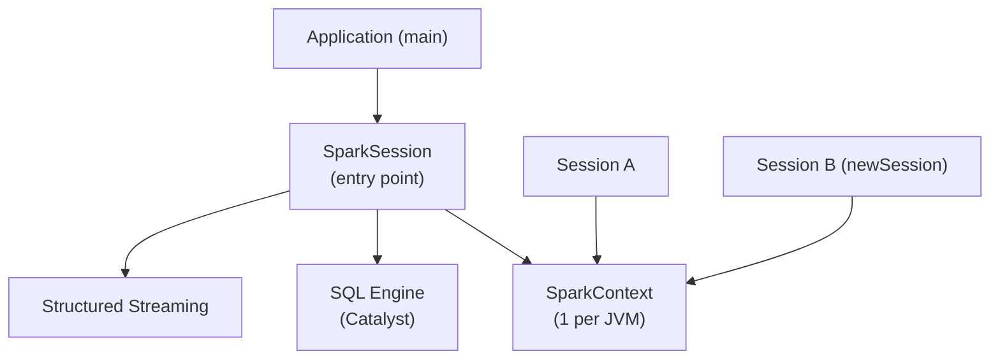

# SparkSession

`SparkSession` is the **unified entry point** to every Spark capability — SQL,
DataFrames, streaming, and the underlying SparkContext. Since Spark 2.0 it
replaces the older `SQLContext`, `HiveContext`, and `StreamingContext`.

## Role in the Architecture



Multiple `SparkSession` objects can coexist in the same process — each has its
own SQL configuration and temporary view catalog — but they all share a
**single `SparkContext`**.

## Key Responsibilities

- Create and configure the Spark application on the Driver.
- Provide the DataFrame and Dataset API.
- Execute SQL queries via `spark.sql(...)`.
- Expose the underlying `SparkContext` through `spark.sparkContext`.
- Manage temporary views and the metastore connection.

## Creating a SparkSession

```python
import os
from pyspark.sql import SparkSession

spark = (SparkSession.builder             # (1)!
         .appName("architecture-demo")    # (2)!
         .master(os.environ.get("SPARK_MASTER", "local[*]"))  # (3)!
         .config("spark.sql.shuffle.partitions", "4")         # (4)!
         .config("spark.sql.adaptive.enabled", "true")
         .config("spark.sql.adaptive.coalescePartitions.enabled", "true")
         .config("spark.ui.enabled", "false")                 # (5)!
         .getOrCreate())                  # (6)!
spark.sparkContext.setLogLevel("WARN")
```

1. `SparkSession.builder` returns a fluent `Builder` object.
2. Name visible in the Spark Web UI and application logs.
3. Falls back to all local CPU cores when no cluster is configured.
4. Default 200 is wasteful for small local datasets.
5. Skip the Web UI to speed up session creation in scripts and tests.
6. Returns an existing session if one already exists in the JVM — safe to call from multiple modules.

## `getOrCreate()` — Singleton Guarantee

Spark enforces **one active SparkContext per JVM**.  `getOrCreate()` ensures
you never accidentally create a second one:

```python
spark1 = SparkSession.builder.appName("A").master("local[*]").getOrCreate()
spark2 = SparkSession.builder.appName("B").master("local[*]").getOrCreate()

assert spark1 is spark2  # identical object — same underlying SparkContext
```

## `newSession()` — Isolated SQL Namespace

`newSession()` creates a sibling session with its own temporary views and SQL
configuration, while **sharing** the SparkContext (and therefore the same cluster
connection and running executors):

```python
session_a = spark.newSession()
session_b = spark.newSession()

# Shared infrastructure
assert spark.sparkContext is session_a.sparkContext
assert spark.sparkContext is session_b.sparkContext

# Isolated SQL namespaces
spark.sql("CREATE TEMP VIEW v AS SELECT 1 AS x")
session_a.catalog.tableExists("v")   # False — different catalog
```

!!! note "When to use `newSession()`"
    Use it in multi-tenant applications where different users or workloads need
    separate SQL namespaces without the cost of starting a new JVM / SparkContext.

## Configuration Reference

| Config key | Default | Description |
| ---------- | ------- | ----------- |
| `spark.app.name` | `""` | Application name shown in UI and logs |
| `spark.master` | *(none)* | Cluster master URL — `local[*]`, `yarn`, `k8s://...` |
| `spark.sql.shuffle.partitions` | `200` | Partitions after a shuffle (join, groupBy) |
| `spark.sql.adaptive.enabled` | `true` (Spark 3.2+) | Enable Adaptive Query Execution |
| `spark.sql.adaptive.coalescePartitions.enabled` | `true` | Merge small post-shuffle partitions |
| `spark.ui.enabled` | `true` | Enable the Spark Web UI |

## When to Use / Avoid

!!! success "Always use SparkSession"
    - Starting any PySpark application
    - Running SQL queries with `spark.sql()`
    - Creating DataFrames with `spark.createDataFrame()` or `spark.read`

!!! failure "Don't do this"
    - Instantiating `SparkContext` directly when a `SparkSession` already exists
    - Creating a new `SparkSession` inside a loop or per-request handler

## Full Example

```python title="src/spark_session.py"
--8<-- "src/architecture/spark_session.py"
```

## Run

```bash
SPARK_MASTER=local[*] python src/architecture/spark_session.py
```
