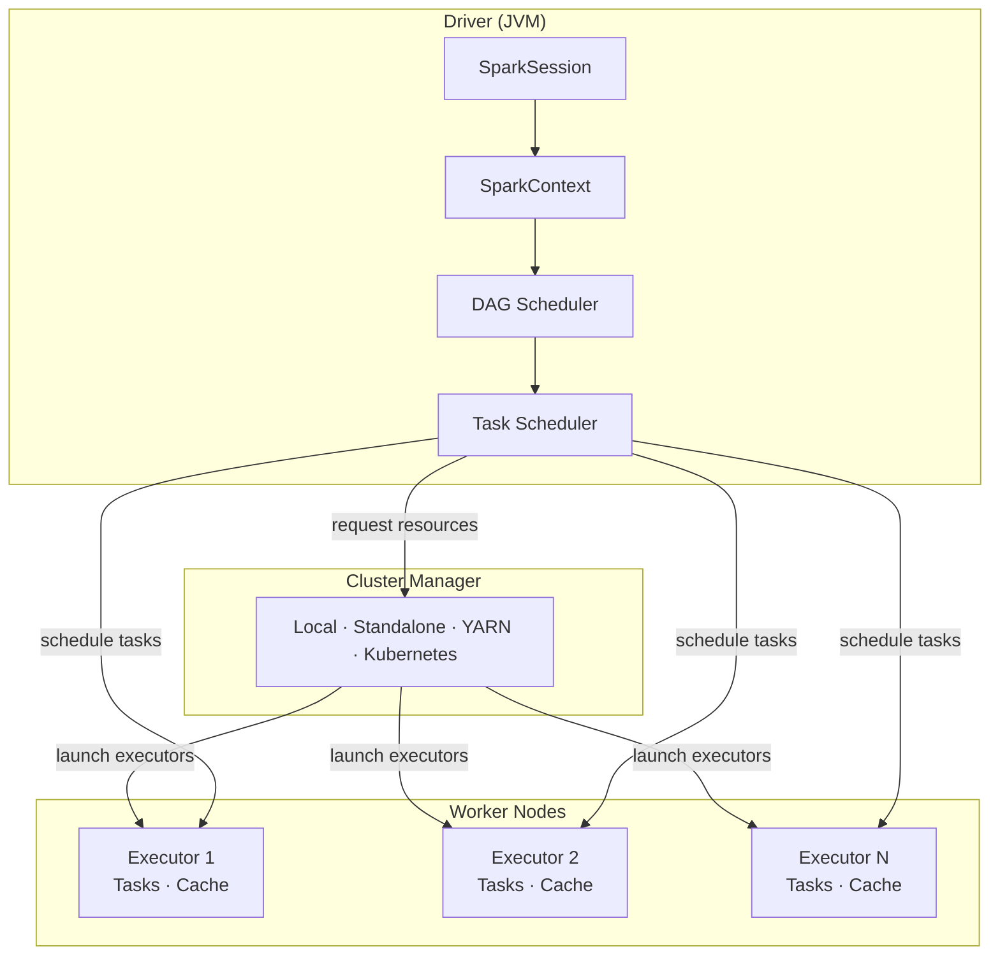
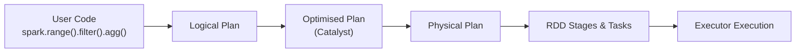

# PySpark Architecture

Apache Spark is a **distributed computing engine** built around a clear separation of
concerns: a single **Driver** program orchestrates work, **Executors** on worker nodes
run the tasks, and a **Cluster Manager** allocates the hardware resources between them.



---

## Core Components

| Component | Where it runs | Responsibility |
| --------- | ------------- | -------------- |
| [SparkSession](components/spark-session.md) | Driver | Unified entry point — wraps SparkContext, SQL engine, and streaming |
| [SparkContext](components/spark-context.md) | Driver | Connects to the cluster; manages RDDs and task scheduling |
| [Driver](components/driver.md) | Driver host | Runs `main()`; builds the DAG; sends tasks to executors |
| [Executor](components/executor.md) | Worker nodes | Runs tasks; stores cached partition data |
| [Catalyst Optimizer](components/catalyst.md) | Driver | Rewrites and optimizes query plans before execution |
| [Query Plans](components/query-plans.md) | Driver | Parsed → analyzed → optimized → physical plan pipeline |
| [Shuffle](components/shuffle.md) | Executors | Redistributes data across partitions for wide transformations |
| [Memory Management](components/memory.md) | Executors | Manages execution and storage memory pools, caching, and spill |

---

## Cluster Managers

| Manager | Best for |
| ------- | -------- |
| [Local](cluster-managers/local.md) | Development, unit tests, laptops |
| [YARN](cluster-managers/yarn.md) | Hadoop / on-premise clusters |
| [Kubernetes](cluster-managers/kubernetes.md) | Cloud-native, containerised workloads |

---

## Key Concepts

### Lazy Evaluation

Transformations (`filter`, `groupBy`, `join`) build a logical plan — no data moves
until an **action** (`show`, `count`, `write`) is called.  This lets Spark's
**Catalyst optimiser** rewrite and simplify the plan before execution.



### Single SparkContext per JVM

Only **one active SparkContext** can exist per JVM process. Use
`SparkSession.builder.getOrCreate()` to safely share a session across modules
without accidentally creating a second context.

### Partition = Unit of Parallelism

Each partition maps to exactly one task on one executor. More partitions → more
parallelism (up to the number of available CPU cores across all executors).

---

## Quick Start

=== "pip"
    ```bash
    pip install pyspark==3.5.0
    ```

=== "conda"
    ```bash
    conda install -c conda-forge pyspark=3.5.0
    ```

=== "uv"
    ```bash
    uv add pyspark
    ```

!!! warning "Java required"
    Java 11 must be on your `PATH`.  Check with `java -version`.

### Run an example

```bash
SPARK_MASTER=local[*] python src/architecture/spark_session.py
SPARK_MASTER=local[*] python src/architecture/spark_driver.py
SPARK_MASTER=local[*] python src/architecture/spark_executor.py
SPARK_MASTER=local[*] python src/architecture/spark_catalyst.py
SPARK_MASTER=local[*] python src/architecture/spark_shuffle.py
SPARK_MASTER=local[*] python src/architecture/spark_memory.py
SPARK_MASTER=local[*] python src/architecture/spark_query_plans.py
```

### Run the tests

```bash
pytest tests/ -v
```
