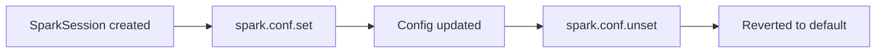

# Dynamic Config

Change Spark configuration at runtime using `spark.conf.set()`, `spark.conf.get()`,
and `spark.conf.unset()`. This is useful for tuning shuffle partitions or toggling
AQE between different stages of a job.

## How It Works



Mutable config keys (like `spark.sql.shuffle.partitions`) can be changed after
the session is created. Immutable keys (like `spark.master`) raise an
`AnalysisException`.

```python
# Read
spark.conf.get("spark.sql.shuffle.partitions")

# Write
spark.conf.set("spark.sql.shuffle.partitions", "8")

# Reset to default
spark.conf.unset("spark.sql.shuffle.partitions")
```

## Run

```bash
uv run python src/cfg/dynamic/config_dynamic.py
```

Expected output:

```
shuffle.partitions = 4
shuffle.partitions = 8
adaptive.enabled   = true
Cannot change spark.master at runtime: ...
shuffle.partitions = 200
```

## Mutable vs Immutable Keys

| Key | Mutable? |
|-----|----------|
| `spark.sql.shuffle.partitions` | ✅ Yes |
| `spark.sql.adaptive.enabled` | ✅ Yes |
| `spark.sql.autoBroadcastJoinThreshold` | ✅ Yes |
| `spark.master` | ❌ No |
| `spark.app.name` | ❌ No |
| `spark.executor.memory` | ❌ No |

## Full Example

```python title="src/cfg/dynamic/config_dynamic.py"
--8<-- "src/cfg/dynamic/config_dynamic.py"
```

!!! tip
    Use dynamic config to tune `shuffle.partitions` between narrow and wide
    transformations in the same job — start low for small joins, increase for
    large aggregations.

!!! warning
    Changing a config does **not** retroactively affect already-cached DataFrames.
    Call `.unpersist()` and recompute if needed.
