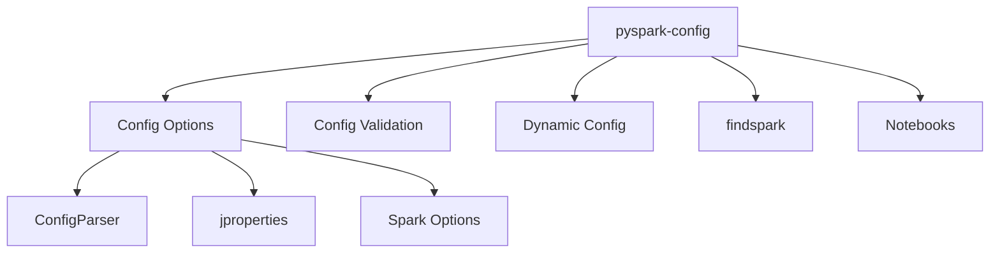

# PySpark Config

Practical examples for configuring PySpark applications — reading config files,
setting SparkConf programmatically, changing options at runtime, validating
settings, and listing all available Spark options.

## Project Layout



| Module | Description |
|--------|-------------|
| `cfg.option.config_parser` | Read config from `.cfg` / `.conf` / `.properties` files using `ConfigParser` or `jproperties` |
| `cfg.option.config_jproperties` | Reusable `PropertiesHandler` class for `.properties` files |
| `cfg.validation` | Create and inspect `SparkConf` objects, print all Spark SQL settings |
| `cfg.dynamic` | Change Spark config at runtime with `spark.conf.set()` / `unset()` |
| `cfg.library` | Locate the Spark installation with `findspark` |
| `notebooks/` | Interactive Jupyter notebooks for each topic |

## Quick Start

=== "uv"
    ```bash
    uv sync
    uv run python src/cfg/option/config_parser/config_option.py
    ```

=== "pip"
    ```bash
    pip install pyspark==3.5.0 jproperties findspark
    python src/cfg/option/config_parser/config_option.py
    ```

!!! tip "No cluster needed"
    Every example runs in `local[*]` mode — no Hadoop or YARN required.
