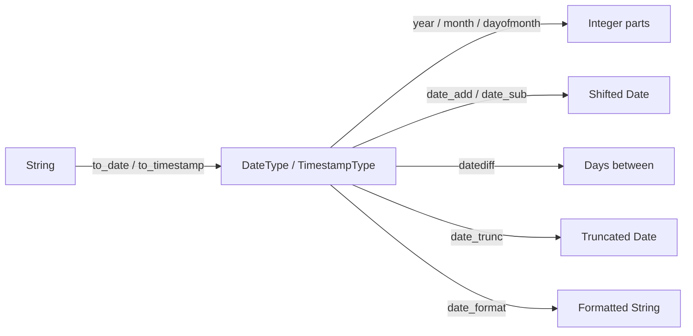
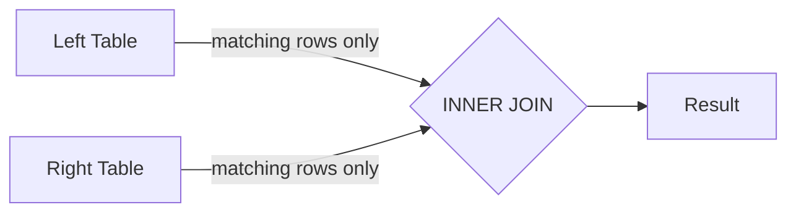
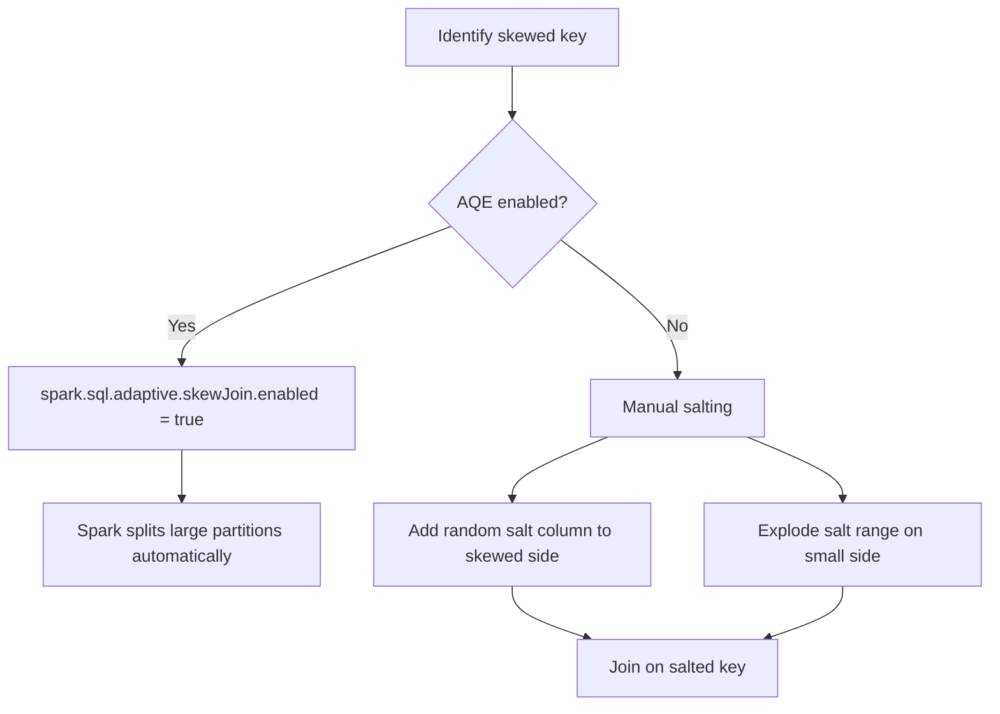

# PySpark DataFrame — Documentation Instructions

## Module Nav Structure

The `pyspark-dataframe` documentation section in `mkdocs.yml` should be organised as:

```yaml
nav:
  - DataFrame API:
      - Overview:      index.md
      - Creation:      creation.md
      - Columns:       columns.md
      - Joins:
          - Overview:         joins/index.md
          - Inner:            joins/inner.md
          - Outer:            joins/outer.md
          - Cross:            joins/cross.md
          - Broadcast:        joins/broadcast.md
          - Self:             joins/self.md
          - Natural:          joins/natural.md
          - Semi & Anti:      joins/semi_anti.md
      - Window Functions:
          - Overview:         window/index.md
          - Specification:    window/specification.md
          - Ranking:          window/ranking.md
          - Analytical:       window/analytical.md
          - Aggregation:      window/aggregation.md
          - Null Options:     window/null_options.md
      - Pivoting:      pivoting.md
      - Aggregations:  aggregations.md
      - Transformations:
          - Filter:    transformations/filter.md
          - Sort:      transformations/sort.md
          - Dedup:     transformations/dedup.md
          - Union:     transformations/union.md
          - Sampling:  transformations/sampling.md
      - Null Handling:   null_handling.md
      - Date & Time:     datetime.md
      - String Functions: string_functions.md
      - Optimization:
          - Caching:   optimization/caching.md
          - Skew Data: optimization/skew.md
      - Schema:        schema.md
      - ETL Pipeline:  etl.md
```

## Page Structure

Every topic page follows this standard order:

1. **One-sentence description** — what the API does and when to reach for it.
2. **Concept diagram** (Mermaid) — for multi-step flows or join visualisations.
3. **API quick-reference table** — key methods / parameters.
4. **Worked example** — annotated code block with `# (N)!` annotations.
5. **Run section** — exact shell command to execute the example.
6. **Common patterns** — additional short snippets for variants.
7. **When to use / When not to use** — `!!! success` / `!!! failure` admonitions.
8. **Full source** — `--8<--` snippet include from the `src/data_frame/` tree.

## Null Handling Page

```markdown
## Null Handling

Spark treats `null` as the absence of a value. Many functions silently propagate or
ignore nulls — document the behaviour explicitly.

| Pattern | Method |
|---------|--------|
| Drop rows with any null | `df.dropna()` |
| Drop rows with null in subset | `df.dropna(subset=["col"])` |
| Fill nulls with scalar | `df.fillna({"col": 0})` |
| First non-null across columns | `F.coalesce(col1, col2, F.lit(default))` |
| Null-safe equality | `F.col("x").eqNullSafe("value")` |
| Filter null rows | `F.col("x").isNull()` / `isNotNull()` |

!!! warning "Aggregation and nulls"
    `F.sum()`, `F.avg()`, `F.count(F.col("x"))` all ignore nulls.
    `F.count("*")` counts every row including those with nulls.
```

## Date and Time Page

```markdown
## Date and Time Functions



| Function | Returns | Example |
|----------|---------|---------|
| `F.to_date(col, fmt)` | `DateType` | `F.to_date("date_str", "yyyy-MM-dd")` |
| `F.to_timestamp(col, fmt)` | `TimestampType` | `F.to_timestamp("ts", "yyyy-MM-dd HH:mm:ss")` |
| `F.year(col)` | `IntegerType` | `F.year("event_date")` |
| `F.date_add(col, n)` | `DateType` | `F.date_add("start", 30)` |
| `F.datediff(end, start)` | `IntegerType` | `F.datediff("end_date", "start_date")` |
| `F.date_trunc(unit, col)` | `TimestampType` | `F.date_trunc("month", "event_ts")` |
| `F.date_format(col, fmt)` | `StringType` | `F.date_format("event_date", "dd/MM/yyyy")` |
| `F.current_date()` | `DateType` | today's date |
| `F.current_timestamp()` | `TimestampType` | current datetime |

!!! tip "Always specify the format string"
    Omitting the format forces Spark to infer it, which may silently produce nulls
    when the string format varies across rows.
```

## ETL Pipeline Page

```markdown
## ETL Pipeline

Structure each ETL script with clearly separated extract, transform, and load phases
exposed as typed functions:

```python
from pyspark.sql import DataFrame, SparkSession
import pyspark.sql.functions as F

def extract(spark: SparkSession, path: str) -> DataFrame:
    return spark.read.parquet(path)

def transform(df: DataFrame) -> DataFrame:
    return (df
            .filter(F.col("status") == "active")   # (1)!
            .withColumn("revenue_eur",              # (2)!
                        F.round(F.col("revenue") * 0.92, 2))
            .dropna(subset=["customer_id"]))

def load(df: DataFrame, path: str) -> None:
    (df.write
       .mode("overwrite")
       .partitionBy("region")
       .parquet(path))
```
1. Push filters early to reduce shuffle cost.
2. Derive new columns before writing.

!!! success "Good ETL practices"
    - Pure functions — each step takes and returns a `DataFrame`
    - Use `DataFrame.transform()` for reusable steps
    - Log row counts between phases with `df.count()` in DEBUG logging

!!! failure "Avoid in ETL pipelines"
    - Calling `.show()` or `.collect()` inside production pipeline functions
    - Mixing schema inference with explicit schema — always define schema for sources
```

## DataFrame Creation Page

```markdown
## Creating a DataFrame

=== "From tuples"
    ```python title="data_frame/creation/tuples/dataframe_from_list_of_tuples.py"
    --8<-- "data_frame/creation/tuples/dataframe_from_list_of_tuples.py"
    ```

=== "From dicts"
    ```python title="data_frame/creation/dictionary/dataframe_from_list_of_dict_directly.py"
    --8<-- "data_frame/creation/dictionary/dataframe_from_list_of_dict_directly.py"
    ```

=== "With schema"
    ```python
    from pyspark.sql.types import StructType, StructField, IntegerType, StringType

    schema = StructType([                                    # (1)!
        StructField("id",   IntegerType(), nullable=False),  # (2)!
        StructField("name", StringType(),  nullable=True),
    ])
    df = spark.createDataFrame([(1, "Alice")], schema)
    df.printSchema()
    ```
    1. Explicit schema prevents Spark from inferring types (which triggers an extra job).
    2. `nullable=False` adds a NOT NULL constraint visible in the schema output.
```

## Join Pages

Every join page includes a visualisation:

```markdown


| Join type    | Rows returned | Right cols? |
|--------------|---------------|:-----------:|
| `inner`      | Only matching rows from both sides | ✅ |
| `left`       | All left rows; NULLs for non-matching right columns | ✅ |
| `right`      | All right rows; NULLs for non-matching left columns | ✅ |
| `full`       | All rows from both sides; NULLs for non-matches | ✅ |
| `left_semi`  | Left rows where a match exists | ❌ |
| `left_anti`  | Left rows where no match exists | ❌ |
| `cross`      | Cartesian product (every left × every right row) | ✅ |
| `natural`    | Equi-join on all shared column names | ✅ (deduplicated) |
```

### Broadcast join admonition

```markdown
!!! tip "Broadcast small tables"
    When one side is under `spark.sql.autoBroadcastJoinThreshold` (default 10 MB),
    Spark broadcasts it automatically. Use `F.broadcast()` to force a broadcast on
    larger tables you know are safe:

    ```python
    result = large_df.join(F.broadcast(small_df), on=["key"], how="inner")
    ```
```

## Window Function Pages

### Specification page

Include a frame-boundary diagram:

```markdown


| Boundary constant              | Meaning                            |
|--------------------------------|------------------------------------|
| `Window.unboundedPreceding`    | Start of the partition             |
| `Window.currentRow`            | The row being evaluated            |
| `Window.unboundedFollowing`    | End of the partition               |
| Integer `n`                    | `n` rows before/after current row  |
```

### Ranking page

```markdown
| Function         | Gaps on ties? | Resets per partition? |
|------------------|---------------|-----------------------|
| `rank()`         | Yes           | Yes                   |
| `dense_rank()`   | No            | Yes                   |
| `row_number()`   | N/A           | Yes                   |
| `percent_rank()` | Yes           | Yes                   |
| `ntile(n)`       | N/A           | Yes                   |
```

## Optimization Pages

### Caching page

```markdown
!!! note "When to cache"
    Cache a DataFrame only when it is **reused more than once** in the same job.
    Caching has overhead — if a DataFrame is read only once, skip it.

| Storage Level               | Memory | Disk | Serialised |
|-----------------------------|:------:|:----:|:----------:|
| `MEMORY_ONLY`               | ✅     | ❌   | ❌         |
| `MEMORY_AND_DISK`           | ✅     | ✅   | ❌         |
| `MEMORY_AND_DISK_SER`       | ✅     | ✅   | ✅         |
| `DISK_ONLY`                 | ❌     | ✅   | ✅         |
```

### Skew data page

```markdown

```

## Admonitions Reference

Use these consistently throughout the DataFrame docs:

```markdown
!!! tip "Performance tip"
    Use `df.cache()` when a DataFrame is reused across multiple actions.

!!! warning "Shuffle cost"
    Joins on non-bucketed tables trigger a shuffle. Consider bucketing large tables
    that are joined repeatedly.

!!! note "AQE behaviour"
    With `spark.sql.adaptive.enabled = true`, Spark may change the join strategy
    at runtime based on actual partition sizes.

!!! success "Good fit for window functions"
    - Running totals and moving averages
    - Ranking within a partition
    - Lead/lag comparisons between rows

!!! failure "Not suitable"
    - Aggregations that don't need per-row context — use `groupBy` instead
    - Cartesian products — use `crossJoin` explicitly
```

## Code Annotation Conventions

For DataFrame transformation chains, annotate each major step:

```python
result = (df                                                      # (1)!
          .filter(F.col("status") == "active")                    # (2)!
          .groupBy("region")                                      # (3)!
          .agg(F.round(F.sum("revenue"), 2).alias("total"))       # (4)!
          .orderBy(F.desc("total")))                              # (5)!
```
1. Start from the raw DataFrame.
2. Push filters as early as possible — reduces data before aggregation.
3. Group by the dimension column.
4. `round(..., 2)` avoids floating-point noise in output.
5. Descending sort puts the highest-revenue region first.

## Run Section Format

Every page must include a runnable command immediately after the example:

```markdown
### Run

```bash
cd spark-python/pyspark-dataframe
python src/data_frame/joins/inner/inner_equi_join.py
```

Or with a custom Spark master:

```bash
SPARK_MASTER=spark://master:7077 python src/data_frame/joins/inner/inner_equi_join.py
```
```

## Testing Section (per-topic)

Include a brief testing note at the bottom of pages that have corresponding tests,
referencing the `chispa` library where whole-DataFrame equality is used:

```markdown
### Testing

The tests for this topic live in `tests/<topic>/`. They use
[chispa](https://github.com/MrPowers/chispa) for DataFrame equality assertions:

```python
from chispa import assert_df_equality

def test_inner_join(spark):
    result = ...
    expected = spark.createDataFrame([...], schema)
    assert_df_equality(result, expected, ignore_row_order=True)
```

Run just this topic's tests:

```bash
pytest tests/joins/ -v
```
```

## Full Source Inclusion

End every page with the complete source file to keep docs in sync with the code:

```markdown
## Full source

```python title="src/data_frame/joins/inner/inner_equi_join.py"
--8<-- "src/data_frame/joins/inner/inner_equi_join.py"
```
```
