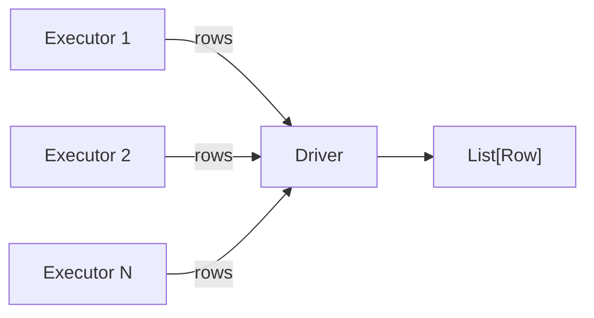

# Collect

Pull rows from executors back to the driver as Python objects. Use these methods
for small result sets — inspecting samples, feeding results into non-Spark code,
or asserting values in tests.



## API Reference

| Method | Returns | Description |
|--------|---------|-------------|
| `collect()` | `List[Row]` | All rows — triggers a full shuffle to the driver |
| `first()` | `Row` or `None` | First row; returns `None` on an empty DataFrame |
| `head()` | `Row` | First row (same as `first()`) |
| `head(n)` | `List[Row]` | First *n* rows |
| `take(n)` | `List[Row]` | First *n* rows (alias for `head(n)`) |
| `tail(n)` | `List[Row]` | Last *n* rows — requires a full scan (Spark 3.0+) |

## Examples

### collect() — all rows

```python
from pyspark.sql import functions as F

rows = df.collect()                          # (1)!
for row in rows:
    print(f"id={row['id']}  name={row['employee_name']}")

# Access by column name or index
first_row = rows[0]
print(first_row['employee_name'])            # column name
print(first_row[1])                          # positional index
print(first_row.asDict())                    # full dict
```
1. `collect()` causes a full shuffle to the driver — never call on production
   DataFrames without a preceding filter or limit.

### first() and head()

```python
row = df.orderBy("id").first()               # single Row
print(row.asDict())

# head() without arguments returns a single Row
single = df.head()

# head(n) returns a list
top3 = df.head(3)
print(f"head(3) returned {len(top3)} rows")
```

### take() — quick content check

```python
sample = df.take(3)
print([r.asDict() for r in sample])

# Existence check without full collect
is_populated = len(df.take(1)) > 0
```

### tail() — last rows (Spark 3.0+)

```python
last2 = df.orderBy("id").tail(2)             # (1)!
print([r.asDict() for r in last2])
```
1. `tail()` requires a full scan of the DataFrame — avoid on large datasets.

### Best practice — aggregate then collect

```python
from pyspark.sql import functions as F

summary = (
    df.filter(F.col("status") == "active")
    .groupBy("product")
    .agg(
        F.count("*").alias("orders"),
        F.round(F.sum(F.col("quantity") * F.col("unit_price")), 2).alias("revenue"),
    )
    .orderBy(F.desc("revenue"))
    .collect()                               # (1)!
)
for row in summary:
    print(f"{row['product']}  orders={row['orders']}  revenue={row['revenue']}")
```
1. Aggregate on executors first, then collect the small summary to the driver.

### Run

```bash
cd spark-python/pyspark-dataframe
python src/data_frame/actions/collect/action_collect.py
```

!!! warning "Out-of-memory risk"
    `collect()` transfers **every row** to the driver process. On a DataFrame
    with millions of rows this will exhaust driver memory and crash the
    application. Always filter, limit, or aggregate before collecting.

!!! tip "first() may return None"
    `first()` returns `None` when the DataFrame is empty. Always guard with
    an `if row is not None` check when the result set may be empty.

!!! note "Row access patterns"
    `Row` objects support dict-style access (`row['col']`), index access
    (`row[0]`), and conversion to a Python dict via `row.asDict()`.

## Full Source

```python title="src/data_frame/actions/collect/action_collect.py"
--8<-- "src/data_frame/actions/collect/action_collect.py"
```
