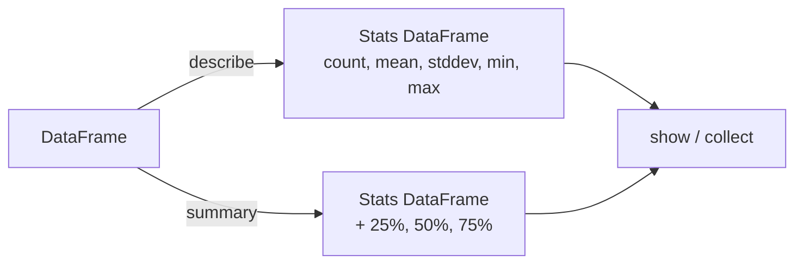

# Describe & Summary

Compute summary statistics — count, mean, standard deviation, min, max, and
percentiles — and return them as a new DataFrame.



## API Reference

| Method | Columns | Statistics |
|--------|---------|-----------|
| `describe()` | All or selected | count, mean, stddev, min, max |
| `describe("col1", "col2")` | Specified subset | count, mean, stddev, min, max |
| `summary()` | All | count, mean, stddev, min, 25%, 50%, 75%, max |
| `summary("count", "mean", "50%")` | All | Selected statistics only |

## Examples

### describe() — all columns

```python
df.describe().show(truncate=False)           # (1)!
```
1. `describe()` works on both numeric and string columns. For strings,
   `mean` and `stddev` are `null`; `min`/`max` are lexicographic.

### describe() — selected columns

```python
df.describe("quantity", "unit_price").show(truncate=False)

# String column statistics
df.describe("product").show(truncate=False)
```

### summary() — with percentiles

```python
df.summary().show(truncate=False)            # (1)!

# Selected statistics only
df.summary("count", "mean", "50%", "max").show(truncate=False)

# Quartiles for a single column
df.select("revenue").summary("25%", "50%", "75%").show(truncate=False)
```
1. `summary()` includes the 25th, 50th (median), and 75th percentiles —
   only meaningful for numeric columns.

### describe() with NULL values

```python
df.describe().show(truncate=False)
# count reflects non-null values only
# A column with 1 NULL out of 4 rows shows count = 3
```

### Collect statistics programmatically

```python
stats = {
    row["summary"]: {col: row[col] for col in df.columns if col != "summary"}
    for row in df.describe().collect()       # (1)!
}

revenue_mean = float(stats["mean"]["revenue"])
revenue_max  = float(stats["max"]["revenue"])
```
1. `describe()` returns a DataFrame — call `collect()` to get the results
   as a Python dict for programmatic access.

### Run

```bash
cd spark-python/pyspark-dataframe
python src/data_frame/actions/describe/action_describe.py
```

!!! note "Statistics are returned as strings"
    Both `describe()` and `summary()` return all values as `StringType`,
    even for numeric columns. Cast with `float()` or `int()` when using
    the results programmatically.

!!! tip "Use summary() for percentiles"
    `describe()` provides only count, mean, stddev, min, and max.
    Switch to `summary()` when you need quartiles (25%, 50%, 75%).

!!! warning "NULL handling in describe()"
    The `count` row reflects **non-null** values only. A column with 3 out
    of 4 non-null values shows count = 3, not 4.

## Full Source

```python title="src/data_frame/actions/describe/action_describe.py"
--8<-- "src/data_frame/actions/describe/action_describe.py"
```
