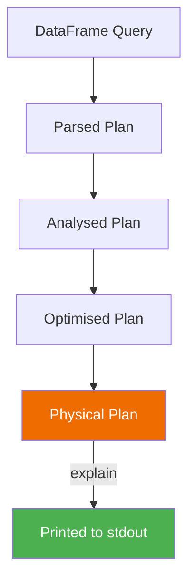

# Explain

Print the query execution plan **without triggering computation**. Use `explain()`
to understand join strategies, filter push-down, broadcast decisions, and stage
boundaries before running a job.



## API Reference

| Signature | Mode | Description |
|-----------|------|-------------|
| `explain()` | simple | Physical plan summary (default) |
| `explain(extended=True)` | extended | Parsed → Analysed → Optimised → Physical |
| `explain(mode="simple")` | simple | Same as `explain()` |
| `explain(mode="extended")` | extended | All four plan phases |
| `explain(mode="cost")` | cost | Plan with cost-based optimizer statistics |
| `explain(mode="codegen")` | codegen | Generated Java code (advanced) |
| `explain(mode="formatted")` | formatted | Human-readable two-section layout (Spark 3.x) |

## Examples

### Simple explain

```python
from pyspark.sql import functions as F

df.filter(F.col("id") > 2).select("id", "employee_name").explain()
```

### Extended explain — all plan phases

```python
from pyspark.sql import functions as F

df.filter(F.col("id") > 2).explain(extended=True)  # (1)!
```
1. Extended mode shows all four phases: Parsed Logical Plan, Analysed Logical
   Plan, Optimised Logical Plan, and Physical Plan.

### All explain modes

```python
from pyspark.sql import functions as F

query = (
    df.filter(F.col("revenue") > 100)
    .groupBy("category")
    .agg(F.round(F.sum("revenue"), 2).alias("total"))
)

for mode in ("simple", "extended", "cost", "formatted"):
    query.explain(mode=mode)
```

### Join strategy inspection

```python
from pyspark.sql import functions as F

# Default — Spark chooses the strategy
emp.join(dept, on=["department_id"], how="inner").explain()

# Force broadcast hint
emp.join(
    F.broadcast(dept),                       # (1)!
    on=["department_id"],
    how="inner",
).explain()
```
1. Look for `BroadcastHashJoin` in the plan output to confirm the hint was
   applied. Without the hint, Spark may choose `SortMergeJoin` for larger tables.

### Filter push-down verification

```python
from pyspark.sql import functions as F

(
    df.filter(F.col("revenue") > 100)        # (1)!
    .groupBy("region")
    .agg(F.sum("revenue").alias("total"))
    .explain()
)
```
1. In the plan output, verify the `Filter` node appears **before** the
   `HashAggregate` — this confirms Spark pushed the filter down to reduce
   data before aggregation.

### Window function plan

```python
from pyspark.sql import functions as F
from pyspark.sql.window import Window

w = Window.partitionBy("region").orderBy("month")
df.withColumn("running", F.sum("revenue").over(w)).explain()
```

### Cache effect on the plan

```python
from pyspark.sql import functions as F

df.cache()
df.filter(F.col("revenue") > 500).explain() # (1)!
df.unpersist()
```
1. After `cache()`, the plan shows `InMemoryRelation` instead of a full
   scan — confirming Spark reads from cached data.

### Run

```bash
cd spark-python/pyspark-dataframe
python src/data_frame/actions/explain/action_explain.py
```

!!! tip "Use explain before running expensive jobs"
    Always call `explain()` on complex queries to verify join strategies
    and filter push-down before executing on a cluster. A missing broadcast
    hint can turn a 10-second job into a 10-minute shuffle.

!!! note "explain() does not trigger execution"
    Unlike all other actions, `explain()` only prints the plan — it does
    **not** execute the query or move any data.

!!! warning "codegen mode is for advanced debugging"
    `explain(mode="codegen")` outputs the generated Java bytecode. This is
    useful for Spark internals debugging but rarely needed in application
    development.

## Full Source

```python title="src/data_frame/actions/explain/action_explain.py"
--8<-- "src/data_frame/actions/explain/action_explain.py"
```
