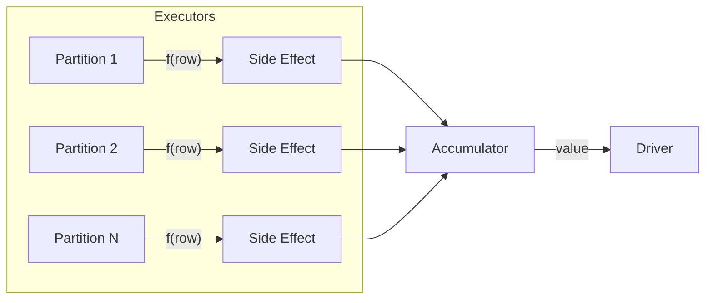

# Foreach

Apply a side-effecting function to each row or each partition without returning a
value. Used for writing to external systems, publishing events, or accumulating
metrics via accumulators.



## API Reference

| Method | Callback Signature | Description |
|--------|--------------------|-------------|
| `df.foreach(f)` | `f(Row) → None` | Called once per row on an executor |
| `df.foreachPartition(f)` | `f(Iterator[Row]) → None` | Called once per partition |
| `df.rdd.foreach(f)` | `f(Row) → None` | Same semantics via the RDD API |
| `df.rdd.foreachPartition(f)` | `f(Iterator[Row]) → None` | Same semantics via the RDD API |

## Examples

### foreach() with Accumulator

```python
from pyspark.sql.types import Row

active_counter = spark.sparkContext.accumulator(0)  # (1)!

def count_active(row: Row) -> None:
    if row["status"] == "active":
        active_counter.add(1)

df.foreach(count_active)
print(f"Active orders: {active_counter.value}")
```
1. Accumulators are the **only** safe way to aggregate results from executor
   functions back to the driver — do not use shared Python variables.

### foreachPartition() — batch writes

```python
written_counter = spark.sparkContext.accumulator(0)

def write_partition(rows) -> None:
    # Open connection once per partition
    batch = list(rows)
    # Bulk-insert batch into target system
    written_counter.add(len(batch))
    # Close connection

df.foreachPartition(write_partition)          # (1)!
print(f"Rows processed: {written_counter.value}")
```
1. `foreachPartition` opens/closes connections **once per partition** instead
   of once per row — far more efficient for database or HTTP writes.

### foreachPartition() with repartition

```python
from pyspark.sql import functions as F

df_active = (
    df.filter(F.col("status") == "active")
    .select("order_id", "product", "quantity", "unit_price")
    .repartition(2)                          # (1)!
)

batch_log = spark.sparkContext.accumulator(0)

def write_batch(rows) -> None:
    records = [row.asDict() for row in rows]
    if records:
        batch_log.add(len(records))

df_active.foreachPartition(write_batch)
```
1. `repartition()` controls how many partitions (and therefore how many
   connection open/close cycles) `foreachPartition` will perform.

### rdd.foreach() — accumulate revenue

```python
total_acc = spark.sparkContext.accumulator(0.0)

def accumulate_revenue(row) -> None:
    total_acc.add(float(row["revenue"]))

df.rdd.foreach(accumulate_revenue)
print(f"Total revenue: {total_acc.value:.2f}")
```

### Run

```bash
cd spark-python/pyspark-dataframe
python src/data_frame/actions/foreach/action_foreach.py
```

!!! tip "Prefer foreachPartition over foreach"
    When the callback opens a connection (database, HTTP, file), use
    `foreachPartition` to amortise connection setup across all rows in a
    partition instead of paying the cost per row.

!!! warning "Executor stdout in cluster mode"
    `print()` inside `foreach` writes to **executor** stdout, not the driver.
    In cluster mode this output goes to executor log files. Use accumulators
    to report results back to the driver.

!!! note "No return value"
    Both `foreach` and `foreachPartition` return `None`. The only way to
    get data back to the driver is through an `Accumulator`.

## Full Source

```python title="src/data_frame/actions/foreach/action_foreach.py"
--8<-- "src/data_frame/actions/foreach/action_foreach.py"
```
