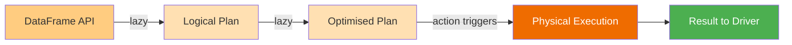
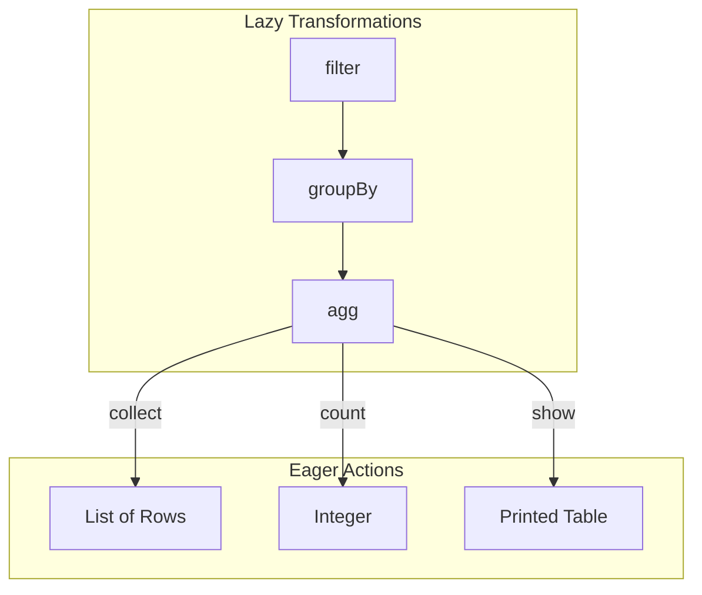

# Actions

Actions **trigger execution** of the lazy computation graph and return a result
to the driver — a value, a side effect, or printed output. Until an action is
called, Spark only builds a logical plan without moving any data.

## Action Categories

| Category | Key Methods | Returns |
|----------|-------------|---------|
| [Collect](collect.md) | `collect()`, `first()`, `head(n)`, `take(n)`, `tail(n)` | `List[Row]` or `Row` |
| [Count](count.md) | `count()`, `isEmpty()`, `distinct().count()`, `countDistinct()` | `int` or `bool` |
| [Show](show.md) | `show()`, `show(n, truncate, vertical)` | Prints to stdout |
| [Describe](describe.md) | `describe()`, `summary()` | Statistics DataFrame |
| [Foreach](foreach.md) | `foreach(f)`, `foreachPartition(f)` | Side effects only |
| [Reduce](reduce.md) | `rdd.reduce()`, `rdd.fold()`, `rdd.aggregate()`, `treeReduce()` | Single value |
| [Iterate](iterate.md) | `toLocalIterator()`, `toJSON()`, `saveAsTextFile()` | Iterator or RDD |
| [Explain](explain.md) | `explain()`, `explain(mode=...)` | Prints plan to stdout |

## Lazy vs Eager

Transformations such as `filter()`, `select()`, `groupBy()`, and `join()` are **lazy** —
they return a new DataFrame without executing anything. Actions are **eager** — they
force Spark to compute the result.

!!! tip "Minimise data returned to the driver"
    Always filter, aggregate, or limit **before** calling an action. Pulling
    the full dataset to the driver with `collect()` on a large DataFrame will
    cause an out-of-memory error.

!!! note "Actions trigger the full lineage"
    Each action re-executes the entire DAG from source unless intermediate
    results are cached with `df.cache()` or `df.persist()`.
