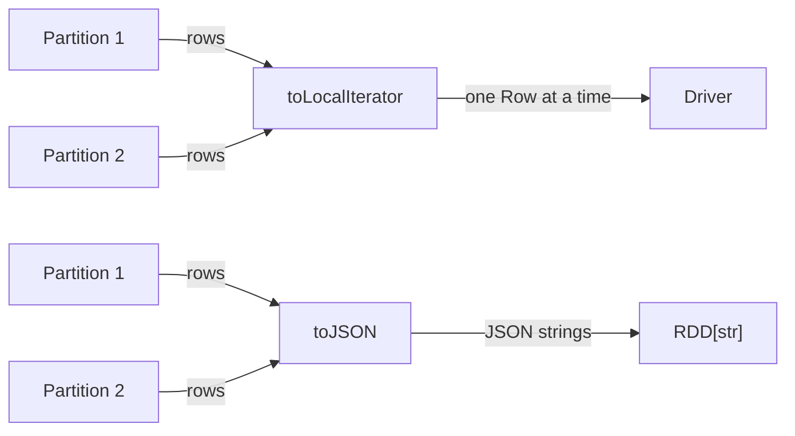

# Iterate

Stream rows to the driver one at a time or convert them to JSON strings —
memory-efficient alternatives to `collect()` when you need to process every
row on the driver.



## API Reference

| Method | Returns | Description |
|--------|---------|-------------|
| `toLocalIterator()` | `Iterator[Row]` | Yields rows partition-by-partition to the driver |
| `toLocalIterator(prefetchPartitions=True)` | `Iterator[Row]` | Prefetches the next partition while processing the current one |
| `toJSON()` | `RDD[str]` | Converts each row to a JSON string on executors |
| `toJSON().collect()` | `List[str]` | All JSON strings brought to the driver |
| `toJSON().saveAsTextFile(path)` | `None` | Write newline-delimited JSON to files |

## Examples

### toLocalIterator() — process rows one at a time

```python
for row in df.toLocalIterator():             # (1)!
    print(f"  {row['id']}  {row['employee_name']}")
```
1. `toLocalIterator` fetches one partition at a time — peak driver memory
   equals the size of the largest single partition.

### toLocalIterator() — row-level processing

```python
processed = 0
revenue_total = 0.0

for row in df.toLocalIterator():
    if row["status"] == "active":
        revenue_total += row["quantity"] * row["unit_price"]
        processed += 1

print(f"Processed {processed} active orders, total={revenue_total:.2f}")
```

### Prefetch partitions (Spark 3.x)

```python
rows = list(
    df.toLocalIterator(prefetchPartitions=True)  # (1)!
)
print(f"Fetched {len(rows)} rows with prefetch")
```
1. `prefetchPartitions=True` overlaps network transfer and driver processing
   at the cost of holding **two** partitions in driver memory simultaneously.

### toJSON() — row-level JSON strings

```python
import json

json_rdd = df.toJSON()
for json_str in json_rdd.take(3):            # (1)!
    parsed = json.loads(json_str)
    print(parsed)
```
1. `toJSON()` converts each `Row` to a JSON string on the executors —
   only lightweight strings travel to the driver.

### toJSON() → collect and filter

```python
import json

records = [json.loads(s) for s in df.toJSON().collect()]
electronics = [r for r in records if r["category"] == "Electronics"]
```

### toJSON() → save as newline-delimited JSON

```python
import os
import shutil

output_path = os.environ.get("OUTPUT_PATH", "/tmp/orders_json")
shutil.rmtree(output_path, ignore_errors=True)
df.toJSON().saveAsTextFile(output_path)      # (1)!

# Read back to verify
read_back = spark.read.json(output_path)
print(f"Round-trip row count: {read_back.count()}")
```
1. `saveAsTextFile` writes one `part-*` file per partition. Use
   `df.coalesce(1).toJSON()` to force a single output file.

### Run

```bash
cd spark-python/pyspark-dataframe
python src/data_frame/actions/iterate/action_iterate.py
```

!!! tip "toLocalIterator for large result sets"
    When you need every row on the driver but cannot hold the full dataset
    in memory, `toLocalIterator()` is the safest option — it streams one
    partition at a time.

!!! warning "prefetchPartitions doubles driver memory"
    With `prefetchPartitions=True`, the driver holds the current partition
    **and** the next one simultaneously. Only enable when the speedup
    outweighs the extra memory cost.

!!! note "toJSON encodes on executors"
    `toJSON()` performs serialisation on the executors, so the driver
    receives lightweight strings instead of full `Row` objects.

## Full Source

```python title="src/data_frame/actions/iterate/action_iterate.py"
--8<-- "src/data_frame/actions/iterate/action_iterate.py"
```
