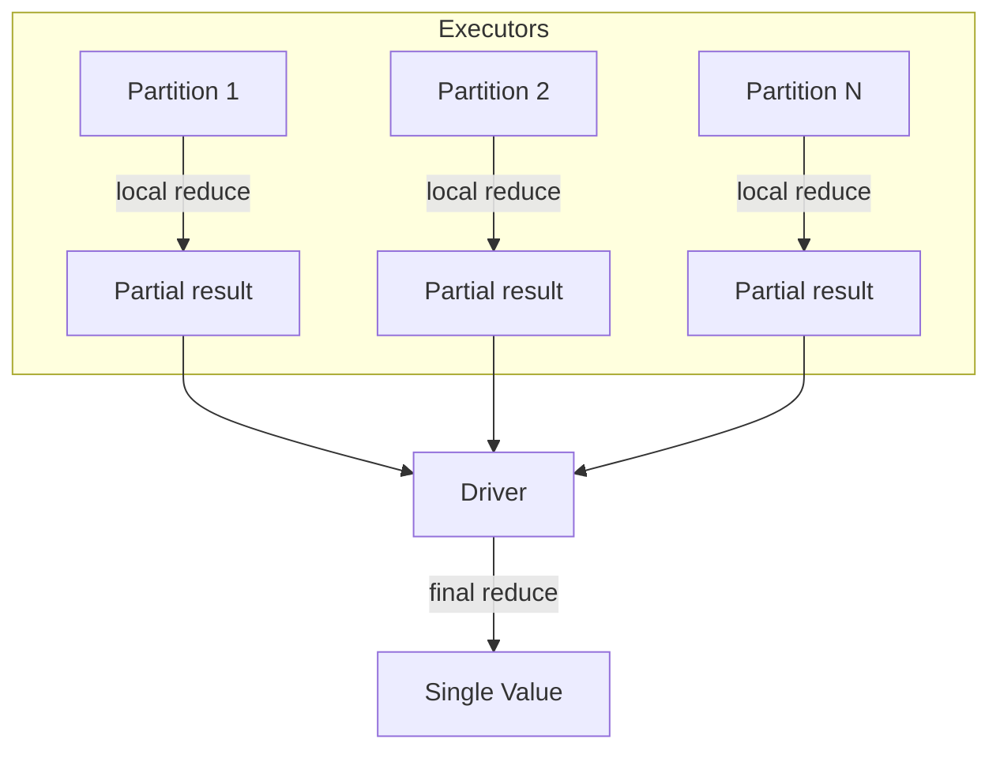

# Reduce

RDD-level reduce operations collapse distributed data into a single driver value
without a full `collect()`. Access them via `df.rdd`.



## API Reference

| Method | Signature | Description |
|--------|-----------|-------------|
| `rdd.reduce(f)` | `f(T, T) → T` | Associative + commutative binary function → single value |
| `rdd.fold(zero, f)` | `f(T, T) → T` | Like reduce but safe on empty RDDs (returns `zero`) |
| `rdd.aggregate(zero, seqOp, combOp)` | `seqOp(U, T) → U`, `combOp(U, U) → U` | Accumulate into a different type than the RDD elements |
| `rdd.reduceByKey(f)` | `f(V, V) → V` | Reduce values per key on `(K, V)` pair RDDs |
| `rdd.treeReduce(f, depth)` | `f(T, T) → T` | Multi-level reduce tree — less data sent to driver |

## Examples

### reduce() — sum and max

```python
revenues = df.rdd.map(lambda r: r["revenue"])

total = revenues.reduce(lambda a, b: a + b)  # (1)!
maximum = revenues.reduce(lambda a, b: max(a, b))
```
1. The function passed to `reduce` must be **associative** and **commutative** —
   Spark may apply it in any order across partitions.

### fold() — safe on empty RDDs

```python
total = df.rdd.map(lambda r: r["revenue"]).fold(
    0.0, lambda a, b: a + b                  # (1)!
)

# Empty DataFrame — fold returns zeroValue; reduce raises ValueError
empty_rdd = spark.createDataFrame([], df.schema).rdd.map(lambda r: r["revenue"])
safe_total = empty_rdd.fold(0.0, lambda a, b: a + b)
```
1. `fold` combines `zeroValue` with each partition result **and** the final
   result, so it is safe on empty RDDs.

### aggregate() — compute mean in one pass

```python
from pyspark.sql.types import Row

zero = (0.0, 0)                              # (sum, count)

def seq_op(acc: tuple, row: Row) -> tuple:   # (1)!
    return acc[0] + row["revenue"], acc[1] + 1

def comb_op(a: tuple, b: tuple) -> tuple:    # (2)!
    return a[0] + b[0], a[1] + b[1]

total, count = df.rdd.aggregate(zero, seq_op, comb_op)
mean = total / count if count else 0.0
```
1. `seqOp` merges one RDD element into the accumulator — runs on executors.
2. `combOp` merges two accumulators — runs on the driver to combine partition results.

### reduceByKey() — per-category totals

```python
category_totals = (
    df.rdd
    .map(lambda r: (r["category"], r["revenue"]))
    .reduceByKey(lambda a, b: a + b)
    .sortBy(lambda kv: -kv[1])
    .collect()
)
for category, total in category_totals:
    print(f"  {category}: {total:.2f}")
```

### treeReduce() — multi-level reduction

```python
total = (
    df.rdd
    .map(lambda r: r["revenue"])
    .treeReduce(lambda a, b: a + b, depth=2) # (1)!
)
```
1. `treeReduce` reduces in a tree structure, limiting data sent to the driver
   in each round — useful for large partition counts.

### Run

```bash
cd spark-python/pyspark-dataframe
python src/data_frame/actions/reduce/action_reduce.py
```

!!! warning "Prefer df.agg() over rdd.reduce()"
    `df.agg(F.sum("revenue"))` stays inside the Catalyst optimizer and runs
    much faster than dropping to the RDD layer. Use `rdd.reduce` / `fold` /
    `aggregate` **only** when the aggregation logic cannot be expressed with
    built-in Spark functions.

!!! tip "fold is safer than reduce"
    `reduce` raises `ValueError` on an empty RDD. `fold` returns the
    `zeroValue` instead — always prefer `fold` when the input may be empty.

!!! note "treeReduce reduces driver pressure"
    On RDDs with many partitions, `treeReduce` performs intermediate
    reductions on executors before sending partial results to the driver,
    reducing network traffic and driver memory pressure.

## Full Source

```python title="src/data_frame/actions/reduce/action_reduce.py"
--8<-- "src/data_frame/actions/reduce/action_reduce.py"
```
