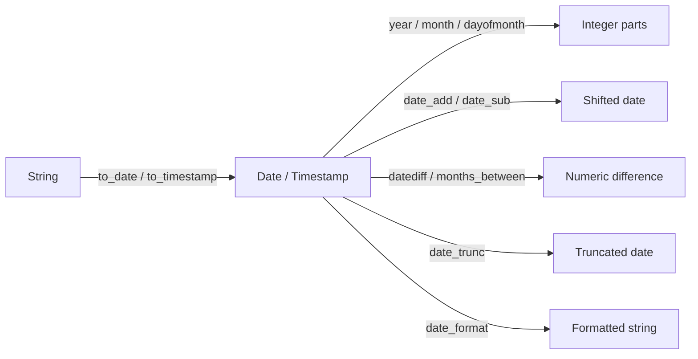

# Date and Time Functions

Parse, extract, truncate, format, and compute differences between dates and timestamps.



## Function Reference

| Function | Returns | Example |
|----------|---------|---------|
| `F.to_date(col, fmt)` | `DateType` | `F.to_date("date_str", "yyyy-MM-dd")` |
| `F.to_timestamp(col, fmt)` | `TimestampType` | `F.to_timestamp("ts", "yyyy-MM-dd HH:mm:ss")` |
| `F.current_date()` | `DateType` | Today's date |
| `F.current_timestamp()` | `TimestampType` | Current datetime |
| `F.year(col)` | `IntegerType` | `F.year("event_date")` |
| `F.month(col)` | `IntegerType` | `F.month("event_date")` |
| `F.dayofmonth(col)` | `IntegerType` | `F.dayofmonth("event_date")` |
| `F.dayofweek(col)` | `IntegerType` | 1=Sunday … 7=Saturday |
| `F.dayofyear(col)` | `IntegerType` | Day 1–366 |
| `F.hour / minute / second` | `IntegerType` | Time components |
| `F.date_add(col, n)` | `DateType` | Add `n` days |
| `F.date_sub(col, n)` | `DateType` | Subtract `n` days |
| `F.datediff(end, start)` | `IntegerType` | Days between two dates |
| `F.months_between(end, start)` | `DoubleType` | Months between two dates |
| `F.date_trunc(unit, col)` | `TimestampType` | Truncate to year/month/week/day/hour |
| `F.date_format(col, fmt)` | `StringType` | `F.date_format("d", "dd/MM/yyyy")` |
| `F.trunc(col, fmt)` | `DateType` | Truncate date to year/month |
| `F.last_day(col)` | `DateType` | Last day of the month |

## Example

```python
import os
from pyspark.sql import SparkSession
from pyspark.sql import functions as F

spark = (SparkSession.builder
         .appName("datetime-functions")
         .master(os.environ.get("SPARK_MASTER", "local[*]"))
         .config("spark.sql.shuffle.partitions", "4")
         .config("spark.ui.enabled", "false")
         .getOrCreate())
spark.sparkContext.setLogLevel("WARN")

data = [
    (1, "2024-01-15", "2024-01-15 09:30:00"),
    (2, "2024-06-01", "2024-06-01 14:00:00"),
]
df = spark.createDataFrame(data, ["id", "date_str", "ts_str"])

result = (df
          .withColumn("event_date",   F.to_date("date_str",  "yyyy-MM-dd"))         # (1)!
          .withColumn("event_ts",     F.to_timestamp("ts_str", "yyyy-MM-dd HH:mm:ss"))
          .withColumn("year",         F.year("event_date"))
          .withColumn("month",        F.month("event_date"))
          .withColumn("day",          F.dayofmonth("event_date"))
          .withColumn("due_date",     F.date_add("event_date", 30))                 # (2)!
          .withColumn("days_since",   F.datediff(F.current_date(), "event_date"))   # (3)!
          .withColumn("month_start",  F.date_trunc("month", "event_ts"))            # (4)!
          .withColumn("formatted",    F.date_format("event_date", "dd/MM/yyyy")))   # (5)!
result.show(truncate=False)
```
1. Always specify the format string — omitting it forces inference which can silently
   produce nulls when the string format varies.
2. Adds exactly 30 calendar days.
3. Returns `end - start` in whole days.
4. Truncates to midnight on the first of the month.
5. Returns a formatted string — useful for display but loses date semantics.

### Run

```bash
python src/data_frame/columns/dataframe_columns.py
```

## Filter by Date Range

```python
from datetime import date

start = F.lit(date(2024, 1, 1)).cast("date")
end   = F.lit(date(2024, 6, 30)).cast("date")

df.filter(F.col("event_date").between(start, end)).show()
```

## Month-over-Month Change

```python
from pyspark.sql.window import Window

w = Window.partitionBy("region").orderBy("month_start")
result = (df
          .withColumn("prev_revenue", F.lag("revenue", 1).over(w))
          .withColumn("mom_pct",
                      F.round((F.col("revenue") - F.col("prev_revenue")) /
                               F.col("prev_revenue") * 100, 1)))
```

!!! warning "Always specify the format string"
    Without a format, Spark uses a heuristic that may silently produce nulls when
    the string format is inconsistent across rows.

!!! tip "TimestampType and time zones"
    `TimestampType` is stored as UTC internally. Use `F.convert_timezone` (Spark 3.4+)
    or `F.to_utc_timestamp` / `F.from_utc_timestamp` to handle local time zones.
