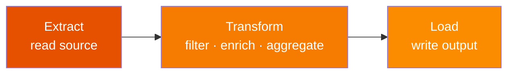

# ETL Pipeline

Structure an end-to-end PySpark job as three clearly separated phases: **Extract**,
**Transform**, and **Load** — each exposed as a typed, testable function.



## Pattern

```python
import os
from pyspark.sql import DataFrame, SparkSession
from pyspark.sql import functions as F
from pyspark.sql.types import StructType, StructField, LongType, StringType, DoubleType, DateType

INPUT_PATH  = os.environ.get("INPUT_PATH",  "/tmp/etl_input")
OUTPUT_PATH = os.environ.get("OUTPUT_PATH", "/tmp/etl_output")


def build_schema() -> StructType:                                          # (1)!
    return StructType([
        StructField("order_id",    LongType(),   nullable=False),
        StructField("customer_id", LongType(),   nullable=True),
        StructField("product",     StringType(), nullable=True),
        StructField("quantity",    LongType(),   nullable=True),
        StructField("unit_price",  DoubleType(), nullable=True),
        StructField("order_date",  DateType(),   nullable=True),
    ])


def extract(spark: SparkSession, path: str) -> DataFrame:                  # (2)!
    return (spark.read
            .schema(build_schema())
            .parquet(path))


def transform(df: DataFrame) -> DataFrame:                                 # (3)!
    return (df
            .filter(F.col("quantity").isNotNull() &
                    F.col("unit_price").isNotNull())
            .withColumn("revenue",
                        F.round(F.col("quantity") * F.col("unit_price"), 2))
            .withColumn("tier",
                        F.when(F.col("revenue") >= 1000, "Gold")
                         .when(F.col("revenue") >= 500,  "Silver")
                         .otherwise("Bronze"))
            .groupBy("product", "tier")
            .agg(
                F.round(F.sum("revenue"), 2).alias("total_revenue"),
                F.sum("quantity").alias("total_units"),
                F.countDistinct("customer_id").alias("unique_customers"),
            )
            .orderBy(F.desc("total_revenue")))


def load(df: DataFrame, path: str) -> None:                                # (4)!
    (df.write
       .mode("overwrite")
       .partitionBy("tier")
       .parquet(path))


def main(spark: SparkSession) -> None:
    raw = extract(spark, INPUT_PATH)
    result = transform(raw)
    load(result, OUTPUT_PATH)
    print(f"Wrote {result.count()} rows to {OUTPUT_PATH}")


if __name__ == "__main__":
    spark = (SparkSession.builder
             .appName("sales-etl")
             .master(os.environ.get("SPARK_MASTER", "local[*]"))
             .config("spark.sql.shuffle.partitions", "4")
             .config("spark.sql.adaptive.enabled", "true")
             .config("spark.ui.enabled", "false")
             .getOrCreate())
    spark.sparkContext.setLogLevel("WARN")
    main(spark)
    spark.stop()
```
1. Centralise schema definition — reuse it in tests and extract.
2. Always apply an explicit schema when reading — never rely on inference.
3. Pure function: `DataFrame → DataFrame`. Easy to unit-test with `chispa`.
4. `mode("overwrite")` + `partitionBy` is the idiomatic production write pattern.

### Run

```bash
python src/data_frame/etl/etl.py
```

Or with custom paths:

```bash
INPUT_PATH=/data/orders OUTPUT_PATH=/data/summary python src/data_frame/etl/etl.py
```

## Reusable Steps with DataFrame.transform()

Break common transformations into standalone functions and compose them:

```python
def add_revenue(df: DataFrame) -> DataFrame:
    return df.withColumn("revenue",
                         F.round(F.col("quantity") * F.col("unit_price"), 2))

def add_tier(df: DataFrame) -> DataFrame:
    return df.withColumn("tier",
                         F.when(F.col("revenue") >= 1000, "Gold").otherwise("Bronze"))

def filter_valid(df: DataFrame) -> DataFrame:
    return df.dropna(subset=["quantity", "unit_price"])

result = (raw
          .transform(filter_valid)
          .transform(add_revenue)
          .transform(add_tier))
```

## Testing the Pipeline

```python
# tests/etl/test_etl.py
from chispa import assert_df_equality
from pyspark.sql import functions as F

def test_transform_revenue_calculation(spark):
    raw = spark.createDataFrame(
        [(1, 1, "Widget", 3, 10.0, None)],
        ["order_id", "customer_id", "product", "quantity", "unit_price", "order_date"],
    )
    result = transform(raw)
    row = result.filter(F.col("product") == "Widget").first()
    assert row["total_revenue"] == 30.0
```

!!! success "ETL best practices"
    - Pure `extract` / `transform` / `load` functions — each independently testable
    - Never call `.show()` or `.collect()` in production pipeline functions
    - All paths from environment variables with `/tmp/` fallbacks
    - Explicit schema on every source read

!!! failure "Anti-patterns to avoid"
    - Mixing schema inference with explicit schema in the same pipeline
    - One monolithic function with no separation of concerns
    - Hardcoded file paths or credentials in source files
