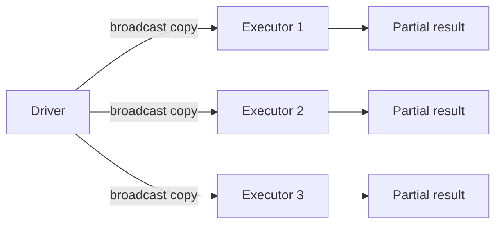

# Broadcast Join

Force a small DataFrame to be broadcast to every executor, eliminating the shuffle
that a standard sort-merge join requires.



## Broadcast Hash Join

Use `F.broadcast()` to hint that the wrapped DataFrame should be replicated:

```python
import os
from pyspark.sql import SparkSession
from pyspark.sql import functions as F

spark = (SparkSession.builder
         .appName("broadcast-hash-join")
         .master(os.environ.get("SPARK_MASTER", "local[*]"))
         .config("spark.sql.shuffle.partitions", "4")
         .config("spark.ui.enabled", "false")
         .getOrCreate())
spark.sparkContext.setLogLevel("WARN")

orders = spark.createDataFrame([
    (1, "A", 100.0), (2, "B", 200.0), (3, "A", 150.0)
], ["order_id", "product_code", "amount"])

products = spark.createDataFrame([
    ("A", "Widget"), ("B", "Gadget")
], ["product_code", "product_name"])

result = orders.join(
    F.broadcast(products),          # (1)!
    on=["product_code"],
    how="inner",
)
result.show()
result.explain()                    # (2)!
```
1. `F.broadcast()` wraps the small DataFrame — Spark sends it to all executors.
2. Check the physical plan for `BroadcastHashJoin` to confirm the hint was applied.

### Run

```bash
python src/data_frame/joins/broadcast/broadcast_hash_join.py
```

## Automatic Broadcast

Spark automatically broadcasts tables below `spark.sql.autoBroadcastJoinThreshold`
(default **10 MB**). Raise or lower the threshold as needed:

```python
spark.conf.set("spark.sql.autoBroadcastJoinThreshold", str(50 * 1024 * 1024))  # 50 MB
```

Disable automatic broadcasting:

```python
spark.conf.set("spark.sql.autoBroadcastJoinThreshold", "-1")
```

## Broadcast Nested Loop Join

When there is no equi-join key, Spark falls back to a broadcast **nested loop** join:

```python
result = orders.join(
    F.broadcast(discounts),
    on=(F.col("amount") >= F.col("min_amount")) & (F.col("amount") < F.col("max_amount")),
    how="inner",
)
```

!!! tip "Verify with explain()"
    After adding a broadcast hint, call `df.explain()` and look for
    `BroadcastHashJoin` or `BroadcastNestedLoopJoin` in the physical plan.

!!! success "Good fit for broadcast join"
    - Small dimension tables (< 100 MB) joined to large fact tables
    - Reducing shuffle in iterative pipelines that reuse the same lookup

!!! failure "Avoid broadcast join when"
    - The broadcast table exceeds available executor memory — causes OOM errors
    - Both sides are large — use bucketing or AQE instead
