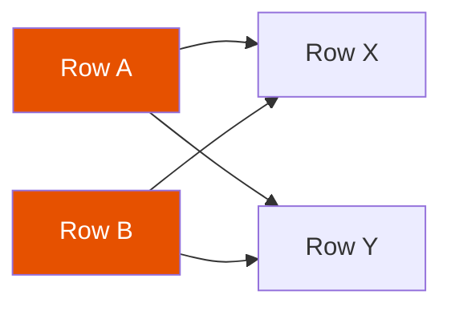

# Cross Join

A cross join returns the **Cartesian product** of two DataFrames — every row in the
left paired with every row in the right. For `n` left rows and `m` right rows, the
result has `n × m` rows.



## API Reference

| Method | Equivalent | Notes |
|--------|-----------|-------|
| `df1.crossJoin(df2)` | `df1.join(df2, how="cross")` | Explicit Cartesian product |
| `df1.join(df2)` | — | Implicit cross join when no `on=` is given (requires `crossJoin.enabled`) |
| `df1.hint("broadcast").crossJoin(df2)` | — | Broadcast the smaller side to avoid shuffle |

## Example

```python
import os
from pyspark.sql import SparkSession

spark = (SparkSession.builder
         .appName("cross-join")
         .master(os.environ.get("SPARK_MASTER", "local[*]"))
         .config("spark.sql.shuffle.partitions", "4")
         .config("spark.sql.crossJoin.enabled", "true")   # (1)!
         .config("spark.ui.enabled", "false")
         .getOrCreate())
spark.sparkContext.setLogLevel("WARN")

sizes   = spark.createDataFrame([("S",), ("M",), ("L",)],  ["size"])
colours = spark.createDataFrame([("Red",), ("Blue",)],     ["colour"])

result = sizes.crossJoin(colours)   # (2)!
result.show()
# 3 × 2 = 6 rows
```
1. Cross joins are disabled by default to prevent accidental Cartesian products.
   Set `spark.sql.crossJoin.enabled = true` or use `crossJoin()` explicitly.
2. `crossJoin()` is the explicit API; `join(how="cross")` also works.

### Run

```bash
python src/data_frame/joins/cross/cross_join.py
```

## Common Patterns

### Date Spine Generation

```python
from pyspark.sql import functions as F

dates = spark.sql("SELECT sequence(to_date('2024-01-01'), to_date('2024-12-31'), interval 1 day) AS date_arr") \
    .select(F.explode("date_arr").alias("date"))

entities = spark.createDataFrame([("Store_A",), ("Store_B",)], ["store"])

spine = dates.crossJoin(entities)   # one row per store per day
```

### Filtering After Cross Join

```python
result = (sizes
          .crossJoin(colours)
          .filter(~((F.col("size") == "S") & (F.col("colour") == "Red"))))
```

## Number of Partitions

A cross join may produce a very large DataFrame. Tune the output partitions:

```python
result = sizes.crossJoin(colours).repartition(8)
```

!!! success "Good fit for cross join"
    - Generating all combinations of two small lookup tables (e.g., size × colour)
    - Creating a date spine by crossing a date range with a list of entities
    - Pairing every row with a reference set for distance/similarity calculation

!!! failure "Avoid cross join when"
    - Either side is large — the result grows quadratically
    - You actually mean an equi-join — a missing `on=` accidentally produces a cross join

## Full Source

```python title="src/data_frame/joins/cross/cross_join.py"
--8<-- "src/data_frame/joins/cross/cross_join.py"
```
