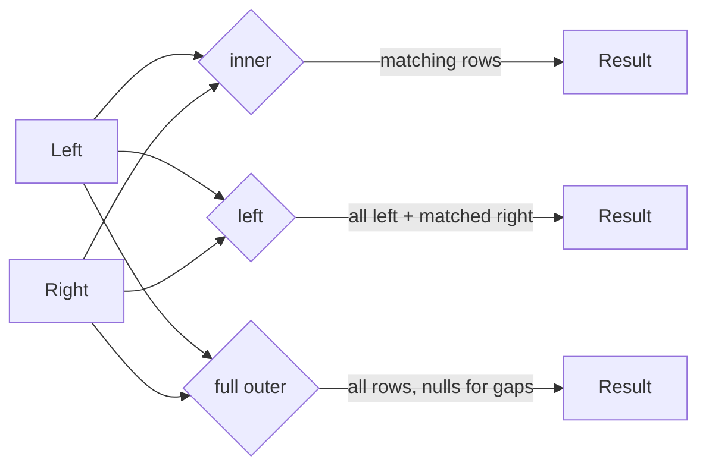

# Joins — Overview

Combine two DataFrames by matching rows on one or more key columns.

## Join Types



| Type | `how=` | Rows Returned | Right Columns? |
|------|--------|---------------|:--------------:|
| Inner | `"inner"` | Only matching rows from both sides | ✅ |
| Left outer | `"left"` | All left; NULLs for non-matching right | ✅ |
| Right outer | `"right"` | All right; NULLs for non-matching left | ✅ |
| Full outer | `"full"` | All rows from both sides; NULLs for gaps | ✅ |
| Left semi | `"left_semi"` | Left rows where a match exists | ❌ |
| Left anti | `"left_anti"` | Left rows where no match exists | ❌ |
| Cross | `"cross"` | Every left × every right row | ✅ |
| Natural | `"natural"` | Equi-join on all shared column names | ✅ (deduplicated) |

## Key Conventions

```python
from pyspark.sql import functions as F

# Preferred — keys as a list removes duplicate columns automatically
result = employees.join(departments, on=["dept_id"], how="inner")

# Non-equi condition
result = orders.join(discounts,
                     on=F.col("orders.amount") >= F.col("discounts.min_amount"),
                     how="left")

# Broadcast hint for small dimension tables
result = large_df.join(F.broadcast(small_df), on=["key"], how="inner")
```

!!! tip "Pass keys as a list"
    `on=["key"]` automatically deduplicates the join column in the result.
    Using `on=df1.key == df2.key` keeps both columns and causes `AnalysisException`
    on subsequent column references.

!!! warning "Shuffle cost"
    Every non-broadcast join triggers a shuffle. For tables joined repeatedly,
    consider bucketing (`bucketBy`) to pre-sort data on disk.

## Pages in This Section

| Page | Content |
|------|---------|
| [Inner](inner.md) | Equi-join, non-equi join |
| [Outer](outer.md) | Left, right, full outer joins |
| [Cross](cross.md) | Cartesian product |
| [Broadcast](broadcast.md) | Broadcast hash join and broadcast nested loop join |
| [Self](self.md) | Joining a table to itself with aliases |
| [Natural](natural.md) | Auto-join on shared column names |
| [Semi & Anti](semi_anti.md) | Filter-style joins without materialising right columns |
