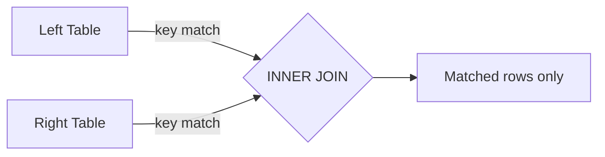

# Inner Join

Return only rows where a match exists in **both** DataFrames.
It is the most common join type and the default when `how` is omitted.



## Equi-Join

```python
import os
from pyspark.sql import SparkSession
from pyspark.sql import functions as F
from pyspark.sql.types import StructType, StructField, IntegerType, StringType, DoubleType

spark = (SparkSession.builder
         .appName("inner-equi-join")
         .master(os.environ.get("SPARK_MASTER", "local[*]"))
         .config("spark.sql.shuffle.partitions", "4")
         .config("spark.ui.enabled", "false")
         .getOrCreate())
spark.sparkContext.setLogLevel("WARN")

employee_schema = StructType([
    StructField("emp_id",    IntegerType(), nullable=False),
    StructField("name",      StringType(),  nullable=True),
    StructField("dept_id",   IntegerType(), nullable=True),
    StructField("salary",    DoubleType(),  nullable=True),
])
employees = spark.createDataFrame([
    (1, "Alice", 10, 85000.0),
    (2, "Bob",   20, 72000.0),
    (3, "Carol", 10, 91000.0),
    (4, "Dave",  99, 60000.0),   # dept 99 has no match
], employee_schema)

dept_schema = StructType([
    StructField("dept_id",   IntegerType(), nullable=False),
    StructField("dept_name", StringType(),  nullable=True),
])
departments = spark.createDataFrame([
    (10, "Engineering"),
    (20, "Marketing"),
], dept_schema)

result = employees.join(departments, on=["dept_id"], how="inner")  # (1)!
result.show()
```
1. `on=["dept_id"]` deduplicates the key column. `how="inner"` is the default
   but always write it explicitly for clarity.

### Run

```bash
python src/data_frame/joins/inner/inner_equi_join.py
```

## Non-Equi Join

Use a boolean expression instead of a key list for range or inequality conditions.

```python
orders = spark.createDataFrame([
    (1, 150.0), (2, 600.0), (3, 1200.0)
], ["order_id", "amount"])

discounts = spark.createDataFrame([
    ("Bronze", 0.0,   499.99),
    ("Silver", 500.0, 999.99),
    ("Gold",   1000.0, 9999.99),
], ["tier", "min_amount", "max_amount"])

result = orders.join(
    discounts,
    on=(F.col("amount") >= F.col("min_amount")) &    # (1)!
       (F.col("amount") <= F.col("max_amount")),
    how="inner",
)
result.show()
```
1. Multiple conditions are combined with `&` (and) or `|` (or) — not Python `and`/`or`.

### Run

```bash
python src/data_frame/joins/inner/inner_non_equi_join.py
```

!!! success "Good fit for inner join"
    - Lookup enrichment (add dimension attributes to a fact table)
    - Filtering a large table to only rows that appear in a reference set

!!! failure "Not suitable"
    - When you need to keep rows with no match — use left/full outer join
    - Filtering without needing right columns — use `left_semi` instead (cheaper)
