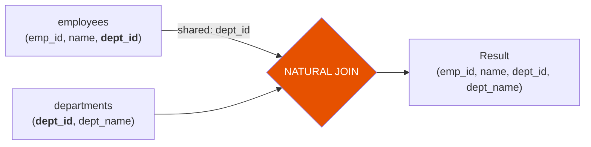

# Natural Join

A natural join automatically uses all columns that share the same name in both
DataFrames as join keys, returning each shared column once in the result.



## API Reference

| Syntax | Semantics | Shared Columns |
|--------|-----------|----------------|
| `df1.join(df2, how="natural")` | Inner (default) — only matching rows | Appears once in result |
| `df1.join(df2, how="natural_left")` | Left outer — all left rows | Appears once in result |
| `df1.join(df2, how="natural_right")` | Right outer — all right rows | Appears once in result |
| `df1.join(df2, how="natural_full")` | Full outer — all rows | Appears once in result |

!!! warning "Use with care"
    Natural joins are implicit — if a new column is added to either DataFrame with
    the same name as a column in the other, the join condition changes silently.
    Prefer explicit key lists (`on=["col"]`) in production code.

## Example

```python
import os
from pyspark.sql import SparkSession

spark = (SparkSession.builder
         .appName("natural-join")
         .master(os.environ.get("SPARK_MASTER", "local[*]"))
         .config("spark.sql.shuffle.partitions", "4")
         .config("spark.ui.enabled", "false")
         .getOrCreate())
spark.sparkContext.setLogLevel("WARN")

employees = spark.createDataFrame([
    (1, "Alice", 10), (2, "Bob", 20), (3, "Carol", 99)
], ["emp_id", "name", "dept_id"])

departments = spark.createDataFrame([
    (10, "Engineering"), (20, "Marketing")
], ["dept_id", "dept_name"])

# Shared column: dept_id
result = employees.join(departments, how="natural")    # (1)!
result.show()
# dept_id appears once; unmatched Carol (dept 99) is excluded (inner semantics)
```
1. No `on=` parameter — Spark infers the key from shared column names.

### Run

```bash
python src/data_frame/joins/natural/natural_join.py
```

## Natural Join Semantics

Natural join uses **inner join** semantics by default — only rows with a matching
value in the shared key column(s) are returned.

### Equivalent Explicit Join

A natural join on `dept_id` is equivalent to:

```python
result = employees.join(departments, on=["dept_id"], how="inner")
```

The explicit form is preferred for production code because it makes the join
condition visible and resilient to schema changes.

!!! success "Good fit"
    - Quick exploratory queries on DataFrames with well-named, disjoint columns
    - Interactive sessions where explicit keys add noise

!!! failure "Avoid in production pipelines"
    - Schema changes silently alter the join condition
    - Multiple shared columns may cause unintended multi-key joins
    - Harder to reason about without reading both schemas

## Full Source

```python title="src/data_frame/joins/natural/natural_join.py"
--8<-- "src/data_frame/joins/natural/natural_join.py"
```
