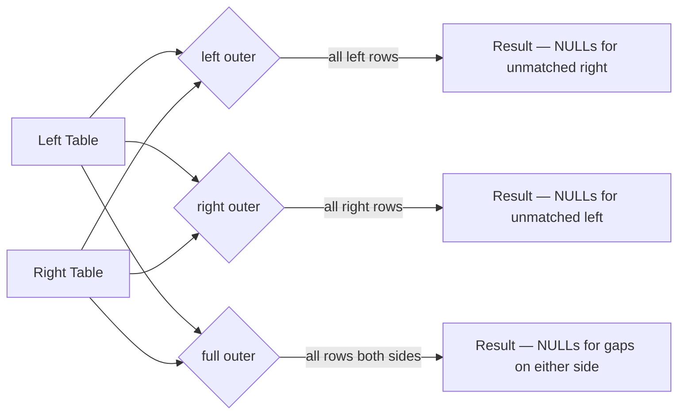

# Outer Joins

Outer joins preserve rows even when no match exists in the other DataFrame.



## Join Type Comparison

| Type | Keeps unmatched left? | Keeps unmatched right? |
|------|-----------------------|------------------------|
| `left` | ✅ | ❌ |
| `right` | ❌ | ✅ |
| `full` | ✅ | ✅ |

## Left Outer Join

All rows from the **left** DataFrame; `null` for right-side columns when no match.

```python
import os
from pyspark.sql import SparkSession
from pyspark.sql import functions as F

spark = (SparkSession.builder
         .appName("outer-joins")
         .master(os.environ.get("SPARK_MASTER", "local[*]"))
         .config("spark.sql.shuffle.partitions", "4")
         .config("spark.ui.enabled", "false")
         .getOrCreate())
spark.sparkContext.setLogLevel("WARN")

employees = spark.createDataFrame([
    (1, "Alice", 10), (2, "Bob", 20), (3, "Carol", 99)
], ["emp_id", "name", "dept_id"])

departments = spark.createDataFrame([
    (10, "Engineering"), (20, "Marketing")
], ["dept_id", "dept_name"])

left_result = employees.join(departments, on=["dept_id"], how="left")  # (1)!
left_result.show()
# Carol (dept 99) appears with dept_name = null
```
1. Use `"left"` or `"left_outer"` — both are accepted.

### Run

```bash
python src/data_frame/joins/outer/left/left_outer_join.py
```

## Right Outer Join

All rows from the **right** DataFrame; `null` for left-side columns when no match.

```python
right_result = employees.join(departments, on=["dept_id"], how="right")  # (1)!
right_result.show()
# Marketing (dept 20) appears even if no employee references it
```
1. Use `"right"` or `"right_outer"`.

### Run

```bash
python src/data_frame/joins/outer/right/right_outer_join.py
```

## Full Outer Join

All rows from **both** DataFrames; `null` wherever no match exists.

```python
full_result = employees.join(departments, on=["dept_id"], how="full")  # (1)!
full_result.show()
```
1. Use `"full"`, `"full_outer"`, or `"outer"`.

### Run

```bash
python src/data_frame/joins/outer/full/full_outer_join.py
```

## Handling Nulls in Outer Join Results

```python
result = (employees
          .join(departments, on=["dept_id"], how="left")
          .withColumn("dept_name", F.coalesce(F.col("dept_name"), F.lit("Unknown"))))
```

!!! tip "Fill unmatched right columns after a left join"
    Use `F.coalesce(F.col("col"), F.lit(default))` to replace nulls introduced by
    the outer join without changing rows that had genuine matches.

!!! success "Good fit for outer joins"
    - Auditing which records in table A have no corresponding entry in table B
    - Merging two datasets where both may have unique records

!!! failure "Avoid full outer join when"
    - One side always has a match — use inner or left join instead
    - Data is very large on both sides — full outer triggers a large shuffle
