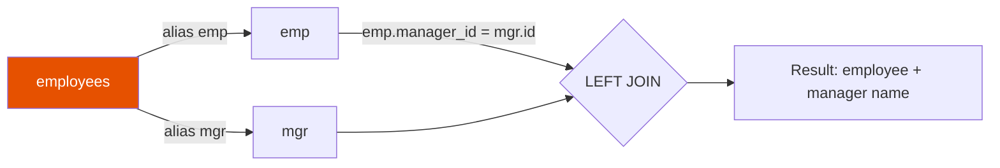

# Self Join

Join a DataFrame to itself to compare rows within the same table — for example,
finding employees and their managers stored in the same table.



## API Reference

| Step | Method | Purpose |
|------|--------|---------|
| 1. Alias | `df.alias("a")` | Create a named reference to avoid ambiguous columns |
| 2. Join | `a.join(b, condition, how)` | Join the two aliases on a cross-reference column |
| 3. Select | `.select(F.col("a.col"))` | Use `alias.column` to disambiguate identically named columns |

!!! warning "Always alias both sides"
    Without aliases, Spark cannot distinguish `id` from the left side from `id` on
    the right side and raises `AnalysisException: Resolved attribute missing`.

## Example — Employee / Manager Hierarchy

```python
import os
from pyspark.sql import SparkSession
from pyspark.sql import functions as F

spark = (SparkSession.builder
         .appName("self-join")
         .master(os.environ.get("SPARK_MASTER", "local[*]"))
         .config("spark.sql.shuffle.partitions", "4")
         .config("spark.ui.enabled", "false")
         .getOrCreate())
spark.sparkContext.setLogLevel("WARN")

employees = spark.createDataFrame([
    (1, "Alice", None),
    (2, "Bob",   1),
    (3, "Carol", 1),
    (4, "Dave",  2),
], ["id", "name", "manager_id"])

emp = employees.alias("emp")       # (1)!
mgr = employees.alias("mgr")       # (2)!

result = (emp
          .join(mgr,
                F.col("emp.manager_id") == F.col("mgr.id"),   # (3)!
                how="left")
          .select(
              F.col("emp.id").alias("emp_id"),
              F.col("emp.name").alias("employee"),
              F.col("mgr.name").alias("manager"),
          ))
result.show()
```
1. Left side alias — represents the employee row.
2. Right side alias — represents the manager row.
3. Use `alias.column` notation to disambiguate the same column from both sides.

### Run

```bash
python src/data_frame/joins/self/self_join.py
```

## Common Self-Join Patterns

### Same-Group Pairs

```python
# Find pairs of employees in the same department
result = (emp
          .join(mgr,
                (F.col("emp.dept_id") == F.col("mgr.dept_id")) &
                (F.col("emp.id") < F.col("mgr.id")),   # avoid duplicate pairs
                how="inner")
          .select("emp.name", "mgr.name", "emp.dept_id"))
```

### Multi-Level Hierarchy

```python
# Walk two levels: employee → manager → skip-level manager
lvl1 = employees.alias("lvl1")
lvl2 = employees.alias("lvl2")
lvl3 = employees.alias("lvl3")

chain = (lvl1
         .join(lvl2, F.col("lvl1.manager_id") == F.col("lvl2.id"), "left")
         .join(lvl3, F.col("lvl2.manager_id") == F.col("lvl3.id"), "left")
         .select(
             F.col("lvl1.name").alias("employee"),
             F.col("lvl2.name").alias("manager"),
             F.col("lvl3.name").alias("skip_level_manager"),
         ))
chain.show()
```

!!! success "Good fit for self join"
    - Hierarchical data (employee → manager, category → parent category)
    - Finding pairs within the same group (e.g., co-workers in a department)
    - Multi-level hierarchy traversal (walk 2–3 levels deep)

!!! failure "Not suitable when"
    - You need to compare every row with every other — the result is quadratic;
      use window functions (`lag`, `lead`) for ordered row comparisons instead
    - Unlimited-depth recursion is needed — Spark SQL does not support recursive CTEs

## Full Source

```python title="src/data_frame/joins/self/self_join.py"
--8<-- "src/data_frame/joins/self/self_join.py"
```
