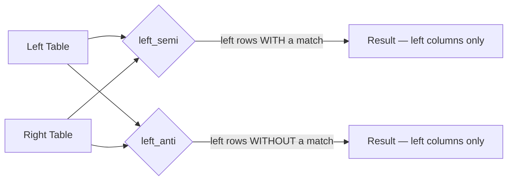

# Semi & Anti Joins

Semi and anti joins are **filter-style** joins: they use the right DataFrame to
decide which left rows to keep, but never materialise right-side columns in the result.
They are cheaper than inner/outer joins when you only need the filter effect.



## Left Semi Join

Keep only the left rows that **have** a matching row in the right DataFrame.
No right-side columns are included in the result.

```python
import os
from pyspark.sql import SparkSession

spark = (SparkSession.builder
         .appName("semi-anti-join")
         .master(os.environ.get("SPARK_MASTER", "local[*]"))
         .config("spark.sql.shuffle.partitions", "4")
         .config("spark.ui.enabled", "false")
         .getOrCreate())
spark.sparkContext.setLogLevel("WARN")

orders = spark.createDataFrame([
    (1, 101), (2, 102), (3, 103), (4, 104)
], ["order_id", "customer_id"])

valid_customers = spark.createDataFrame([
    (101,), (103,)
], ["customer_id"])

# Only orders from valid customers
matched = orders.join(valid_customers, on=["customer_id"], how="left_semi")  # (1)!
matched.show()
# order_id 1 (customer 101) and order_id 3 (customer 103)
```
1. Result contains only `orders` columns — `valid_customers` columns are never added.

### Run

```bash
# no dedicated example file yet — add to joins/ directory
```

## Left Anti Join

Keep only the left rows that **do not have** a matching row in the right DataFrame.
Useful for finding orphaned or unprocessed records.

```python
# Orders with no valid customer — candidates for cleanup
orphaned = orders.join(valid_customers, on=["customer_id"], how="left_anti")  # (1)!
orphaned.show()
# order_id 2 (customer 102) and order_id 4 (customer 104)
```
1. Anti join is equivalent to `WHERE NOT EXISTS (subquery)` in SQL.

## Comparison with Inner / Left

| Goal | Recommended join |
|------|-----------------|
| Enrich left with right columns | `inner` or `left` |
| Check existence in right (keep left cols only) | `left_semi` |
| Find records missing from right | `left_anti` |

!!! tip "Semi/anti joins are cheaper"
    Spark can short-circuit the right-side scan once a match (or non-match) is
    confirmed, making semi/anti joins faster than equivalent inner joins followed
    by a `select`.

!!! success "Good fit"
    - Existence checks: "which orders have a payment record?"
    - Difference queries: "which customers placed no order this month?"
    - De-duplication against a reference set

!!! failure "Not suitable when"
    - You need columns from the right DataFrame — use inner or left join instead
