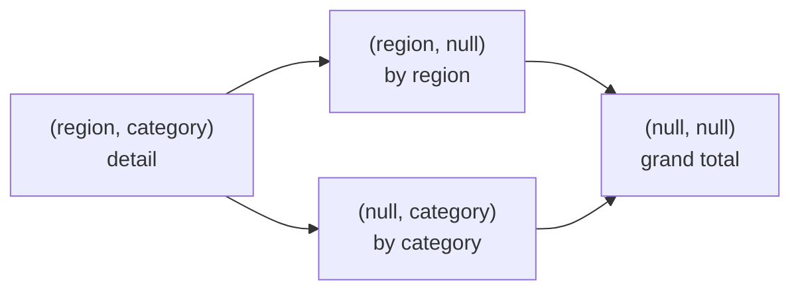

# CUBE — All-Combination Subtotals

`cube` computes aggregates for **every possible combination** of the given dimensions.
With `n` columns it produces `2^n` distinct grouping combinations — compared to
`n+1` for `rollup`.



## API

| Method | Description |
|--------|-------------|
| `df.cube(*cols).agg(...)` | All dimension combinations |
| `df.rollup(*cols).agg(...)` | Hierarchical subset — `n+1` levels only |
| `F.grouping_id(*cols)` | Bitmask identifying which combination each row represents |

## CUBE vs ROLLUP — Row Count

| Operation | Formula | 2 dims | 3 dims |
|-----------|---------|--------|--------|
| `rollup(a, b, c)` | `n + 1` | 3 | 4 |
| `cube(a, b, c)` | `2^n` | 4 | 8 |

## Example

```python
import os
from pyspark.sql import SparkSession
from pyspark.sql import functions as F

spark = (SparkSession.builder
         .appName("olap-cube")
         .master(os.environ.get("SPARK_MASTER", "local[*]"))
         .config("spark.sql.shuffle.partitions", "4")
         .config("spark.ui.enabled", "false")
         .getOrCreate())
spark.sparkContext.setLogLevel("WARN")

data = [
    ("North", "Electronics", "2023", "Q1", 15000.0),
    ("North", "Apparel",     "2023", "Q1",  8000.0),
    ("South", "Electronics", "2023", "Q1", 12000.0),
    ("South", "Apparel",     "2023", "Q1",  6000.0),
    ("East",  "Electronics", "2023", "Q1",  9000.0),
    ("East",  "Books",       "2023", "Q1",  2000.0),
]
df = spark.createDataFrame(data, ["region", "category", "year", "quarter", "revenue"])

result = (
    df.cube("region", "category")                               # (1)!
    .agg(F.round(F.sum("revenue"), 2).alias("total_revenue"))
    .orderBy(
        F.col("region").asc_nulls_last(),
        F.col("category").asc_nulls_last(),
    )
)
result.show(truncate=False)
# region  category      total_revenue
# East    Books         2000.0         ← (region, category)  gid=0
# East    Electronics   9000.0
# ...
# East    null          11000.0        ← (region only)       gid=1
# ...
# null    Apparel       14000.0        ← (category only)     gid=2
# null    Electronics   36000.0
# null    Books          2000.0
# null    null          52000.0        ← grand total          gid=3
```
1. CUBE produces the two rows that ROLLUP would skip:
   `(null, category)` — subtotal per category across all regions.

### Run

```bash
python src/data_frame/analytical/olap/cube/olap_cube.py
```

## Multiple Aggregates

```python
result = (
    df.cube("region", "category")
    .agg(
        F.round(F.sum("revenue"), 2).alias("total_revenue"),
        F.round(F.avg("revenue"), 2).alias("avg_revenue"),
        F.count("*").alias("records"),
    )
    .orderBy(
        F.col("region").asc_nulls_last(),
        F.col("category").asc_nulls_last(),
    )
)
```

## Three-Dimension Cube

With 3 dimensions CUBE produces `2^3 = 8` combinations:

```python
result = (
    df.cube("region", "category", "year")    # (1)!
    .agg(F.round(F.sum("revenue"), 2).alias("total_revenue"))
    .orderBy(
        F.col("region").asc_nulls_last(),
        F.col("category").asc_nulls_last(),
        F.col("year").asc_nulls_last(),
    )
)
# 8 combinations:
# (region, category, year)  gid=0  ← finest grain
# (region, category, null)  gid=1
# (region, null,     year)  gid=2
# (region, null,     null)  gid=3
# (null,   category, year)  gid=4
# (null,   category, null)  gid=5
# (null,   null,     year)  gid=6
# (null,   null,     null)  gid=7  ← grand total
```
1. Be careful with more than 3 dimensions — `2^n` grows quickly.
   Consider GROUPING SETS to select only the combinations you need.

## SQL Equivalent

```sql
SELECT
    region,
    category,
    ROUND(SUM(revenue), 2) AS total_revenue
FROM sales
GROUP BY CUBE(region, category)
ORDER BY region ASC NULLS LAST, category ASC NULLS LAST
```

!!! success "Good fit for CUBE"
    - Ad-hoc analysis where any dimension slice may be queried
    - Pre-computing a full summary table that feeds multiple dashboard panels
    - Data warehouse fact tables with low-cardinality dimensions

!!! failure "Avoid CUBE when"
    - You only need hierarchical drill-down — use the cheaper `rollup`
    - Dimensions have high cardinality — the result set grows as `2^n × distinct_values`
    - Only a subset of combinations is actually needed — use GROUPING SETS instead

!!! warning "Output size"
    With 4 dimensions `2^4 = 16` combinations. With 5 it is 32.
    Always benchmark on a representative sample before running CUBE on a full dataset.
