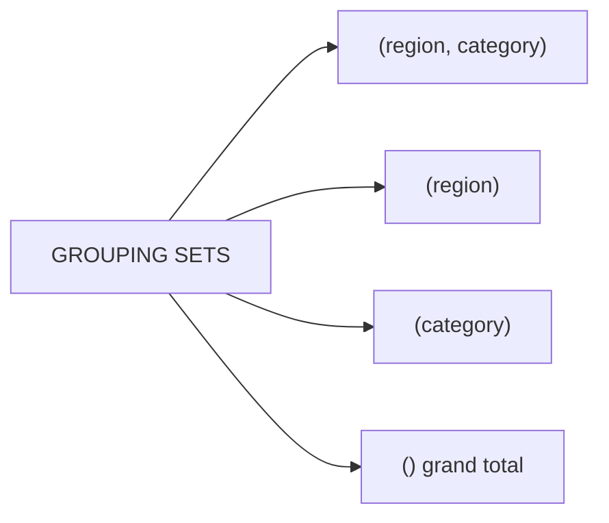

# Grouping Sets — Custom Combinations

`GROUPING SETS` lets you specify **exactly which grouping combinations** to compute.
It is more flexible than both `rollup` (hierarchical) and `cube` (all combinations)
because you define the set explicitly.



## API

!!! note "SQL-only in PySpark 3.5"
    The DataFrame API does not expose a `groupingSets()` method as of Spark 3.5.
    Use `spark.sql()` with a temporary view, or emulate it with `unionByName`
    (see [DataFrame emulation](#dataframe-emulation) below).

| Approach | When to use |
|----------|-------------|
| `spark.sql("GROUP BY GROUPING SETS ...")` | Preferred — concise, full SQL power |
| `unionByName` of separate `groupBy` calls | When SQL is not available (e.g. streaming, custom catalog) |

## Basic Example

```python
import os
from pyspark.sql import SparkSession
from pyspark.sql import functions as F

spark = (SparkSession.builder
         .appName("olap-grouping-sets")
         .master(os.environ.get("SPARK_MASTER", "local[*]"))
         .config("spark.sql.shuffle.partitions", "4")
         .config("spark.ui.enabled", "false")
         .getOrCreate())
spark.sparkContext.setLogLevel("WARN")

data = [
    ("North", "Electronics", "2023", "Q1", 15000.0),
    ("North", "Apparel",     "2023", "Q1",  8000.0),
    ("South", "Electronics", "2023", "Q1", 12000.0),
    ("South", "Apparel",     "2023", "Q1",  6000.0),
    ("East",  "Books",       "2023", "Q1",  2000.0),
]
df = spark.createDataFrame(data, ["region", "category", "year", "quarter", "revenue"])
df.createOrReplaceTempView("sales")                              # (1)!

spark.sql("""
    SELECT
        region,
        category,
        ROUND(SUM(revenue), 2) AS total_revenue
    FROM sales
    GROUP BY GROUPING SETS (
        (region, category),                                      -- detail
        (region),                                                -- region subtotal
        ()                                                       -- grand total
    )
    ORDER BY region ASC NULLS LAST, category ASC NULLS LAST
""").show(truncate=False)
```
1. Register as a temp view so `spark.sql()` can reference it by name.

### Run

```bash
python src/data_frame/analytical/olap/grouping_sets/olap_grouping_sets.py
```

## Skipping the Grand Total

Unlike ROLLUP, you can omit any level — including the grand total:

```sql
GROUP BY GROUPING SETS (
    (region, category, year),   -- finest grain
    (region, category),         -- year rolled up
    (region)                    -- category + year rolled up
    -- no () → grand total row is intentionally excluded
)
```

## Relationship to ROLLUP and CUBE

ROLLUP and CUBE are shorthand for specific GROUPING SETS patterns:

```sql
-- These three are equivalent:
GROUP BY ROLLUP(a, b)
GROUP BY GROUPING SETS ((a, b), (a), ())

-- These two are equivalent:
GROUP BY CUBE(a, b)
GROUP BY GROUPING SETS ((a, b), (a), (b), ())
```

## DataFrame Emulation

When SQL is unavailable, emulate GROUPING SETS with `unionByName`:

```python
by_region_category = (
    df.groupBy("region", "category")
    .agg(F.round(F.sum("revenue"), 2).alias("total_revenue"))
)
by_region = (
    df.groupBy("region")
    .agg(F.round(F.sum("revenue"), 2).alias("total_revenue"))
    .withColumn("category", F.lit(None).cast("string"))          # (1)!
)
grand_total = (
    df.agg(F.round(F.sum("revenue"), 2).alias("total_revenue"))
    .withColumn("region",   F.lit(None).cast("string"))
    .withColumn("category", F.lit(None).cast("string"))
)

result = (
    by_region_category
    .unionByName(by_region)
    .unionByName(grand_total)
    .orderBy(
        F.col("region").asc_nulls_last(),
        F.col("category").asc_nulls_last(),
    )
)
```
1. Pad missing columns with `F.lit(None).cast(type)` so all three DataFrames
   share the same schema for `unionByName`.

!!! success "Good fit for GROUPING SETS"
    - You need a strict subset of CUBE combinations (avoids computing unused rows)
    - You need asymmetric groupings that don't follow a hierarchy
    - Saving compute by skipping the grand total or intermediate levels

!!! failure "Avoid GROUPING SETS when"
    - A full hierarchy is needed — just use `rollup` (simpler syntax)
    - All combinations are needed — just use `cube`
    - The same result can be expressed more clearly with a single `groupBy`
