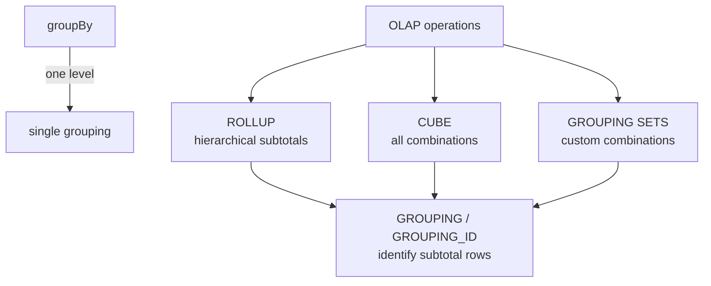

# OLAP — Overview

OLAP (Online Analytical Processing) operations compute **multi-dimensional aggregates**
in a single pass — subtotals, cross-tabulations, and grand totals — without requiring
multiple queries or application-side post-processing.



## Operation Comparison

| Operation | Combinations produced | Use when |
|-----------|----------------------|----------|
| `rollup(a, b, c)` | `n+1` levels along the hierarchy | Drill-down reports (year → quarter → month) |
| `cube(a, b, c)` | `2^n` combinations | Cross-dimensional analysis (all region × category combos) |
| `GROUPING SETS` | Exactly what you specify | Mix-and-match levels without hierarchy constraint |
| `grouping(col)` / `grouping_id(...)` | — (used with the above) | Identify which rows are subtotals vs detail |

## Data Shape

All three operations return **NULL** in the grouped column to indicate
that the row is a subtotal or grand total for that dimension:

```
region   category   total_revenue
------   --------   -------------
East     Books      11000.0       ← detail
East     null       47000.0       ← East subtotal  (category rolled up)
null     null       237000.0      ← grand total    (all dimensions rolled up)
```

Use `F.grouping(col)` or `F.coalesce()` to distinguish aggregation-produced
NULLs from genuine NULL values in your data.

## Sample Dataset

All OLAP examples in this section use `olap_sales()` from `sample_data.py`:

| Dimensions | Values |
|-----------|--------|
| `region` | North, South, East |
| `category` | Electronics, Apparel, Books |
| `year` | 2023, 2024 |
| `quarter` | Q1, Q2 |

## Pages

| Page | Topic |
|------|-------|
| [Rollup](rollup.md) | Hierarchical subtotals |
| [Cube](cube.md) | All-combination subtotals |
| [Grouping Sets](grouping_sets.md) | Custom grouping combinations |
| [Grouping ID](grouping_id.md) | Identifying subtotal rows |

!!! tip "Start with ROLLUP"
    Most reporting use cases need hierarchical drill-down (region → category → year).
    ROLLUP is the right default — CUBE generates far more rows and is rarely needed
    unless you genuinely need every cross-dimensional combination.
