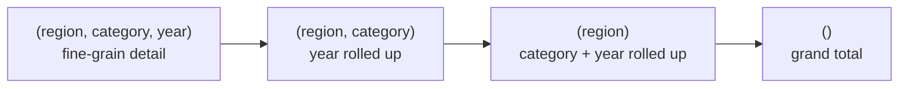

# ROLLUP — Hierarchical Subtotals

`rollup` computes subtotals along an **ordered dimension hierarchy**, producing
`n+1` grouping levels for `n` columns — one per level of the hierarchy plus a
grand total.



## API

| Method | Description |
|--------|-------------|
| `df.rollup(*cols).agg(...)` | Hierarchical subtotals from left to right |
| `F.coalesce(col, F.lit("label"))` | Replace aggregation NULLs with readable labels |
| `F.grouping(col)` | `1` if the column is NULL due to rollup; `0` otherwise |

## Two-Level Rollup

```python
import os
from pyspark.sql import SparkSession
from pyspark.sql import functions as F

spark = (SparkSession.builder
         .appName("olap-rollup")
         .master(os.environ.get("SPARK_MASTER", "local[*]"))
         .config("spark.sql.shuffle.partitions", "4")
         .config("spark.ui.enabled", "false")
         .getOrCreate())
spark.sparkContext.setLogLevel("WARN")

data = [
    ("North", "Electronics", "2023", "Q1", 15000.0),
    ("North", "Electronics", "2024", "Q1", 20000.0),
    ("North", "Apparel",     "2023", "Q1",  8000.0),
    ("South", "Electronics", "2023", "Q1", 12000.0),
    ("South", "Apparel",     "2023", "Q1",  6000.0),
]
df = spark.createDataFrame(data, ["region", "category", "year", "quarter", "revenue"])

result = (
    df.rollup("region", "category")                              # (1)!
    .agg(F.round(F.sum("revenue"), 2).alias("total_revenue"))
    .orderBy(
        F.col("region").asc_nulls_last(),                        # (2)!
        F.col("category").asc_nulls_last(),
    )
)
result.show(truncate=False)
# region  category      total_revenue
# East    Books         11000.0        ← detail row
# East    null          47000.0        ← East subtotal
# null    null          237000.0       ← grand total
```
1. Dimensions are listed left-to-right from coarsest to finest in the hierarchy.
2. `asc_nulls_last` pushes subtotal/grand-total rows to the bottom within each group.

### Run

```bash
python src/data_frame/analytical/olap/rollup/olap_rollup.py
```

## Three-Level Rollup

Add a third dimension to get an extra level of subtotals:

```python
result = (
    df.rollup("region", "category", "year")          # (1)!
    .agg(
        F.round(F.sum("revenue"), 2).alias("total_revenue"),
        F.count("*").alias("records"),
    )
    .orderBy(
        F.col("region").asc_nulls_last(),
        F.col("category").asc_nulls_last(),
        F.col("year").asc_nulls_last(),
    )
)
result.show(40, truncate=False)
# Levels produced:
#   (region, category, year)  → detail
#   (region, category, null)  → year subtotal
#   (region, null,     null)  → category + year subtotal
#   (null,   null,     null)  → grand total
```
1. With `n=3` dimensions ROLLUP produces exactly `n+1 = 4` distinct grouping levels.

## Labelling Subtotal Rows

Replace aggregation NULLs with human-readable labels before displaying:

```python
result = (
    df.rollup("region", "category")
    .agg(F.round(F.sum("revenue"), 2).alias("total_revenue"))
    .withColumn("region",   F.coalesce(F.col("region"),   F.lit("GRAND TOTAL")))  # (1)!
    .withColumn("category", F.coalesce(F.col("category"), F.lit("ALL")))
    .orderBy("region", "category")
)
result.show(truncate=False)
```
1. `coalesce` returns the first non-NULL argument — safe even for columns that
   genuinely contain NULL values in the source data (use `F.grouping()` there instead).

## SQL Equivalent

```sql
SELECT
    region,
    category,
    ROUND(SUM(revenue), 2) AS total_revenue
FROM sales
GROUP BY ROLLUP(region, category)
ORDER BY region ASC NULLS LAST, category ASC NULLS LAST
```

!!! success "Good fit for ROLLUP"
    - Hierarchical drill-down reports (geography, time, product hierarchy)
    - Dashboards that show both detail rows and subtotals in one query
    - Replacing multiple `groupBy` + `union` chains

!!! failure "Avoid ROLLUP when"
    - You need subtotals for non-adjacent dimension combinations — use CUBE or GROUPING SETS
    - Your data has genuine NULLs in the rollup columns — use `F.grouping()` to tell them apart from aggregation NULLs

!!! warning "NULL ambiguity"
    A NULL in a ROLLUP result can mean either *"this is a subtotal row"* or
    *"the source value was NULL"*. Use `F.grouping(col)` to distinguish them.
    See [Grouping ID](grouping_id.md) for the full pattern.
