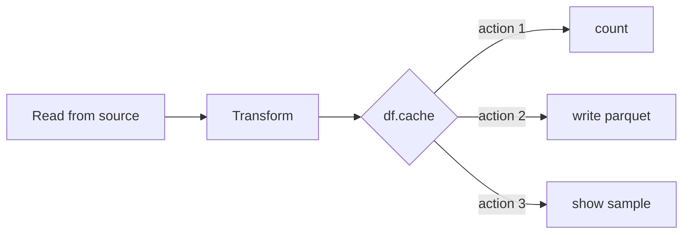

# Caching

Persist a DataFrame in memory (and optionally disk) so Spark can reuse it across
multiple actions without re-computing the full lineage.

## When to Cache

Cache a DataFrame **only** when it is used more than once in the same job. Caching
adds overhead — serialisation, memory pressure, and bookkeeping. One-time DataFrames
are cheaper to recompute.



## Storage Levels

| Level | Stored in | Serialised | Best For |
|-------|-----------|:----------:|---------|
| `MEMORY_ONLY` | Executor memory | ❌ | Fastest re-reads; risk of OOM |
| `MEMORY_AND_DISK` *(default)* | Memory + disk spill | ❌ | Balance of speed and safety |
| `MEMORY_AND_DISK_SER` | Memory + disk spill | ✅ | Smaller memory footprint |
| `DISK_ONLY` | Executor disk | ✅ | Very large DataFrames |
| `OFF_HEAP` | Off-heap memory | ✅ | Reduce GC pressure |

## Example

```python
import os
from pyspark import StorageLevel
from pyspark.sql import SparkSession
from pyspark.sql import functions as F

spark = (SparkSession.builder
         .appName("caching")
         .master(os.environ.get("SPARK_MASTER", "local[*]"))
         .config("spark.sql.shuffle.partitions", "4")
         .config("spark.ui.enabled", "false")
         .getOrCreate())
spark.sparkContext.setLogLevel("WARN")

data = [(i, f"item_{i}", float(i * 10)) for i in range(1000)]
df = spark.createDataFrame(data, ["id", "name", "revenue"])

expensive_df = df.filter(F.col("revenue") > 100).withColumn(
    "tier", F.when(F.col("revenue") >= 5000, "Gold").otherwise("Silver")
)

expensive_df.cache()                          # (1)!

count   = expensive_df.count()                # triggers computation and caches
sample  = expensive_df.limit(10).collect()    # reads from cache
totals  = expensive_df.groupBy("tier").agg(F.sum("revenue")).collect()  # from cache

expensive_df.unpersist()                      # (2)!
```
1. `.cache()` is shorthand for `.persist(StorageLevel.MEMORY_AND_DISK)`.
2. Always unpersist when done — releases memory/disk for other jobs.

### Run

```bash
python src/data_frame/optimization/caching/in_memory_deserialized/in_memory_deserialized.py
```

## Explicit Storage Level

```python
from pyspark import StorageLevel

df.persist(StorageLevel.MEMORY_AND_DISK_SER)   # serialised — smaller footprint
df.persist(StorageLevel.DISK_ONLY)             # disk only — for very large DataFrames
```

## Checking Cache Status

```python
print(df.is_cached)           # True / False
spark.catalog.cacheTable("my_view")   # cache a registered temp view
```

!!! tip "cache() is lazy"
    Calling `.cache()` only marks the DataFrame for caching. The actual data is
    stored on the **first action** (e.g., `count()`, `collect()`). Call one cheap
    action immediately after `cache()` to warm the cache before the critical path.

!!! warning "Unpersist when done"
    Cached DataFrames survive beyond the current stage. If you forget to call
    `unpersist()`, Spark holds memory until the SparkContext is stopped or the LRU
    eviction policy removes it — potentially causing memory pressure for other jobs.

!!! success "Good fit for caching"
    - DataFrames reused in multiple branches of the same job
    - Expensive joins or aggregations whose result is read multiple times
    - Iterative algorithms (ML training loops)

!!! failure "Not suitable"
    - DataFrames read only once — recomputation is cheaper than cache overhead
    - Streaming DataFrames — use `checkpoint()` instead
