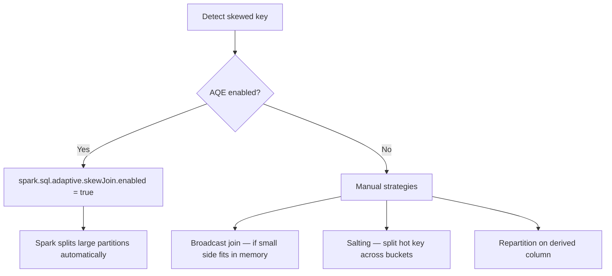

# Skew Data

Data skew occurs when one or a few partition keys hold a disproportionate share of
the data, causing some executors to stall while others finish quickly.



## Strategy 1 — AQE Skew Join (Recommended)

Enable Adaptive Query Execution to detect and split skewed partitions automatically:

```python
import os
from pyspark.sql import SparkSession

spark = (SparkSession.builder
         .appName("skew-aqe")
         .master(os.environ.get("SPARK_MASTER", "local[*]"))
         .config("spark.sql.adaptive.enabled",                               "true")
         .config("spark.sql.adaptive.skewJoin.enabled",                      "true")
         .config("spark.sql.adaptive.skewJoin.skewedPartitionFactor",        "5")     # (1)!
         .config("spark.sql.adaptive.skewJoin.skewedPartitionThresholdInBytes", "256m") # (2)!
         .getOrCreate())
spark.sparkContext.setLogLevel("WARN")
```
1. A partition is skewed if its size is `factor × median partition size`.
2. Partitions smaller than this threshold are never split, even if they are
   `factor` times larger than the median.

### Run

```bash
python src/data_frame/optimization/skew_data/skew_data_aqe_join_solution.py
```

## Strategy 2 — Broadcast Join

When the smaller side of a skewed join fits in executor memory:

```python
from pyspark.sql import functions as F

result = large_skewed_df.join(
    F.broadcast(small_lookup_df),
    on=["join_key"],
    how="inner",
)
result.explain()   # verify BroadcastHashJoin in the plan
```

### Run

```bash
python src/data_frame/optimization/skew_data/skew_data_broadcast_join_solution.py
```

## Strategy 3 — Manual Salting

When AQE is not available or the skew is too severe:

```python
SALT_BUCKETS = 10

# Add a random salt to the skewed side
skewed = skewed_df.withColumn(
    "salted_key",
    F.concat_ws("_", F.col("join_key"), (F.rand() * SALT_BUCKETS).cast("int"))   # (1)!
)

# Explode the same salt range on the small side
small = small_df.withColumn(
    "salt", F.explode(F.array([F.lit(i) for i in range(SALT_BUCKETS)]))
)
small = small.withColumn(
    "salted_key", F.concat_ws("_", F.col("join_key"), F.col("salt"))
)

result = skewed.join(small, on="salted_key", how="inner").drop("salted_key", "salt")
```
1. The random salt distributes hot-key rows across `SALT_BUCKETS` partitions.

### Run

```bash
python src/data_frame/optimization/skew_data/skew_data_using_salting.py
```

## Strategy 4 — Derived Column Repartition

Repartition on a derived column to spread skewed keys across more partitions:

```python
result = (skewed_df
          .withColumn("derived_key",
                      F.concat(F.col("join_key"), F.monotonically_increasing_id() % 10))
          .repartition("derived_key"))
```

### Run

```bash
python src/data_frame/optimization/skew_data/skew_data_derived_column_solution.py
```

## Strategy Comparison

| Strategy | When to Use | Cost |
|----------|-------------|------|
| AQE skew join | Spark 3.0+; most cases | Low — automatic |
| Broadcast join | Small side < executor memory | Low — no shuffle |
| Salting | AQE insufficient; large both sides | Medium — explode on small side |
| Derived column | Custom partition logic needed | Medium — extra column |

!!! tip "Diagnose with Spark UI"
    Open the Spark Web UI → Stages tab → look for tasks with a much higher
    duration or input size than the median. That stage contains the skewed partition.

!!! success "Start with AQE"
    Enable AQE first — it handles most skew automatically without code changes.
    Only add manual strategies when AQE is insufficient or unavailable.
