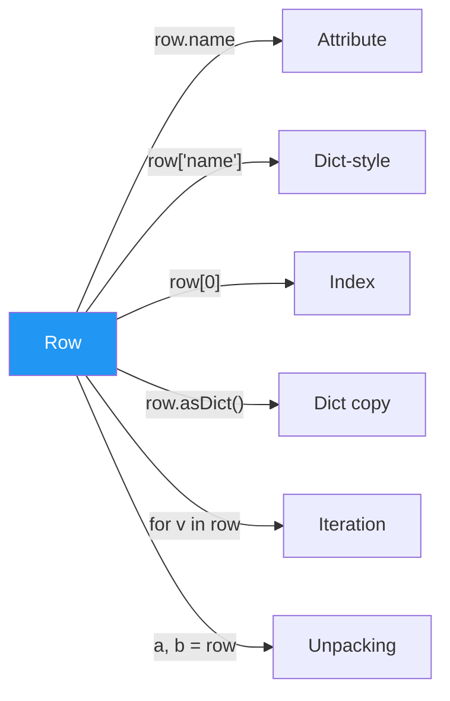

# Row Field Access

Every way to read values from a collected `pyspark.sql.Row` object — from simple
attribute access to safe lookups with defaults.

## Access Patterns



## API Quick Reference

| Pattern | Syntax | Returns | Fails When |
|---------|--------|---------|------------|
| Attribute | `row.name` | Field value | Field missing → `AttributeError` |
| Dict-style | `row["name"]` | Field value | Field missing → `KeyError` |
| Index | `row[0]` | Value at position | Index out of range |
| `asDict()` | `row.asDict()` | `dict` copy | Never (always works) |
| `hasattr` | `hasattr(row, "name")` | `bool` | Never |
| `getattr` | `getattr(row, "name", default)` | Value or default | Never |
| `__fields__` | `row.__fields__` | Tuple of names | Positional Row → empty |
| Iteration | `for v in row` | Values in order | Never |
| `len()` | `len(row)` | Field count | Never |
| Unpacking | `a, b, c = row` | Individual vars | Arity mismatch |

## Worked Example

### Attribute and Dict-Style Access

```python
from pyspark.sql import Row

row = Row(id=1, name="Alice", salary=90000.0)

row.name        # "Alice"          # (1)!
row["name"]     # "Alice"          # (2)!
row[0]          # 1                # (3)!
```

1. Attribute access — the most natural syntax for named Rows.
2. Dict-style access — identical result, useful when field name is in a variable.
3. Index access — 0-based, follows schema column order.

### asDict — Full Row as a Dictionary

```python
d = row.asDict()                   # (1)!
print(d)        # {'id': 1, 'name': 'Alice', 'salary': 90000.0}
print(d.keys()) # dict_keys(['id', 'name', 'salary'])

# Convert all collected rows to dicts
records = [r.asDict() for r in df.collect()]  # (2)!
```

1. Returns an `OrderedDict` — field order matches the schema.
2. Common pattern for exporting DataFrame rows to Python data structures.

### Safe Access with hasattr / getattr

```python
row = Row(id=1, name="Alice", department_id=None)

hasattr(row, "id")       # True
hasattr(row, "salary")   # False  — field not present   # (1)!

getattr(row, "name", "UNKNOWN")          # "Alice"
getattr(row, "salary", 0.0)             # 0.0   — default returned   # (2)!
getattr(row, "department_id", -1)       # None   — field exists, value is None   # (3)!
```

1. `hasattr` checks field existence, not whether the value is `None`.
2. `getattr` returns the default only when the field does **not exist** on the Row.
3. If the field exists but its value is `None`, `getattr` returns `None` — not the default.

### __fields__, Iteration, and Unpacking

```python
row = Row(id=1, name="Alice", salary=90000.0, active=True)

row.__fields__   # ('id', 'name', 'salary', 'active')     # (1)!
len(row)         # 4

for field, value in zip(row.__fields__, row):              # (2)!
    print(f"{field} = {value}")

id_, name_, salary_, active_ = row                         # (3)!
```

1. `__fields__` gives the ordered tuple of field names — only available on named Rows.
2. Pairing `__fields__` with iteration lets you process fields generically.
3. Standard tuple unpacking works because `Row` is iterable.

### Run

```bash
cd spark-python/pyspark-dataframe
python src/data_frame/rows/access/row_access.py
```

!!! tip "Prefer attribute access for readability"
    `row.name` is the clearest syntax. Use `row["name"]` when the field name comes
    from a variable, and `row[i]` only when processing columns by position.

!!! warning "getattr does not replace None"
    `getattr(row, "field", default)` returns the default only when the **field is
    missing** from the Row. If the field exists with a `None` value, you get `None`.
    Use `row["field"] or default` or explicit null checks instead.

!!! note "Positional Rows have no __fields__"
    `Row(1, "Alice").__fields__` returns an empty tuple. Use named-keyword Rows
    to get field introspection.

## Full Source

```python title="src/data_frame/rows/access/row_access.py"
--8<-- "data_frame/rows/access/row_access.py"
```
