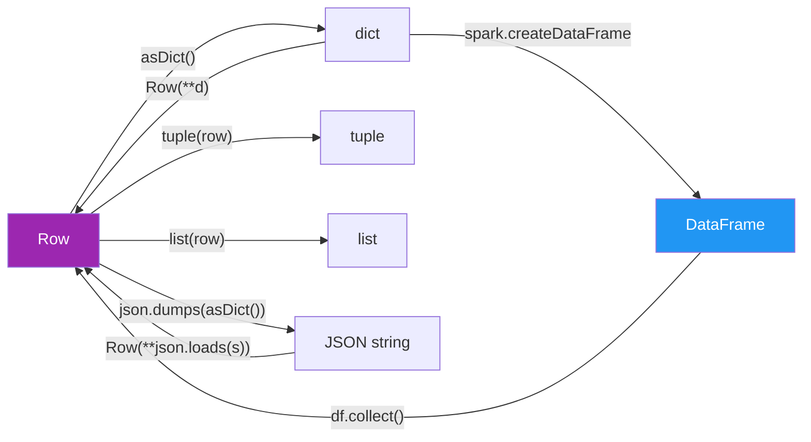

# Row Conversion

Transform `Row` objects to and from Python dicts, tuples, lists, and JSON strings.

## Conversion Map



## API Quick Reference

| Conversion | Syntax | Notes |
|------------|--------|-------|
| Row → dict | `row.asDict()` | Shallow; nested Rows stay as Row objects |
| Row → dict (deep) | `row.asDict(recursive=True)` | Nested Rows become nested dicts |
| dict → Row | `Row(**d)` | Dict keys become field names |
| Row → tuple | `tuple(row)` | Values only, no field names |
| Row → list | `list(row)` | Same as tuple but mutable |
| Row → named dict | `dict(zip(row.__fields__, row))` | Preserves field order |
| Rows → list[dict] | `[r.asDict() for r in df.collect()]` | Bulk export |
| list[dict] → DataFrame | `spark.createDataFrame(dicts)` | Schema inferred from first dict |
| Row → JSON | `json.dumps(row.asDict())` | Standard JSON string |
| JSON → Row | `Row(**json.loads(s))` | Round-trip back to Row |
| Normalise nulls | Replace `None` in dict with defaults | Manual dict comprehension |
| Flatten nested | Recursive prefix-based flattening | Custom helper function |

## Worked Example

### Row ↔ Dict

```python
from pyspark.sql import Row

row = Row(id=1, name="Alice", salary=90000.0)

d = row.asDict()                        # (1)!
print(d)  # {'id': 1, 'name': 'Alice', 'salary': 90000.0}

# Modify the copy — original Row is immutable
d["name"] = d["name"].upper()
restored = Row(**d)                     # (2)!
print(restored)  # Row(id=1, name='ALICE', salary=90000.0)
```

1. `asDict()` returns a shallow copy — safe to modify without affecting the Row.
2. `Row(**d)` reconstructs a Row from the modified dict.

### Row → Tuple / List

```python
row = Row(id=1, name="Alice", salary=90000.0)

t = tuple(row)   # (1, 'Alice', 90000.0)           # (1)!
l = list(row)    # [1, 'Alice', 90000.0]            # (2)!
```

1. Tuple conversion strips field names — only values remain.
2. List is the mutable equivalent of the tuple conversion.

### Bulk Collect to Dicts

```python
records = [r.asDict() for r in df.collect()]        # (1)!
for rec in records:
    print(rec)
```

1. Common export pattern — each row becomes a plain Python dict.

### JSON Round-Trip

```python
import json

json_str = json.dumps(row.asDict())                 # (1)!
print(json_str)  # '{"id": 1, "name": "Alice", "salary": 90000.0}'

restored = Row(**json.loads(json_str))               # (2)!
print(restored.name)  # "Alice"
```

1. `asDict()` produces a JSON-serialisable dict (when values are primitive types).
2. Round-trip: JSON string → dict → Row preserves all field names and values.

### Null Normalisation

```python
defaults = {"customer_id": 0, "product": "UNKNOWN", "quantity": 0}

def normalise(row: Row) -> dict:
    d = row.asDict()
    return {k: (d[k] if d[k] is not None else defaults.get(k)) for k in d}  # (1)!

normalised = [normalise(r) for r in df.collect()]
```

1. Replace `None` values with typed defaults — useful before serialising to JSON
   or passing to systems that don't handle nulls.

### Flatten Nested Row

```python
def flatten_dict(d: dict, prefix: str = "") -> dict:
    result = {}
    for k, v in d.items():
        full_key = f"{prefix}{k}"
        if isinstance(v, dict):
            result.update(flatten_dict(v, prefix=f"{full_key}_"))  # (1)!
        else:
            result[full_key] = v
    return result

for row in df.collect():
    nested = row.asDict(recursive=True)
    flat = flatten_dict(nested)
    # {'id': 1, 'name': 'Alice', 'address_city': 'London', 'address_country': 'UK'}
```

1. Recursive flattening prefixes nested keys — `address.city` becomes `address_city`.

### Run

```bash
cd spark-python/pyspark-dataframe
python src/data_frame/rows/conversion/row_conversion.py
```

!!! tip "Use asDict(recursive=True) for nested structs"
    Without `recursive=True`, nested struct fields remain as `Row` objects in the
    dict — which won't serialise to JSON correctly.

!!! warning "collect() pulls all data to the driver"
    `df.collect()` materialises every row in driver memory. For large DataFrames,
    use `df.limit(n).collect()` or `df.toLocalIterator()` to avoid OOM errors.

!!! note "Row is immutable"
    Converting to dict, modifying, then converting back to Row is the standard
    "mutation" pattern. The original Row is never changed.

## Full Source

```python title="src/data_frame/rows/conversion/row_conversion.py"
--8<-- "data_frame/rows/conversion/row_conversion.py"
```
