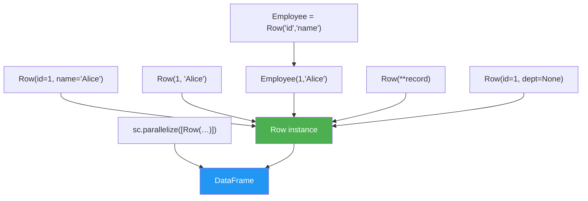

# Row Creation

Every way to construct a `pyspark.sql.Row` — from inline keyword arguments to
RDD-based factory patterns.

## Creation Patterns



## API Quick Reference

| Pattern | Syntax | Field Names | Schema Source |
|---------|--------|:-----------:|:------------:|
| Named kwargs | `Row(id=1, name="Alice")` | ✅ embedded | Inferred from Row |
| Positional | `Row(1, "Alice")` | ❌ none | External `StructType` required |
| Factory subclass | `E = Row("id", "name"); E(1, "Alice")` | ✅ from factory | Inferred from Row |
| Dict unpacking | `Row(**{"id": 1, "name": "Alice"})` | ✅ from keys | Inferred from Row |
| Nullable fields | `Row(id=1, dept=None)` | ✅ embedded | Inferred (nullable) |
| From RDD | `spark.createDataFrame(rdd_of_rows)` | ✅ from Row | Inferred from Row |

## Worked Example

### Named-keyword Row

```python
from pyspark.sql import Row

row = Row(id=1, name="Alice", department="Engineering", salary=90000.0)  # (1)!

print(row.name)           # "Alice"
print(row.__fields__)     # ('id', 'name', 'department', 'salary')

data = [
    Row(id=1, name="Alice", salary=90000.0),
    Row(id=2, name="Bob",   salary=75000.0),
]
df = spark.createDataFrame(data)  # (2)!
df.show()
```

1. Field names are stored inside the Row — no external schema needed.
2. Spark infers the schema from the Row field names and Python types.

### Factory Subclass

```python
Employee = Row("id", "name", "department")  # (1)!

alice = Employee(1, "Alice", "Engineering")
bob   = Employee(2, "Bob",   "Sales")

print(alice.name)           # "Alice"
print(alice.__fields__)     # ('id', 'name', 'department')

df = spark.createDataFrame([alice, bob])
```

1. `Row("f1", "f2", …)` returns a **class**, not an instance. Call it to create rows.

### From Dict Unpacking

```python
records = [
    {"order_id": 101, "customer": "Alice", "amount": 299.99},
    {"order_id": 102, "customer": "Bob",   "amount": 149.50},
]
rows = [Row(**r) for r in records]  # (1)!
df = spark.createDataFrame(rows)
```

1. `**r` unpacks the dict keys as keyword arguments to `Row()`.

### Positional Row with Explicit Schema

```python
from pyspark.sql.types import StructType, StructField, IntegerType, StringType, DoubleType

data = [Row(1, "Alice", 90000.0), Row(2, "Bob", 75000.0)]
schema = StructType([
    StructField("id",     IntegerType(), nullable=False),
    StructField("name",   StringType(),  nullable=True),
    StructField("salary", DoubleType(),  nullable=True),
])
df = spark.createDataFrame(data, schema)  # (1)!
```

1. Positional Rows have no field names — the schema must be supplied externally.

### Row with None (NULL)

```python
data = [
    Row(id=1, name="Alice", manager_id=None),  # (1)!
    Row(id=2, name="Bob",   manager_id=1),
]
df = spark.createDataFrame(data)
df.filter(df.manager_id.isNull()).count()  # 1
```

1. `None` becomes `NULL` in the DataFrame. Spark infers the column as nullable.

### Row from RDD

```python
Employee = Row("id", "name", "score")
rdd = spark.sparkContext.parallelize([
    Employee(1, "Alice", 95.5),
    Employee(2, "Bob",   87.0),
])
df = spark.createDataFrame(rdd)  # (1)!
```

1. Named Rows in the RDD provide both data and field names for schema inference.

### Run

```bash
cd spark-python/pyspark-dataframe
python src/data_frame/rows/creation/row_creation.py
```

!!! tip "Named kwargs are the safest pattern"
    Named-keyword Rows (`Row(id=1, name="Alice")`) embed field names in the object,
    making schema inference automatic and code self-documenting.

!!! warning "Positional Rows lose field names"
    `Row(1, "Alice")` has no `.name` attribute — you can only access values by index.
    Always pair positional Rows with an explicit `StructType` schema.

!!! note "Factory subclass reuse"
    `Employee = Row("id", "name")` is useful when creating many rows with the same
    schema — it avoids repeating keyword names and catches arity mismatches at
    construction time.

## Full Source

```python title="src/data_frame/rows/creation/row_creation.py"
--8<-- "data_frame/rows/creation/row_creation.py"
```
